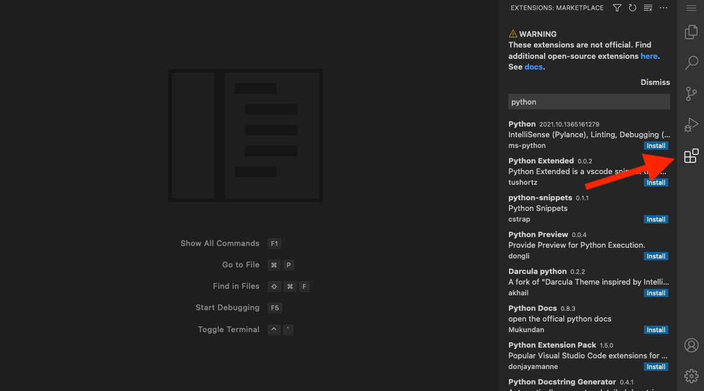

# Visual Studio Code

You can develop in your Coder workspace remotely with
[VSCode](https://code.visualstudio.com/download). We support connecting with the
desktop client and VSCode in the browser with
[code-server](https://github.com/coder/code-server).

## VSCode Desktop

VSCode desktop is a default app for workspaces.

Click `VS Code Desktop` in the dashboard to one-click enter a workspace. This
automatically installs the [Coder Remote](https://github.com/coder/vscode-coder)
extension, authenticates with Coder, and connects to the workspace.


> [!NOTE]
> The `VS Code Desktop` button can be hidden by enabling
> [Browser-only connections](../../admin/networking/index.md#browser-only-connections).

### Manual Installation

You can install our extension manually in VSCode using the command palette.
Launch VS Code Quick Open (Ctrl+P), paste the following command, and press
enter.

```text
ext install coder.coder-remote
```

Alternatively, manually install the VSIX from the
[latest release](https://github.com/coder/vscode-coder/releases/latest).

## VS Code extensions

There are multiple ways to add extensions to VS Code Desktop:

1. Using the
   [public extensions marketplaces](#using-the-public-extensions-marketplaces)
   with Code Web (code-server)
1. Adding [extensions to custom images](#adding-extensions-to-custom-images)
1. Installing extensions
   [using its `vsix` file at the command line](#installing-extensions-using-its-vsix-file-at-the-command-line)
1. Installing extensions
   [from a marketplace using the command line](#installing-from-a-marketplace-at-the-command-line)

### Using the public extensions marketplaces

You can manually add an extension while you're working in the Code Web IDE. The
extensions can be from Coder's public marketplace, Eclipse Open VSX's public
marketplace, or the Eclipse Open VSX _local_ marketplace.



> [!NOTE]
> Microsoft does not allow any unofficial VS Code IDE to connect to the
> extension marketplace.

### Adding extensions to custom images

You can add extensions to a custom image and install them either through Code
Web or using the workspace's terminal.

1. Download the extension(s) from the Microsoft public marketplace.

   

1. Add the `vsix` extension files to the same folder as your Dockerfile.

   ```shell
   ~/images/base
    ➜  ls -l
    -rw-r--r-- 1 coder coder       0 Aug 1 19:23 Dockerfile
    -rw-r--r-- 1 coder coder 8925314 Aug 1 19:40 GitHub.copilot.vsix
   ```

1. In the Dockerfile, add instructions to make a folder and to copy the `vsix`
   files into the newly created folder.

   ```Dockerfile
   FROM codercom/enterprise-base:ubuntu

   # Run below commands as root user
   USER root

   # Download and install VS Code extensions into the container
   RUN mkdir -p /vsix
   ADD ./GitHub.copilot.vsix /vsix

   USER coder
   ```

1. Build the custom image, and push it to your image registry.

1. Pass in the image and below command into your template `startup_script` (be
   sure to update the filename below):

   **Startup Script**

   ```tf
   resource "coder_agent" "main" {
     ...
     startup_script = "code-server --install-extension /vsix/GitHub.copilot.vsix"
   }
   ```

   **Image Definition**

   ```tf
   resource "kubernetes_deployment" "main" {
     spec {
       template {
         spec {
           container {
             name   = "dev"
             image  = "registry.internal/image-name:tag"
           }
         }
       }
     }
   }
   ```

1. Create a workspace using the template.

You will now have access to the extension in your workspace.

### Installing extensions using its `vsix` file at the command line

Using the workspace's terminal or the terminal available inside `code-server`,
you can install an extension whose files you've downloaded from a marketplace:

```console
/path/to/code-server --install-extension /vsix/GitHub.copilot.vsix
```

### Installing from a marketplace at the command line

Using the workspace's terminal or the terminal available inside Code Web (code
server), run the following to install an extension (be sure to update the
snippets with the name of the extension you want to install):

```console
SERVICE_URL=https://extensions.coder.com/api ITEM_URL=https://extensions.coder.com/item /path/to/code-server --install-extension GitHub.copilot
```

Alternatively, you can install an extension from Open VSX's public marketplace:

```console
SERVICE_URL=https://open-vsx.org/vscode/gallery ITEM_URL=https://open-vsx.org/vscode/item /path/to/code-server --install-extension GitHub.copilot
```

### Using VS Code Desktop

For your local VS Code to pickup extension files in your Coder workspace,
include this command in your `startup_script`, or run in manually in your
workspace terminal:

```console
code --extensions-dir ~/.vscode-server/extensions --install-extension "$extension"
```
