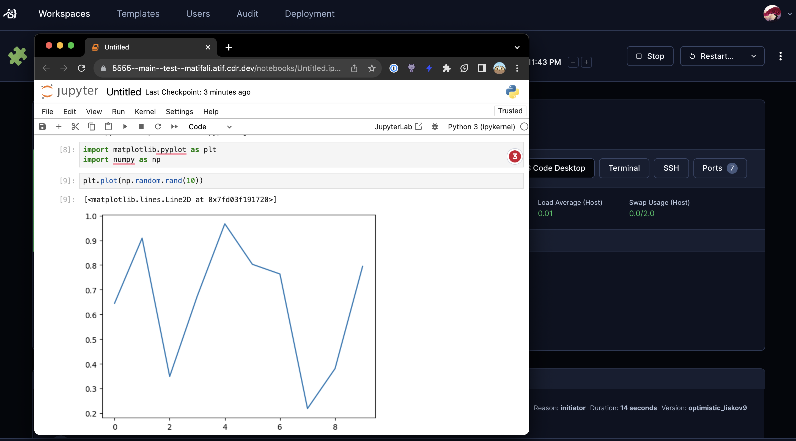
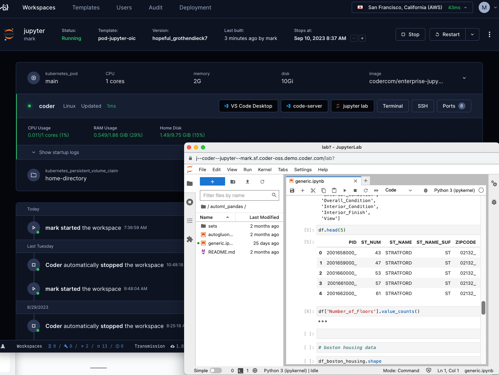
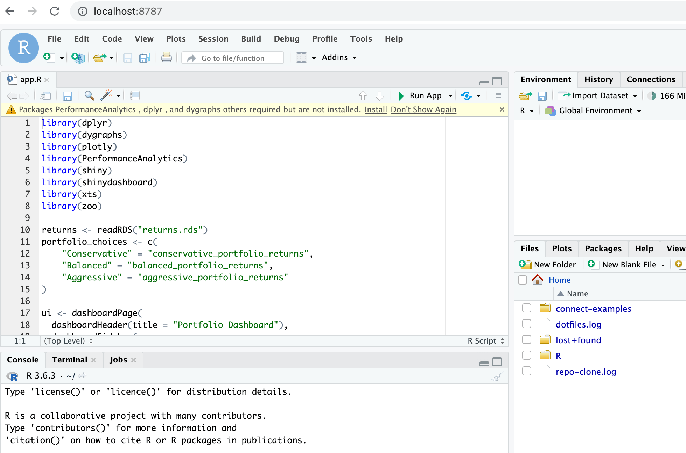

# Web IDEs

By default, Coder workspaces allow connections via:

- Web terminal
- [SSH](./index.md#ssh)

It's common to also connect via web IDEs for uses cases like zero trust
networks, data science, contractors, and infrequent code contributors.

In Coder, web IDEs are defined as
[coder_app](https://registry.terraform.io/providers/coder/coder/latest/docs/resources/app)
resources in the template. With our generic model, any web application can be
used as a Coder application. For example:

To learn more about configuring IDEs in templates, see our docs on
[template administration](../../admin/templates/index.md).

## code-server

[`code-server`](https://github.com/coder/code-server) is our supported method of
running VS Code in the web browser. You can read more in our
[documentation for code-server](https://coder.com/docs/code-server).

## VS Code Web

We also support Microsoft's official product for using VS Code in the browser. A
template administrator can add it by following the
[Extending Templates](../../admin/templates/extending-templates/web-ides.md#vs-code-web)
guide.

## Jupyter Notebook

Jupyter Notebook is a web-based interactive computing platform. A template
administrator can add it by following the
[Extending Templates](../../admin/templates/extending-templates/web-ides.md#jupyter-notebook)
guide.

## JupyterLab

In addition to Jupyter Notebook, you can use Jupyter lab in your workspace. A
template administrator can add it by following the
[Extending Templates](../../admin/templates/extending-templates/web-ides.md#jupyterlab)
guide.

## RStudio

RStudio is a popular IDE for R programming language. A template administrator
can add it to your workspace by following the
[Extending Templates](../../admin/templates/extending-templates/web-ides.md#rstudio)
guide.

## Airflow

Apache Airflow is an open-source workflow management platform for data
engineering pipelines. A template administrator can add it by following the
[Extending Templates](../../admin/templates/extending-templates/web-ides.md#airflow)
guide.

## SSH Fallback

If you prefer to run web IDEs in localhost, you can port forward using
[SSH](./index.md#ssh) or the Coder CLI `port-forward` sub-command. Some web IDEs
may not support URL base path adjustment so port forwarding is the only
approach.
