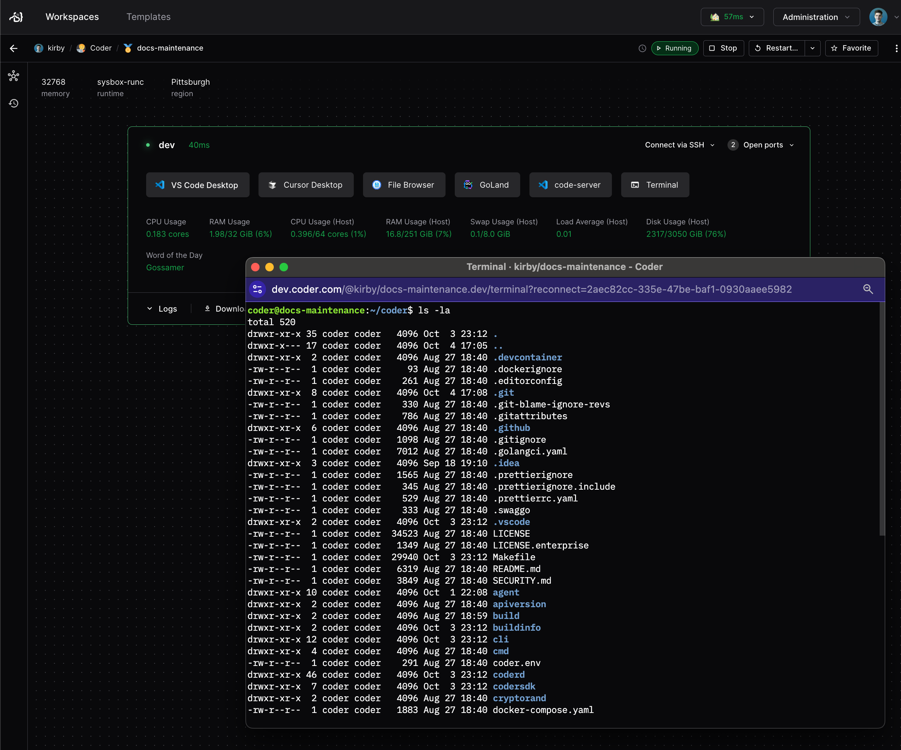

# Web Terminal

The Web Terminal is a browser-based terminal interface that provides instant
access to your workspace's shell environment directly from the Coder dashboard.
It's automatically enabled for all workspaces and requires no additional
configuration.



## Overview

The Web Terminal leverages
[ghostty-web](https://github.com/coder/ghostty-web), a WASM-compiled terminal
emulator powered by [Ghostty](https://ghostty.org/), combined with WebSocket
technology to provide a responsive and feature-rich terminal experience in your
browser.

### Key Features

- **Instant Access**: Click the terminal icon in your workspace to open a shell
  session
- **Persistent Sessions**: Sessions are maintained using reconnection tokens,
  allowing you to resume your terminal even after page refreshes or network
  interruptions
- **Full Unicode Support**: Displays international characters and emojis
  correctly
- **Clickable Links**: Automatically detects and makes URLs clickable
- **Copy/Paste Support**: Select text to automatically copy it to your clipboard
- **Hardware-Accelerated Rendering**: Canvas-based rendering powered by Ghostty's
  WASM engine

## Accessing the Terminal

### From the Dashboard

1. Navigate to your workspace in the Coder dashboard
2. Click the **Terminal** button or icon
3. The terminal will open in a new browser tab or window

The terminal automatically connects to your workspace agent using an optimized
WebSocket connection.

### Direct URL Access

You can also bookmark or share direct terminal URLs:

```text
https://coder.example.com/@username/workspace-name/terminal
```

To access a specific agent in a multi-agent workspace:

```text
https://coder.example.com/@username/workspace-name.agent-name/terminal
```

## Architecture

### How It Works

The Web Terminal creates a persistent connection between your browser and the
workspace:

1. **Browser**: Renders the terminal using ghostty-web
2. **WebSocket**: Maintains a persistent, low-latency connection
3. **Coder Server**: Routes traffic between browser and workspace
4. **Workspace Agent**: Manages the pseudo-terminal (PTY) session
5. **Shell Process**: Your actual bash/zsh/fish shell

The connection flow is: Browser ↔ WebSocket ↔ Coder Server ↔ Workspace Agent ↔ Shell Process

### Reconnection & Persistence

The terminal uses reconnection tokens to maintain session state:

- Each terminal session has a unique UUID
- If the connection drops, the same token is used to reconnect
- The workspace agent buffers output during disconnections
- Your shell session continues running even when the browser is closed

## Customization

### Font Selection

You can customize the terminal font through your user settings:

1. Click your avatar in the top-right corner
2. Select **Settings** → **Appearance**
3. Choose from available fonts:
   - **IBM Plex Mono** (default)
   - **Fira Code** (with ligatures)
   - **JetBrains Mono**
   - **Source Code Pro**

The font change applies immediately to all open terminal sessions.

## Keyboard Shortcuts

The Web Terminal supports standard terminal keybindings:

| Shortcut                            | Action                    |
|-------------------------------------|---------------------------|
| `Ctrl+Shift+C` (Mac: `Cmd+Shift+C`) | Copy selected text        |
| `Ctrl+Shift+V` (Mac: `Cmd+Shift+V`) | Paste from clipboard      |
| `Shift+Enter`                       | Insert literal newline    |
| `Ctrl+C`                            | Send interrupt (SIGINT)   |
| `Ctrl+D`                            | Send EOF / exit shell     |
| `Ctrl+Z`                            | Suspend process (SIGTSTP) |

### Copy/Paste Behavior

- **Auto-copy**: Selecting text automatically copies it to your clipboard
- **Paste**: Use the standard paste shortcut or middle-click (on Linux/X11)
- **Browser permissions**: First paste may prompt for clipboard access

## URL Handling

The terminal automatically detects URLs and makes them clickable. When you click
a URL:

- **External URLs** (e.g., `https://example.com`) open in a new tab
- **Localhost URLs** (e.g., `http://localhost:3000`) are automatically
  port-forwarded through Coder's [port forwarding](./port-forwarding.md) system
- **Port-forwarded URLs** use your configured workspace proxy

This makes it seamless to open development servers running in your workspace.

## Advanced Usage

### Custom Commands

You can open a terminal with a specific command by adding a query parameter:

```text
https://coder.example.com/@user/workspace/terminal?command=htop
```

This will execute `htop` immediately when the terminal opens.

### Container Selection

For workspaces with multiple Docker containers, specify which container to
connect to:

```text
https://coder.example.com/@user/workspace/terminal?container=sidecar
```

You can also specify the container user:

```text
https://coder.example.com/@user/workspace/terminal?container=app&container_user=node
```

> **Note:** This feature only works with Docker containers.

### Debug Mode

Enable debug information to monitor connection latency:

```text
https://coder.example.com/@user/workspace/terminal?debug
```

This displays the current latency to your selected workspace proxy in the
bottom-right corner.

## Configuration File Support

The Web Terminal uses ghostty-web under the hood, which is configured
programmatically rather than through a configuration file. However, you can
customize various aspects:

### User-Side Customization

End-users can customize:

- **Font family** via Settings → Appearance
- **Shell environment** via dotfiles or shell rc files
- **TERM variable** is automatically set to `xterm-256color`

### Shell Configuration

The terminal respects your shell's configuration files:

```bash
# ~/.bashrc or ~/.zshrc
export PS1="\u@\h:\w\$ "  # Custom prompt
alias ll="ls -lah"         # Custom aliases

# Set terminal colors
export CTERM=xterm-256color
```

## Troubleshooting

### Connection Issues

If the terminal fails to connect:

1. **Check workspace status**: Ensure your workspace is running
2. **Verify agent health**: Look for agent connection warnings
3. **Network issues**: Check if WebSockets are blocked by your firewall/proxy
4. **Browser console**: Open DevTools to see WebSocket error messages

### Display Issues

If characters or colors appear incorrect:

1. **Unicode support**: Ensure your shell locale is set correctly (`locale -a`)
2. **Terminal type**: The terminal sets `TERM=xterm-256color` automatically
3. **Color schemes**: Some applications may not render correctly in dark mode
4. **Font rendering**: Try switching terminal fonts in your appearance settings
