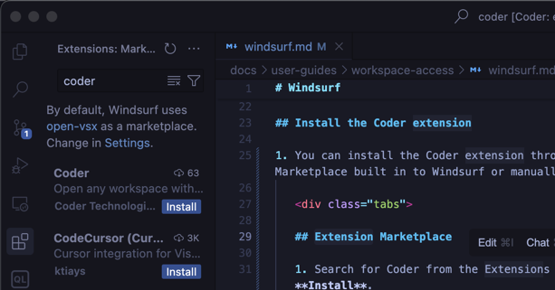

# Windsurf

[Windsurf](https://codeium.com/windsurf) is Codeium's code editor designed for AI-assisted
development.

Follow this guide to use Windsurf to access your Coder workspaces.

If your team uses Windsurf regularly, ask your Coder administrator to add Windsurf as a workspace application in your template.

## Install Windsurf

Windsurf can connect to your Coder workspaces via SSH:

1. [Install Windsurf](https://docs.codeium.com/windsurf/getting-started) on your local machine.

1. Open Windsurf and select **Get started**.

   Import your settings from another IDE, or select **Start fresh**.

1. Complete the setup flow and log in or [create a Codeium account](https://codeium.com/windsurf/signup)
   if you don't have one already.

## Install the Coder extension

1. You can install the Coder extension through the Marketplace built in to Windsurf or manually.

   

   ## Extension Marketplace

   1. Search for Coder from the Extensions Pane and select **Install**.

   ## Manually

   1. Download the [latest vscode-coder extension](https://github.com/coder/vscode-coder/releases/latest) `.vsix` file.

   1. Drag the `.vsix` file into the extensions pane of Windsurf.

      Alternatively:

      1. Open the Command Palette
   (<kdb>Ctrl</kdb>+<kdb>Shift</kdb>+<kdb>P</kdb> or <kdb>Cmd</kdb>+<kdb>Shift</kdb>+<kdb>P</kdb>)
   and search for `vsix`.

      1. Select **Extensions: Install from VSIX** and select the vscode-coder extension you downloaded.

   

## Open a workspace in Windsurf

1. From the Windsurf Command Palette
(<kdb>Ctrl</kdb>+<kdb>Shift</kdb>+<kdb>P</kdb> or <kdb>Cmd</kdb>+<kdb>Shift</kdb>+<kdb>P</kdb>),
enter `coder` and select **Coder: Login**.

1. Follow the prompts to login and copy your session token.

   Paste the session token in the **Coder API Key** dialogue in Windsurf.

1. Windsurf prompts you to open a workspace, or you can use the Command Palette to run **Coder: Open Workspace**.
