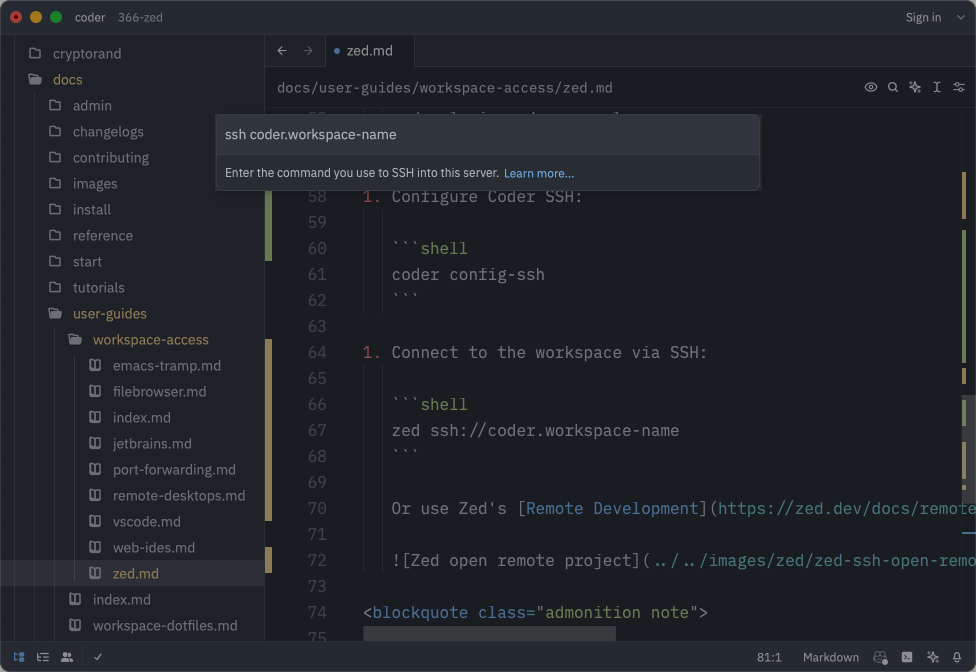

# Zed

[Zed](https://zed.dev/) is an [open-source](https://github.com/zed-industries/zed)
multiplayer code editor from the creators of Atom and Tree-sitter.

## Use Zed to connect to Coder via SSH

Use the Coder CLI to log in and configure SSH, then connect to your workspace with Zed:

1. [Install Zed](https://zed.dev/docs/)
1. Install Coder CLI:

   <!-- copied from docs/install/cli.md - make changes there -->

   <div class="tabs">

   ### Linux/macOS

   Our install script is the fastest way to install Coder on Linux/macOS:

   ```sh
   curl -L https://coder.com/install.sh | sh
   ```

   Refer to [GitHub releases](https://github.com/coder/coder/releases) for
   alternate installation methods (e.g. standalone binaries, system packages).

   ### Windows

   Use [GitHub releases](https://github.com/coder/coder/releases) to download the
   Windows installer (`.msi`) or standalone binary (`.exe`).

   

   Alternatively, you can use the
   [`winget`](https://learn.microsoft.com/en-us/windows/package-manager/winget/#use-winget)
   package manager to install Coder:

   ```powershell
   winget install Coder.Coder
   ```

   </div>

   Consult the [Coder CLI documentation](../../install/cli.md) for more options.

1. Log in to your Coder deployment and authenticate when prompted:

   ```shell
   coder login coder.example.com
   ```

1. Configure Coder SSH:

   ```shell
   coder config-ssh
   ```

1. Connect to the workspace via SSH:

   ```shell
   zed ssh://coder.workspace-name
   ```

   Or use Zed's [Remote Development](https://zed.dev/docs/remote-development#setup) to connect to the workspace:

   

<blockquote class="admonition note">

If you have any suggestions or experience any issues, please
[create a GitHub issue](https://github.com/coder/coder/issues) or share in
[our Discord channel](https://discord.gg/coder).

</blockquote>
