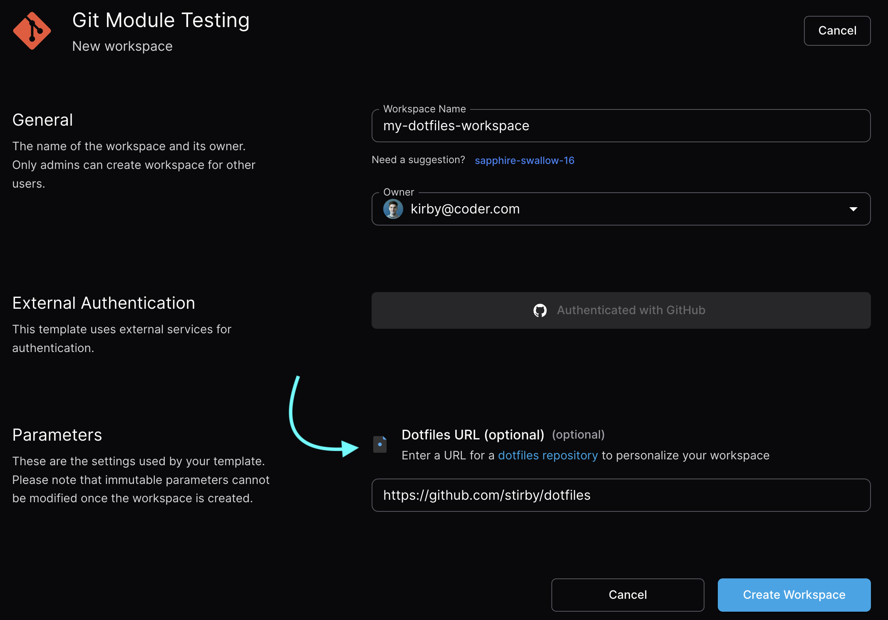

# Dotfiles

<!-- markdown-link-check-disable -->

Coder offers the `coder dotfiles <repo>` command which simplifies workspace
personalization. Our behavior is consistent with Codespaces, so
[their documentation](https://docs.github.com/en/codespaces/customizing-your-codespace/personalizing-codespaces-for-your-account#dotfiles)
explains how it loads your repo.

<!-- markdown-link-check-enable -->

You can read more on dotfiles best practices [here](https://dotfiles.github.io).

## From templates

Templates can prompt users for their dotfiles repo URL, which will personalize
your workspace automatically.



> [!NOTE]
> Template admins: this can be enabled quite easily with a our
> [dotfiles module](https://registry.coder.com/modules/dotfiles) using just a
> few lines in the template.

## Personalize script

Templates may be configured to support executing a `~/personalize` script on
startup which users can populate with commands to customize their workspaces.

You can even fill `personalize` with `coder dotfiles <repo>`, but those looking
for a simpler approach can inline commands like so:

```bash
#!/bin/bash
sudo apt update
# Install some of my favorite tools every time my workspace boots
sudo apt install -y neovim fish cargo
```

> [!NOTE]
> Template admins: refer to
> [this module](https://registry.coder.com/modules/personalize) to enable the
> `~/personalize` script on templates.

## Setup script support

Coder can run an install script from your dotfiles repo to set up your
environment. The scripts it looks for depend on the operating system.

### Linux and macOS

On Linux and macOS, Coder looks for the following script files (in order):

- `install.sh`
- `install`
- `bootstrap.sh`
- `bootstrap`
- `setup.sh`
- `setup`
- `script/install.sh`
- `script/install`
- `script/bootstrap.sh`
- `script/bootstrap`
- `script/setup.sh`
- `script/setup`

The setup script must be executable, otherwise the dotfiles setup will fail. If
you encounter this issue, you can fix it by making the script executable using
the following commands:

```shell
cd <path_to_dotfiles_repo>
chmod +x <script_name>
git commit -m "Make <script_name> executable" <script_name>
git push
```

### Windows

On Windows, Coder looks for PowerShell script files (in order):

- `install.ps1`
- `bootstrap.ps1`
- `setup.ps1`
- `script/install.ps1`
- `script/bootstrap.ps1`
- `script/setup.ps1`

Coder runs these scripts with `powershell -NoLogo`. File permission checks are
skipped on Windows.

### Cross-platform dotfiles

You can support both Unix and Windows from the same dotfiles repository by
including both shell and PowerShell scripts. For example, include both
`install.sh` (for Linux/macOS) and `install.ps1` (for Windows). Coder
automatically selects the correct script based on the workspace operating
system.

### General behavior

If any of the above files are found (in the specified order), Coder will try to
execute the first match. After the first match is found, other files will be
ignored.
