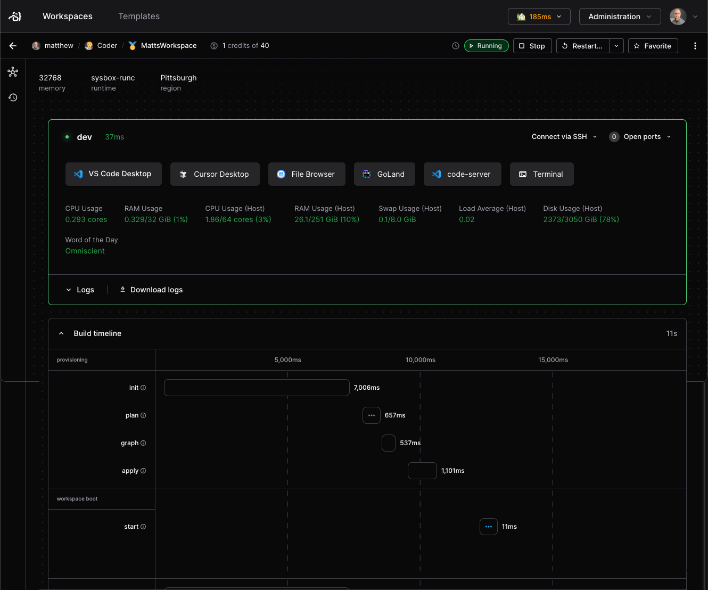

# Workspace lifecycle

Workspaces are flexible, reproducible, and isolated units of compute. Workspaces
are created via Terraform, managed through the Coder control plane, accessed
through the Coder agent, then stopped and deleted again by Terraform.

This page covers how workspaces move through this lifecycle. To learn about
automating workspace schedules for cost control, read the
[workspace scheduling docs](./workspace-scheduling.md).

## Workspace ephemerality

Workspaces are composed of resources which may be _ephemeral_ or _persistent_.
Persistent resources stay provisioned when the workspace is stopped, where as
ephemeral resources are destroyed and recreated on restart. All resources are
destroyed when a workspace is deleted.

Template administrators can learn more about resource configuration in the
[extending templates docs](../admin/templates/extending-templates/resource-persistence.md).

## Workspace States

Generally, there are 3 states that a workspace may fall into:

- Running: Started and ready for connections
- Stopped: Ephemeral resources destroyed, persistent resources idle
- Deleted: All resources destroyed, workspace records removed from database

If some error occurs during the above, a workspace may fall into one of the
following broken states:

- Failed: Failure during provisioning, no resource consumption
- Unhealthy: Resources have been provisioned, but the agent can't facilitate
  connections

## Workspace creation

Workspaces are created from [templates](../admin/templates/index.md) via the
CLI, API, or dashboard.

By default, there is no limit on the number of workspaces a user may create,
regardless of the template's resource demands. Enterprise administrators may
limit the number of workspaces per template, group, and organization using
[quotas](../admin/users/quotas.md) to prevent over provisioning and control
costs.

When a user creates a workspace, they're sending a build request to the control
plane. Coder takes this and uses [Terraform](https://www.terraform.io/) to
provision a workspace defined by your [template](../admin/templates/index.md).
Generally, templates define the resources and environment of a workspace.

The resources that run the agent are described as _computational resources_,
while those that don't are called _peripheral resources_. A workspace must
contain some computational resource to run the Coder agent process.

The provisioned workspace's computational resources start the agent process,
which opens connections to your workspace via SSH, the terminal, and IDES such
as [JetBrains](./workspace-access/jetbrains/index.md) or
[VSCode](./workspace-access/vscode.md).

Once started, the Coder agent is responsible for running your workspace startup
scripts. These may configure tools, service connections, or personalization with
[dotfiles](./workspace-dotfiles.md).

Once these steps have completed, your workspace will now be in the `Running`
state. You can access it via any of the [supported methods](./index.md), stop it
when you're away, or delete it once it's no longer in use.

## Stopping workspaces

Workspaces may be stopped manually by users and admins in the dashboard, CLI, or
API. Workspaces may be automatically stopped due to template updates or
inactivity by [scheduling configuration](./workspace-scheduling.md).

Once stopped, a workspace may resume running by starting it manually, or via
user connection if automatic start is enabled.

## Deleting workspaces

Similarly to stopping, workspaces may be deleted manually or automatically by
Coder through workspace dormancy.

A delete workspace build runs `terraform destroy`, destroying both persistent
and ephemeral resources. This action can not be reverted.

When enabled on enterprise deployments, workspaces will become dormant after a
specified duration of inactivity. Then, if left dormant, the workspaces will be
queued for deletion. Learn about configuring workspace dormancy in the template
scheduling docs.

### Orphan resources

Typically, when a workspace is deleted, all of the workspace's resources are
deleted along with it. Rarely, one may wish to delete a workspace without
deleting its resources, e.g. a workspace in a broken state. Users with the
Template Admin role have the option to do so both in the UI, and also in the CLI
by running the delete command with the `--orphan` flag. This option should be
considered cautiously as orphaning may lead to unaccounted cloud resources.

## Broken workspace states

During a workspace start or stop build, one of two errors may lead to a broken
state. If the call to `terraform apply` fails to correctly provision resources,
a workspace build has **failed**. If the computational resources fail to connect
the agent, a workspace becomes **unhealthy**.

A failed workspace is most often caused by misalignment from the definition in
your template's Terraform file and the target resources on your infrastructure.
Unhealthy workspaces are usually caused by a misconfiguration in the agent or
workspace startup scripts.

## Workspace build times

After a successful build, you can see a timing breakdown of the workspace
startup process from the dashboard (starting in v2.17). We capture and display
both time taken to provision the workspace's compute and agent startup steps.
These include any
[`coder_script`](https://registry.terraform.io/providers/coder/coder/latest/docs/resources/script)s
such as [dotfiles](./workspace-dotfiles.md) or
[`coder_app`](https://registry.terraform.io/providers/coder/coder/latest/docs/resources/app)
startups.

### Next steps

- [Connecting to your workspace](./index.md)
- [Creating templates](../admin/templates/index.md)
- [Workspace scheduling](./workspace-scheduling.md)
