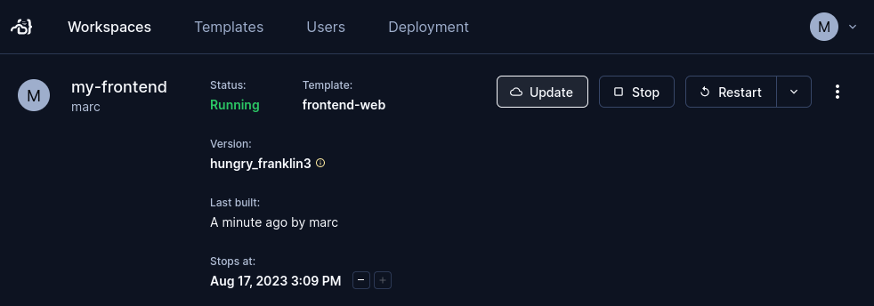

# Workspaces

A workspace is the environment that a developer works in. Developers in a team
each work from their own workspace and can use
[multiple IDEs](./workspace-access/index.md).

A developer creates a workspace from a
[shared template](../admin/templates/index.md). This lets an entire team work in
environments that are identically configured and provisioned with the same
resources.

## Creating workspaces

You can create a workspace in the UI. Log in to your Coder instance, go to the
**Templates** tab, find the template you need, and select **Create Workspace**.


When you create a workspace, you will be prompted to give it a name. You might
also be prompted to set some parameters that the template provides.

You can manage your existing templates in the **Workspaces** tab.

You can also create a workspace from the command line:

Each Coder user has their own workspaces created from
[templates](../admin/templates/index.md):

```shell
# create a workspace from the template; specify any variables
coder create --template="<templateName>" <workspaceName>

# show the resources behind the workspace and how to connect
coder show <workspace-name>
```

### Workspace name rules and restrictions

| Constraint | Rule |
|------------|------|
| Start/end with | Must start and end with a letter or number |
| Character types | Letters, numbers, and hyphens only |
| Length | 1-32 characters |
| Case sensitivity | Case-insensitive (lowercase recommended) |
| Reserved names | Cannot use `new` or `create` |
| Uniqueness | Must be unique within your workspaces |

## Workspace filtering

In the Coder UI, you can filter your workspaces using pre-defined filters or
Coder's filter query. Filters follow the pattern `[filter name]:[filter text]`
and multiple filters can be specified separated by a space i.e
`owner:me status:running`

The following filters are supported:

- `owner` - Represents the `username` of the owner. You can also use `me` as a
  convenient alias for the logged-in user, e.g., `owner:me`
- `name` - Name of the workspace.
- `template` - Name of the template.
- `status` - Indicates the status of the workspace, e.g, `status:failed` For a
  list of supported statuses, see
  [WorkspaceStatus documentation](https://pkg.go.dev/github.com/coder/coder/codersdk#WorkspaceStatus).
- `outdated` - Filters workspaces using an outdated template version, e.g,
  `outdated:true`
- `dormant` - Filters workspaces based on the dormant state, e.g `dormant:true`
- `has-agent` - Only applicable for workspaces in "start" transition. Stopped
  and deleted workspaces don't have agents. List of supported values
  `connecting|connected|timeout`, e.g, `has-agent:connecting`
- `id` - Workspace UUID

## Updating workspaces

After updating the default version of the template that a workspace was created
from, you can update the workspace.



If the workspace is running, Coder stops it, updates it, then starts the
workspace again.

### Updating via the CLI

Update a workspace through the command line:

```shell
coder update <workspace-name>
```

### Automatic updates

It can be tedious to manually update a workspace everytime an update is pushed
to a template. Users can choose to opt-in to automatic updates to update to the
active template version whenever the workspace is started.

Note: If a template is updated such that new parameter inputs are required from
the user, autostart will be disabled for the workspace until the user has
manually updated the workspace.


## Bulk operations

> [!NOTE]
> Bulk operations are a Premium feature.
> [Learn more](https://coder.com/pricing#compare-plans).

Licensed admins may apply bulk operations (update, delete, start, stop) in the
**Workspaces** tab. Select the workspaces you'd like to modify with the
checkboxes on the left, then use the top-right **Actions** dropdown to apply the
operation.

The start and stop operations can only be applied to a set of workspaces which
are all in the same state. For update and delete, the user will be prompted for
confirmation before any action is taken.


## Starting and stopping workspaces

By default, you manually start and stop workspaces as you need. You can also
schedule a workspace to start and stop automatically.

To set a workspace's schedule, go to the workspace, then **Settings** >
**Schedule**.


Coder might also stop a workspace automatically if there is a
[template update](../admin/templates/managing-templates/index.md#updating-templates)
available.

Learn more about [workspace lifecycle](./workspace-lifecycle.md) and our
[scheduling features](./workspace-scheduling.md).

## Workspace resources

Workspaces in Coder are started and stopped, often based on whether there was
any activity or if there was a [template update](../admin/templates/index.md)
available.

Resources are often destroyed and re-created when a workspace is restarted,
though the exact behavior depends on the template. For more information, see
[Resource Persistence](../admin/templates/extending-templates/resource-persistence.md).

## Repairing workspaces

Use the following command to re-enter template input variables in an existing
workspace. This command is useful when a workspace fails to build because its
state is out of sync with the template.

```shell
coder update <your workspace name> --always-prompt
```

First, try re-entering parameters from a workspace. In the Coder UI, you can
filter your workspaces using pre-defined filters or employing the Coder's filter
query. Take a look at the following examples to understand how to use the
Coder's filter query:

- To find the workspaces that you own, use the filter `owner:me`.
- To find workspaces that are currently running, use the filter
  `status:running`.


You can also do this in the CLI with the following command:

```shell
coder update <your workspace name> --always-prompt
```

If that does not work, a Coder admin can manually push and pull the Terraform
state for a given workspace. This can lead to state corruption or deleted
resources if you do not know what you are doing.

```shell
coder state pull <username>/<workspace name>
# Make changes
coder state push <username>/<workspace name>
```

## Logging

Coder stores macOS and Linux logs at the following locations:

| Service           | Location                         |
|-------------------|----------------------------------|
| `startup_script`  | `/tmp/coder-startup-script.log`  |
| `shutdown_script` | `/tmp/coder-shutdown-script.log` |
| Agent             | `/tmp/coder-agent.log`           |

> [!NOTE]
> Logs are truncated once they reach 5MB in size.
