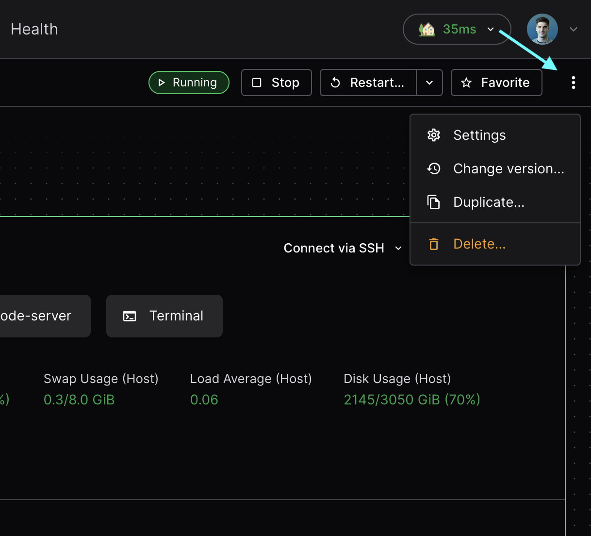
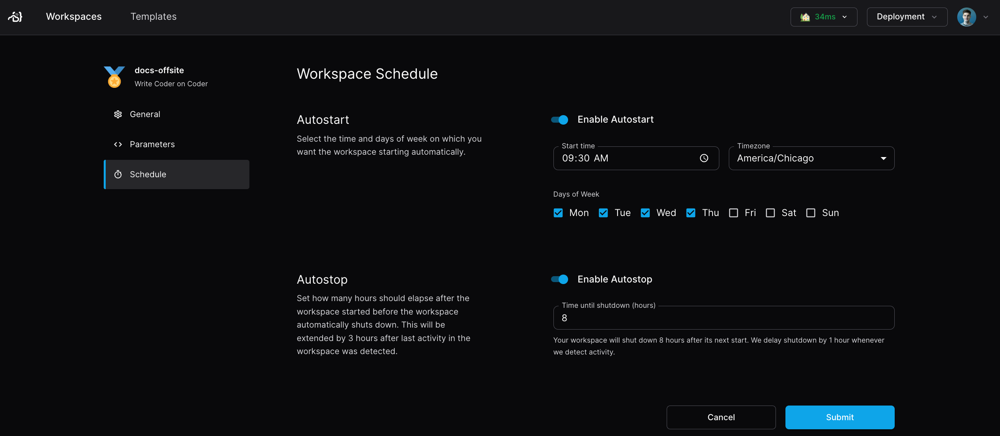
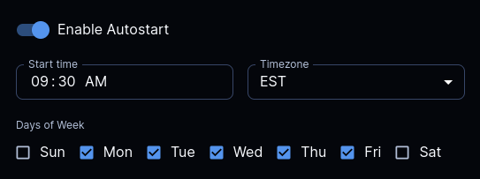
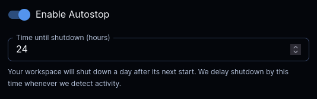
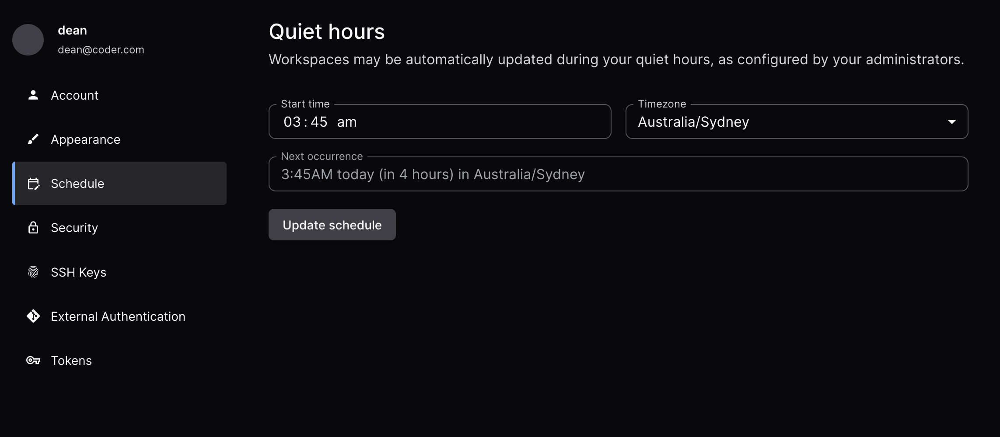

# Managing workspace schedules

Scheduling helps minimize cloud costs without sacrificing the availability of
your workspaces.

You can configure each workspace to automatically start in the morning, and
automatically stop once you log off. Coder also features an inactivity timeout,
configured by your template admin, which will stop a workspace when a user's
absence is detected.

To learn more workspace states and schedule, read the
[workspace lifecycle](../user-guides/workspace-lifecycle.md) documentation.

## Where to find the schedule settings

Click on any workspace the **Workspaces** tab of the dashboard, then go to
**Workspace settings** in the top right.

Then open the **Schedule** tab to see your workspace scheduling options.

## Autostart

Autostart must be enabled in the template settings by your administrator.

Use autostart to start a workspace at a specified time and which days of the
week. Also, you can choose your preferred timezone. Admins may restrict which
days of the week your workspace is allowed to autostart.

## Autostop

Use autostop to stop a workspace after a number of hours. Autostop won't stop a
workspace if you're still using it. It will wait for the user to become inactive
before checking connections again (1 hour by default). Template admins can
modify the inactivity timeout duration with the
[inactivity bump](#inactivity-timeout) template setting. Coder checks for active
connections in the IDE, SSH, Port Forwarding, and coder_app.

## Inactivity timeout

Workspaces will automatically shut down after a period of inactivity. This can
be configured at the template level, but is visible in the autostop description
for your workspace.

## Autostop requirement

> [!NOTE]
> Autostop requirement is an Enterprise and Premium feature.
> [Learn more](https://coder.com/pricing#compare-plans).

Licensed template admins may enforce a required stop for workspaces to apply
updates or undergo maintenance. These stops ignore any active connections or
inactivity bumps. Rather than being specified with a CRON, admins set a
frequency for updates, either in **days** or **weeks**. Workspaces will apply
the template autostop requirement on the given day **in the user's timezone**
and specified quiet hours (see below).

Admins: See the template schedule settings for more information on configuring
Autostop Requirement.

### User quiet hours

> [!NOTE]
> User quiet hours are an Enterprise and Premium feature.
> [Learn more](https://coder.com/pricing#compare-plans).

User quiet hours can be configured in the user's schedule settings page.
Workspaces on templates with an autostop requirement will only be forcibly
stopped due to the policy at the **start** of the user's quiet hours.

## Scheduling configuration examples

The combination of autostart, autostop, and the inactivity timer create a
powerful system for scheduling your workspace. However, synchronizing all of
them simultaneously can be somewhat challenging, here are a few example
configurations to better understand how they interact.

> [!NOTE]
> The inactivity timer must be configured by your template admin.

### Working hours

The intended configuration for autostop is to combine it with autostart, and set
a "working schedule" for your workspace. It's pretty intuitive:

If I want to use my workspace from 9 to 5 on weekdays, I would set my autostart
to 9:00 AM every day with an autostop of 9 hours. My workspace will always be
available during these hours, regardless of how long I spend away from my
laptop. If I end up working overtime and log off at 6:00 PM, the inactivity
timer will kick in, postponing the shutdown until 7:00 PM.

#### Basing solely on inactivity

If you'd like to ignore the TTL from autostop and have your workspace solely
function on inactivity, you can **set your autostop equal to inactivity
timeout**.

Let's say that both are set to 5 hours. When either your workspace autostarts or
you sign in, you will have confidence that the only condition for shutdown is 5
hours of inactivity.

## Dormancy

> [!NOTE]
> Dormancy is an Enterprise and Premium feature.
> [Learn more](https://coder.com/pricing#compare-plans).

Dormancy automatically deletes workspaces which remain unused for long
durations. Template admins configure an inactivity period after which your
workspaces will gain a `dormant` badge. A separate period determines how long
workspaces will remain in the dormant state before automatic deletion.

Licensed admins may also configure failure cleanup, which will automatically
delete workspaces that remain in a `failed` state for too long.
