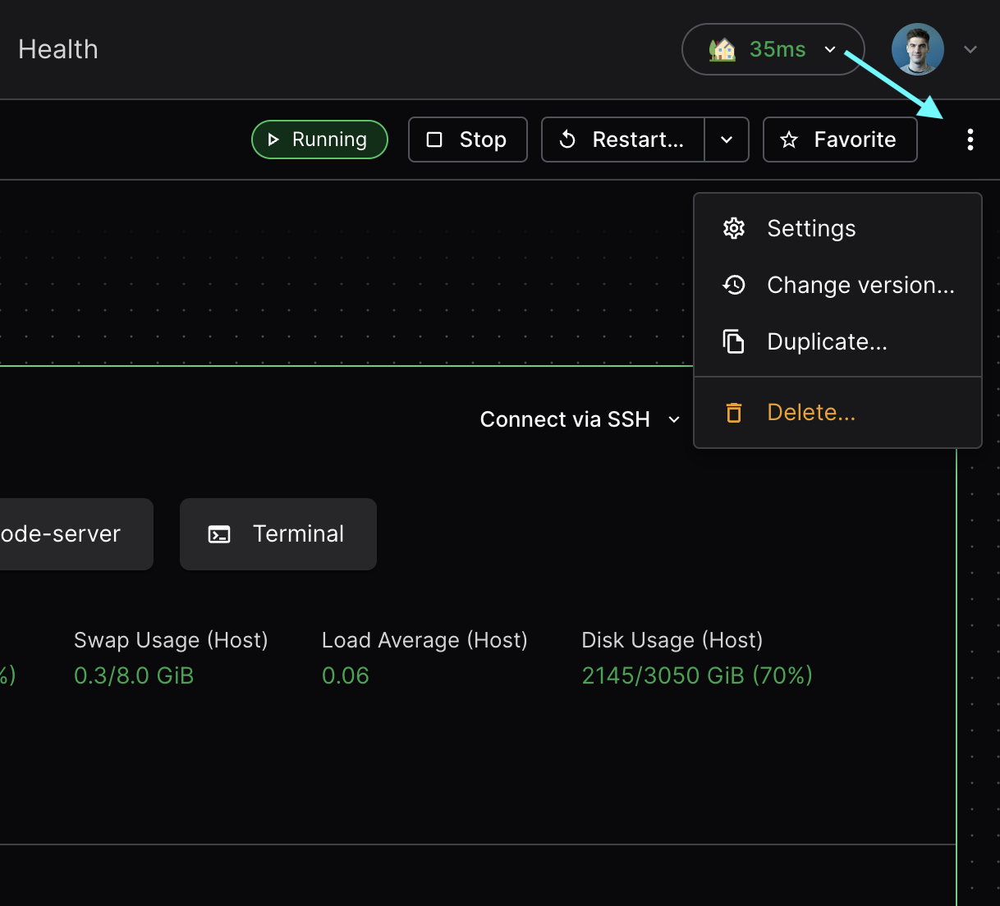
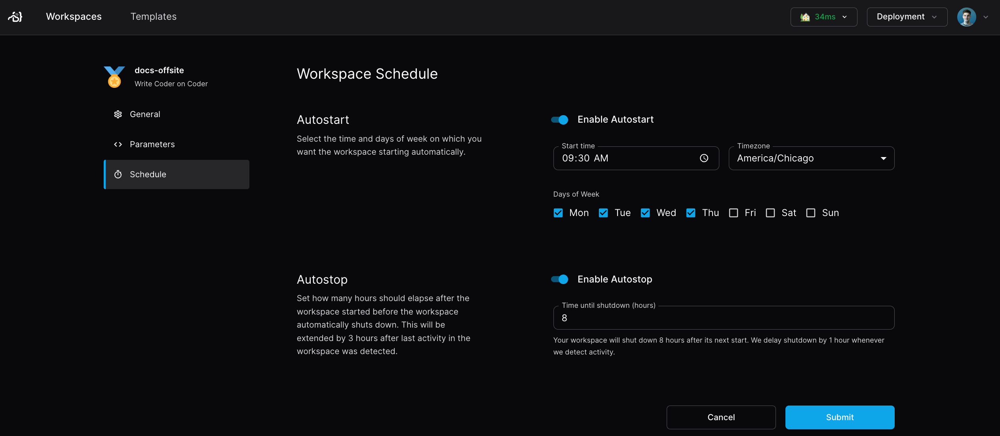
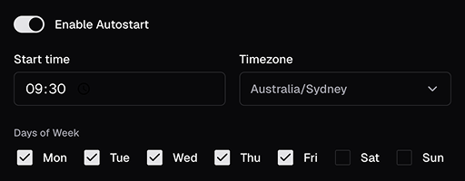
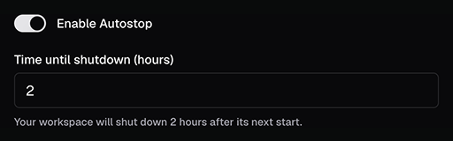
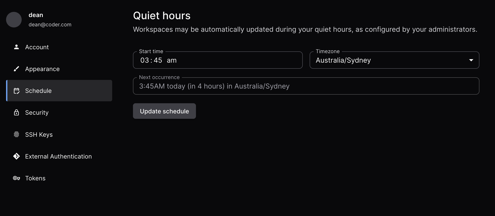

Scheduling helps minimize cloud costs without sacrificing the availability of
your workspaces.

You can configure each workspace to automatically start in the morning, and
automatically stop once you log off. Coder also features an inactivity timeout,
configured by your template admin, which will stop a workspace when a user's
absence is detected.

To learn more workspace states and schedule, read the
[workspace lifecycle](../user-guides/workspace-lifecycle.md) documentation.

## Where to find the schedule settings

Select any workspace the **Workspaces** tab of the dashboard, then go to
**Workspace settings** in the top right.

Then open the **Schedule** tab to see your workspace scheduling options.

## Autostart

Autostart must be enabled in the template settings by your administrator.

Use autostart to start a workspace at a specified time and which days of the
week. Also, you can choose your preferred timezone. Admins may restrict which
days of the week your workspace is allowed to autostart.

## Autostop

Use autostop to stop a workspace after a number of hours. Autostop won't stop a
workspace if you're still using it. It will wait for the user to become inactive
before checking connections again (1 hour by default). Template admins can
modify this duration with the **activity bump** template setting.

> [!NOTE]
> Autostop must be enabled on the template prior to workspace creation, it is not applied to existing running workspaces.

## Activity detection

Workspaces automatically shut down after a period of inactivity. The **activity bump**
duration can be configured at the template level and is visible in the autostop description
for your workspace.

> [!NOTE]
> Coder detects activity by tracking open **connections** to your workspace,
> not by watching for keystrokes, mouse movement, or CPU usage inside the
> workspace. An idle IDE window with an open connection counts as active; a
> closed connection counts as inactive, even if a background process is still
> running.

### What counts as workspace activity?

A workspace is considered "active" when Coder detects one or more active sessions with your workspace. Coder specifically tracks these session types:

- **VSCode sessions**: Using code-server or VS Code with a remote extension
- **JetBrains IDE sessions**: Using JetBrains Gateway or remote IDE plugins
- **Terminal sessions**: Using the web terminal (including reconnecting to the web terminal)
- **SSH sessions**: Connecting via `coder ssh` or SSH config integration
- **AI agent task status**: When a coding agent reports "working" status, the
  workspace deadline is extended

Activity is only detected when there is at least one active session. Each of
these session types is tracked as a simple connection counter: the counter
increments when the connection opens and decrements when it closes. Coder
does not look at what you're doing inside the session, so an **idle IDE,
terminal, or SSH session with an open connection still counts as active**,
and a workspace will not autostop while any of these connections remain open.

#### Idle connections still count as active

Because activity is connection-based rather than keystroke-based, the
following scenario is expected behavior:

1. You open VS Code, JetBrains, a terminal, or an SSH session against your
   workspace.
1. You stop typing and walk away for the night, but leave the window or
   terminal open.
1. The connection stays open, so the workspace keeps being marked active and
   the activity bump keeps extending the autostop deadline.
1. The workspace only becomes idle once that connection actually closes (you
   close the window/session, or the connection drops).

#### JetBrains Gateway and Toolbox

JetBrains Gateway and the JetBrains Toolbox app open many short-lived SSH
sessions in addition to a single persistent forwarded connection used for the
remote IDE backend. Coder ignores the short-lived sessions and instead tracks
that one persistent forwarded connection. In practice, this means:

- What keeps the workspace active is the persistent Gateway/Toolbox
  forwarding connection, not whether the JetBrains IDE window itself is open
  or focused.
- If that forwarding connection is still established (for example, Toolbox is
  running in the background with the connection maintained), the workspace is
  considered active even if you've closed the IDE window.
- If the forwarding connection drops (Toolbox is closed, the network drops,
  or your laptop sleeps), the workspace becomes idle and the autostop
  countdown begins, even if Toolbox or the IDE appear to still be "connected"
  from the client side.

#### Connections can drop without you closing them

A session only keeps a workspace active while its underlying connection is
open. Common situations that unexpectedly drop a connection, and therefore
mark the workspace idle earlier than a user might expect, include:

- Your laptop going to sleep, which can suspend or kill the network socket
  used by your IDE, terminal, or SSH client.
- Network interruptions, VPN drops, or Wi-Fi changes that break the
  underlying TCP connection.
- Client- or server-side connection timeouts when no traffic has been sent
  for a while.

If you want your end users to avoid unexpected autostops, document that they
should keep their laptop awake and their network connection stable while
using a workspace, and that closing an IDE window/SSH session is what starts
the idle countdown, not stepping away from the keyboard.

#### Background jobs and workspace apps

- **Long-running background processes** (build jobs, cron jobs, watchers,
  etc.) running _inside_ the workspace do not, by themselves, count as
  activity. Activity tracking only looks at connections into the workspace,
  not at what's running on it, so a long build with no open IDE/SSH/terminal
  connection will not prevent autostop.
- **Workspace apps opened through a URL** (for example a Jupyter notebook, or
  any other `coder_app`/port accessed via its web URL) are tracked
  separately from the session types above. Using a workspace app updates the
  workspace's last-used time, but it does **not** extend the autostop
  deadline the way an active IDE, terminal, or SSH connection does. This
  means a workspace can still autostop while a browser tab to an app like
  Jupyter is open, unless you also have an active IDE, terminal, or SSH
  session keeping it awake.
- **Accessing a port through a direct URL without an active session** (for
  example, hitting a forwarded port without going through an open app
  session) is not counted as activity at all.

### What does not count as workspace activity

The following actions do **not** count as workspace activity:

- Viewing workspace details in the dashboard
- Viewing or editing workspace settings
- Viewing build logs or audit logs
- Accessing ports through direct URLs without an active session
- Background agent statistics reporting (note: AI agent _task status_
  reporting is different and does count as activity, see above)
- Long-running background processes, cron jobs, or builds running inside the
  workspace with no open IDE/SSH/terminal connection
- Opening a workspace app (such as Jupyter) in a browser tab, unless paired
  with one of the tracked session types above

To avoid unexpected cloud costs, close your connections, this includes IDE windows, SSH sessions, and others, when you finish using your workspace.

### When does autostop actually trigger?

Autostop triggers once the workspace's autostop deadline passes. The
deadline is extended ("bumped") by the activity bump duration every time
Coder detects an active session from the list above, or an AI agent reports
a "working" status. Once **all** tracked connections close and no new one is
established before the deadline, the deadline stops being extended and the
workspace is stopped when it passes.

## Autostop requirement

> [!NOTE]
> Autostop requirement is a Premium feature.
> [Learn more](https://coder.com/pricing#compare-plans).

Licensed template admins may enforce a required stop for workspaces to apply
updates or undergo maintenance. These stops ignore any active connections or
inactivity bumps. Rather than being specified with a CRON, admins set a
frequency for updates, either in **days** or **weeks**. Workspaces will apply
the template autostop requirement on the given day **in the user's timezone**
and specified quiet hours (see below).

Admins: See the template schedule settings for more information on configuring
Autostop Requirement.

### User quiet hours

> [!NOTE]
> User quiet hours are a Premium feature.
> [Learn more](https://coder.com/pricing#compare-plans).

User quiet hours can be configured in the user's schedule settings page.
Workspaces on templates with an autostop requirement will only be forcibly
stopped due to the policy at the **start** of the user's quiet hours.

## Scheduling configuration examples

The combination of autostart, autostop, and the activity bump create a
powerful system for scheduling your workspace. However, synchronizing all of
them simultaneously can be somewhat challenging, here are a few example
configurations to better understand how they interact.

> [!NOTE]
> The activity bump must be configured by your template admin.

### Working hours

The intended configuration for autostop is to combine it with autostart, and set
a "working schedule" for your workspace. It's pretty intuitive:

If I want to use my workspace from 9 to 5 on weekdays, I would set my autostart
to 9:00 AM every day with an autostop of 9 hours. My workspace will always be
available during these hours, regardless of how long I spend away from my
laptop. If I end up working overtime and log off at 6:00 PM, the activity bump
will kick in, postponing the shutdown until 7:00 PM.

#### Basing solely on activity detection

If you'd like to ignore the TTL from autostop and have your workspace solely
function on activity detection, you can set your autostop equal to activity
bump duration.

Let's say that both are set to 5 hours. When either your workspace autostarts or
you sign in, you will have confidence that the only condition for shutdown is 5
hours of inactivity.

## Dormancy

> [!NOTE]
> Dormancy is a Premium feature.
> [Learn more](https://coder.com/pricing#compare-plans).

Dormancy automatically deletes workspaces that remain unused for long
durations. Template admins configure a dormancy threshold that determines how long
a workspace can be inactive before it is marked as `dormant`. A separate setting
determines how long workspaces will remain in the dormant state before automatic deletion.

Licensed admins may also configure failure cleanup, which will automatically
delete workspaces that remain in a `failed` state for too long.
