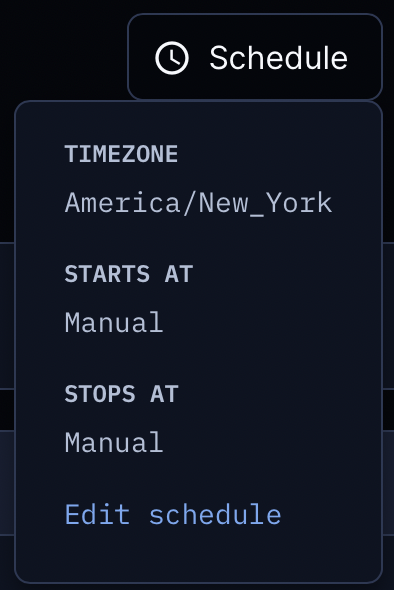
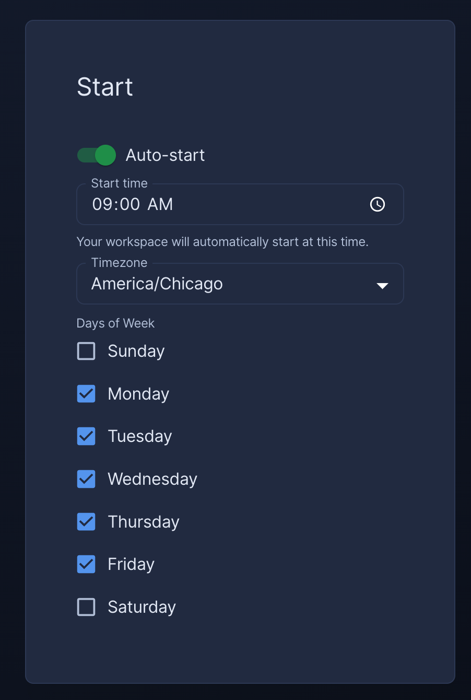
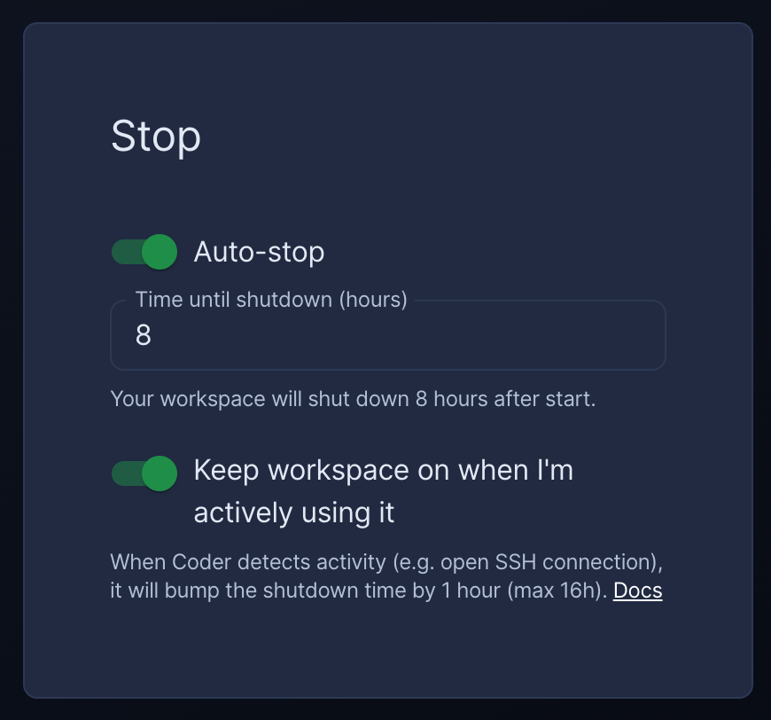

# Workspaces

Workspaces contain the IDEs, dependencies, and configuration information needed
for software development.

## Create workspaces

Each Coder user has their own workspaces created from [shared
templates](./templates.md):

```console
# create a workspace from the template; specify any variables
coder create --template="<templateName>" <workspaceName>

# show the resources behind the workspace and how to connect
coder show <workspace-name>
```

## IDEs

Coder [supports multiple IDEs](ides.md) for use with your workspaces.

## Workspace lifecycle

Workspaces in Coder are started and stopped, often based on whether there was
any activity or if there was a [template
update](./templates.md#start/stop) available.

Resources are often destroyed and re-created when a workspace is restarted,
though the exact behavior depends on the template. For more
information, see [Resource Persistence](./templates/resource-persistence.md).

> ⚠️ To avoid data loss, refer to your template documentation for information on
> where to store files, install software, etc., so that they persist. Default
> templates are documented in [../examples/templates](https://github.com/coder/coder/tree/c6b1daabc5a7aa67bfbb6c89966d728919ba7f80/examples/templates).
>
> You can use `coder show <workspace-name>` to see which resources are
> persistent and which are ephemeral.

When a workspace is deleted, all of the workspace's resources are deleted.

## Workspace scheduling

By default, workspaces are manually turned on/off by the user. However, a schedule
can be defined on a per-workspace basis to automate the workspace start/stop.



### Auto-start

The auto-start feature automates the workspace build at a user-specified time
and day(s) of the week. In addition, users can select their preferred timezone.



### Auto-stop

The auto-stop feature shuts off workspaces after given number of hours in the "on"
state. If Coder detects workspace connection activity, the auto-stop timer is bumped up
one hour. IDE, SSH, Port Forwarding, and coder_app activity trigger this bump.



## Updating workspaces

Use the following command to update a workspace to the latest template version.
The workspace will be stopped and started:

```console
coder update <workspace-name>
```

## Repairing workspaces

Use the following command to re-enter template input
variables in an existing workspace. This command is useful when a workspace fails
to build because its state is out of sync with the template.

```console
coder update <your workspace name> --always-prompt
```

## Logging

Coder stores macOS and Linux logs at the following locations:

| Service           | Location                         |
| ----------------- | -------------------------------- |
| `startup_script`  | `/tmp/coder-startup-script.log`  |
| `shutdown_script` | `/tmp/coder-shutdown-script.log` |
| Agent             | `/tmp/coder-agent.log`           |

---

## Up next

- Learn about how to personalize your workspace with [Dotfiles](./dotfiles.md)
- Learn about using [IDEs](./ides.md)
