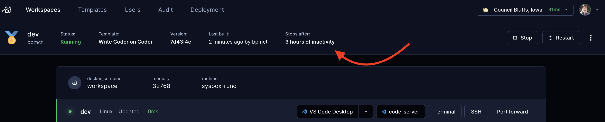
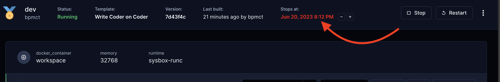
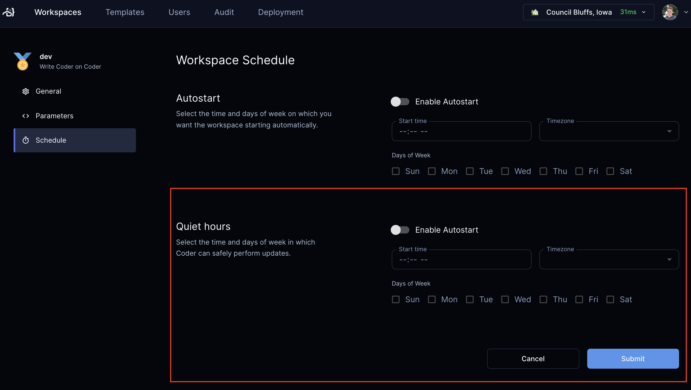

# Workspaces

Workspaces contain the IDEs, dependencies, and configuration information needed
for software development.

## Create workspaces

Each Coder user has their own workspaces created from [shared templates](./templates/index.md):

```console
# create a workspace from the template; specify any variables
coder create --template="<templateName>" <workspaceName>

# show the resources behind the workspace and how to connect
coder show <workspace-name>
```

## IDEs

Coder [supports multiple IDEs](./ides.md) for use with your workspaces.

## Workspace lifecycle

Workspaces in Coder are started and stopped, often based on whether there was
any activity or if there was a [template update](./templates/index.md#Start/stop) available.

Resources are often destroyed and re-created when a workspace is restarted,
though the exact behavior depends on the template. For more
information, see [Resource Persistence](./templates/resource-persistence.md).

> ⚠️ To avoid data loss, refer to your template documentation for information on
> where to store files, install software, etc., so that they persist. Default
> templates are documented in [../examples/templates](https://github.com/coder/coder/tree/c6b1daabc5a7aa67bfbb6c89966d728919ba7f80/examples/templates).
>
> You can use `coder show <workspace-name>` to see which resources are
> persistent and which are ephemeral.

When a workspace is deleted, all of the workspace's resources are deleted.

## Workspace auto-stop

In Coder, workspaces can auto-stop when the user is not actively using the workspace. By default, Coder recognizes the following actions as activity and will keep the workspace online:

- Open SSH connections (VS Code Extension, JetBrains Gateway, `coder ssh`)
- Open tunnels (`coder port-forward`)
- Open WebSockets (web terminal, [web IDEs](./ides/web-ides.md) such as code-server and JupyterLab)

> [Custom activity](#TODO) can be registered via Coder's REST API, such as an ongoing data science pipeline.

<!-- TODO. Document this. We may want to move to a custom activity section. See coder/coder[#8064](https://github.com/coder/coder/issues/8064) and coder/coder#5629 -->

Your workspace's auto-stop behavior can be seen in the dashboard. Template settings in Coder determine if users can alter their workspace schedules. 



### Max workspace lifetime (enterprise)

Workspaces may also have a max lifetime, which enforces a stop or restart even if you are actively using your workspace.



#### Quiet hours

To avoid interruptions, users can establish their "quiet hours", which are by default set from midnight to 4 AM, during which these actions occur. Users can also extend the deadline by up to 3 hours if they are in the middle of important work.

Example:

```text
Quiet hours: 12- 4:00 AM
11:30AM: User is notified their workspace is about to stop

user bumps
user bumps
user bumps

4 AM: workspace stops
```



<!-- NOTE: This will be in the "Account settings" page -->

Admin controls around workspace auto-stop are an enterprise feature. [Learn more here](./admin/template)

## Updating workspaces

Use the following command to update a workspace to the latest template version.
The workspace will be stopped and started:

```console
coder update <workspace-name>
```

## Repairing workspaces

Use the following command to re-enter template input
variables in an existing workspace. This command is useful when a workspace fails
to build because its state is out of sync with the template.

```console
coder update <your workspace name> --always-prompt
```

## Logging

Coder stores macOS and Linux logs at the following locations:

| Service           | Location                         |
| ----------------- | -------------------------------- |
| `startup_script`  | `/tmp/coder-startup-script.log`  |
| `shutdown_script` | `/tmp/coder-shutdown-script.log` |
| Agent             | `/tmp/coder-agent.log`           |

> Note: Logs are truncated once they reach 5MB in size.

## Workspace filtering

In the Coder UI, you can filter your workspaces using pre-defined filters or employing the Coder's filter query. Take a look at the following examples to understand how to use the Coder's filter query:

- To find the workspaces that you own, use the filter `owner:me`.
- To find workspaces that are currently running, use the filter `status:running`.

The following filters are supported:

- `owner` - Represents the `username` of the owner. You can also use `me` as a convenient alias for the logged-in user.
- `template` - Specifies the name of the template.
- `status` - Indicates the status of the workspace. For a list of supported statuses, please refer to the [WorkspaceStatus documentation](https://pkg.go.dev/github.com/coder/coder/codersdk#WorkspaceStatus).

---

## Up next

- Learn about how to personalize your workspace with [Dotfiles](./dotfiles.md)
- Learn about using [IDEs](./ides.md)
