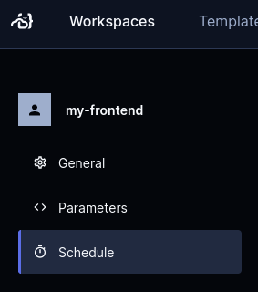

# Workspaces

A workspace is the environment that a developer works in. Developers in a team
each work from their own workspace and can use [multiple IDEs](./ides.md).

A developer creates a workspace from a [shared template](./templates/index.md).
This lets an entire team work in environments that are identically configured
and provisioned with the same resources.

## Creating workspaces

You can create a workspace in the UI. Log in to your Coder instance, go to the
**Templates** tab, find the template you need, and select **Create Workspace**.


When you create a workspace, you will be prompted to give it a name. You might
also be prompted to set some parameters that the template provides.

You can manage your existing templates in the **Workspaces** tab.

You can also create a workspace from the command line:

Each Coder user has their own workspaces created from
[shared templates](./templates/index.md):

```shell
# create a workspace from the template; specify any variables
coder create --template="<templateName>" <workspaceName>

# show the resources behind the workspace and how to connect
coder show <workspace-name>
```

## Workspace filtering

In the Coder UI, you can filter your workspaces using pre-defined filters or
Coder's filter query. For example, you can find the workspaces that you own or
that are currently running.

The following filters are supported:

- `owner` - Represents the `username` of the owner. You can also use `me` as a
  convenient alias for the logged-in user.
- `template` - Specifies the name of the template.
- `status` - Indicates the status of the workspace. For a list of supported
  statuses, see
  [WorkspaceStatus documentation](https://pkg.go.dev/github.com/coder/coder/codersdk#WorkspaceStatus).

## Starting and stopping workspaces

By default, you manually start and stop workspaces as you need. You can also
schedule a workspace to start and stop automatically.

To set a workspace's schedule, go to the workspace, then **Settings** >
**Schedule**.



Coder might also stop a workspace automatically if there is a
[template update](./templates/index.md#Start/stop) available.

### Autostart and autostop

Use autostart to start a workspace at a specified time and which days of the
week. Also, you can choose your preferred timezone.


Use autostop to stop a workspace after a number of hours. Autostop won't stop a
workspace if you're still using it. It waits for another hour before checking
again. Coder checks for active connections in the IDE, SSH, Port Forwarding, and
coder_app.


### Max lifetime (Deprecated, Enterprise)

Max lifetime is a template setting that determines the number of hours a
workspace will run before Coder automatically stops it, regardless of any active
connections. Use this setting to ensure that workspaces do not run in perpetuity
when connections are left open inadvertently.

Max lifetime is deprecated in favor of template autostop requirements. Templates
can choose to use a max lifetime or an autostop requirement during the
deprecation period, but only one can be used at a time. Coder recommends using
autostop requirements instead as they avoid restarts during work hours.

### Autostop requirement (enterprise)

Autostop requirement is a template setting that determines how often workspaces
using the template must automatically stop. Autostop requirement ignores any
active connections, and ensures that workspaces do not run in perpetuity when
connections are left open inadvertently.

Workspaces will apply the template autostop requirement on the given day in the
user's timezone and specified quiet hours (see below). This ensures that
workspaces will not be stopped during work hours.

The available options are "Days", which can be set to "Daily", "Saturday" or
"Sunday", and "Weeks", which can be set to any number from 1 to 16.

"Days" governs which days of the week workspaces must stop. If you select
"daily", workspaces must be automatically stopped every day at the start of the
user's defined quiet hours. When using "Saturday" or "Sunday", workspaces will
be automatically stopped on Saturday or Sunday in the user's timezone and quiet
hours.

"Weeks" determines how many weeks between required stops. It cannot be changed
from the default of 1 if you have selected "Daily" for "Days". When using a
value greater than 1, workspaces will be automatically stopped every N weeks on
the day specified by "Days" and the user's quiet hours. The autostop week is
synchronized for all workspaces on the same template.

Autostop requirement is disabled when the template is using the deprecated max
lifetime feature. Templates can choose to use a max lifetime or an autostop
requirement during the deprecation period, but only one can be used at a time.

### User quiet hours (enterprise)

User quiet hours can be configured in the user's schedule settings page.
Workspaces on templates with an autostop requirement will only be forcibly
stopped due to the policy at the start of the user's quiet hours.


Admins can define the default quiet hours for all users with the
`--default-quiet-hours-schedule` flag or `CODER_DEFAULT_QUIET_HOURS_SCHEDULE`
environment variable. The value should be a cron expression such as
`CRON_TZ=America/Chicago 30 2 * * *` which would set the default quiet hours to
2:30 AM in the America/Chicago timezone. The cron schedule can only have a
minute and hour component. The default schedule is UTC 00:00. It is recommended
to set the default quiet hours to a time when most users are not expected to be
using Coder.

Admins can force users to use the default quiet hours with the
[CODER_ALLOW_CUSTOM_QUIET_HOURS](./cli/server.md#allow-custom-quiet-hours)
environment variable. Users will still be able to see the page, but will be
unable to set a custom time or timezone. If users have already set a custom
quiet hours schedule, it will be ignored and the default will be used instead.

### Automatic updates

It can be tedious to manually update a workspace everytime an update is pushed
to a template. Users can choose to opt-in to automatic updates to update to the
active template version whenever the workspace is started.

Note: If a template is updated such that new parameter inputs are required from
the user, autostart will be disabled for the workspace until the user has
manually updated the workspace.


## Updating workspaces

After updating the default version of the template that a workspace was created
from, you can update the workspace.


If the workspace is running, Coder stops it, updates it, then starts the
workspace again.

On the command line:

```shell
coder update <workspace-name>
```

## Workspace resources

Workspaces in Coder are started and stopped, often based on whether there was
any activity or if there was a
[template update](./templates/index.md#Start/stop) available.

Resources are often destroyed and re-created when a workspace is restarted,
though the exact behavior depends on the template. For more information, see
[Resource Persistence](./templates/resource-persistence.md).

> ⚠️ To avoid data loss, refer to your template documentation for information on
> where to store files, install software, etc., so that they persist. Default
> templates are documented in
> [../examples/templates](https://github.com/coder/coder/tree/main/examples/templates).
>
> You can use `coder show <workspace-name>` to see which resources are
> persistent and which are ephemeral.

Typically, when a workspace is deleted, all of the workspace's resources are
deleted along with it. Rarely, one may wish to delete a workspace without
deleting its resources, e.g. a workspace in a broken state. Users with the
Template Admin role have the option to do so both in the UI, and also in the CLI
by running the `delete` command with the `--orphan` flag. This option should be
considered cautiously as orphaning may lead to unaccounted cloud resources.

## Repairing workspaces

Use the following command to re-enter template input variables in an existing
workspace. This command is useful when a workspace fails to build because its
state is out of sync with the template.

```shell
coder update <your workspace name> --always-prompt
```

First, try re-entering parameters from a workspace. In the Coder UI, you can
filter your workspaces using pre-defined filters or employing the Coder's filter
query. Take a look at the following examples to understand how to use the
Coder's filter query:

- To find the workspaces that you own, use the filter `owner:me`.
- To find workspaces that are currently running, use the filter
  `status:running`.


You can also do this in the CLI with the following command:

```shell
coder update <your workspace name> --always-prompt
```

If that does not work, a Coder admin can manually push and pull the Terraform
state for a given workspace. This can lead to state corruption or deleted
resources if you do not know what you are doing.

```shell
coder state pull <username>/<workspace name>
# Make changes
coder state push <username>/<workspace name>
```

## Logging

Coder stores macOS and Linux logs at the following locations:

| Service           | Location                         |
| ----------------- | -------------------------------- |
| `startup_script`  | `/tmp/coder-startup-script.log`  |
| `shutdown_script` | `/tmp/coder-shutdown-script.log` |
| Agent             | `/tmp/coder-agent.log`           |

> Note: Logs are truncated once they reach 5MB in size.

## Up next

- Learn about how to personalize your workspace with [Dotfiles](./dotfiles.md)
- Learn about using [IDEs](./ides.md)
