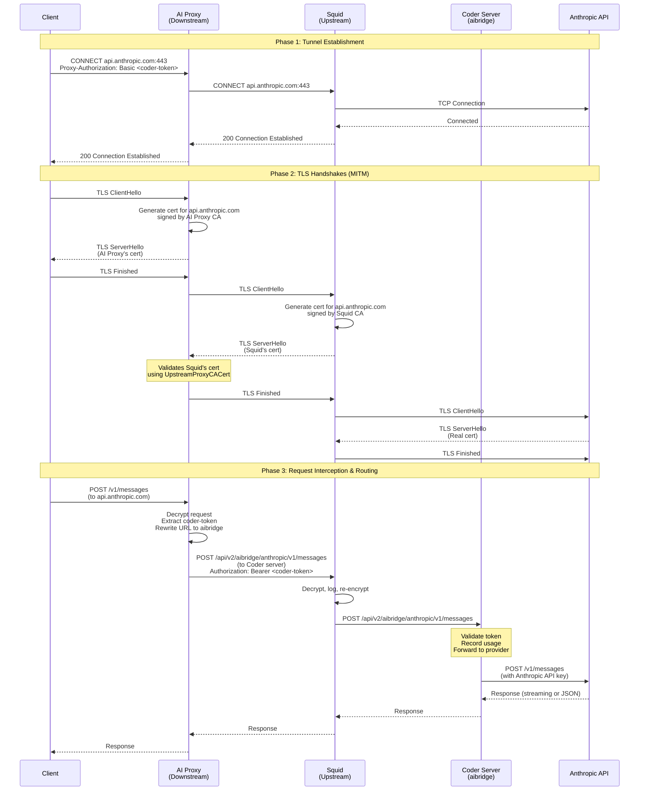
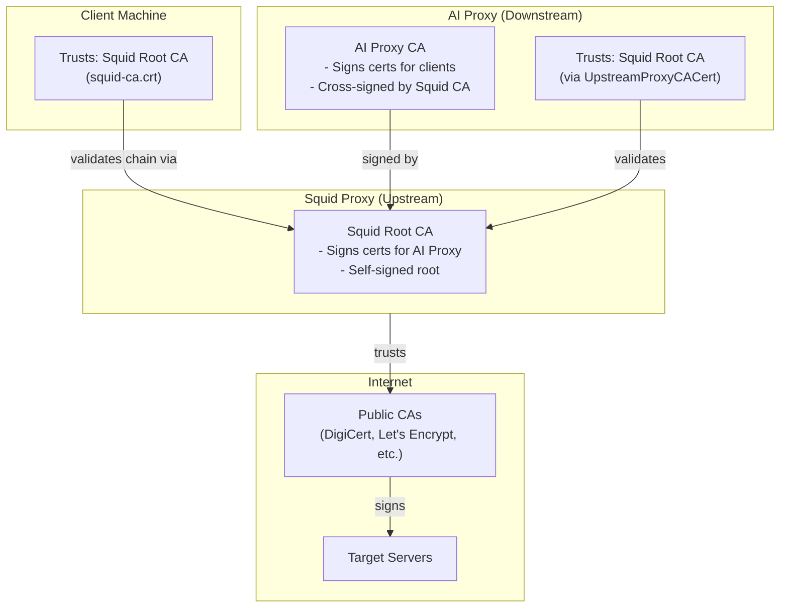
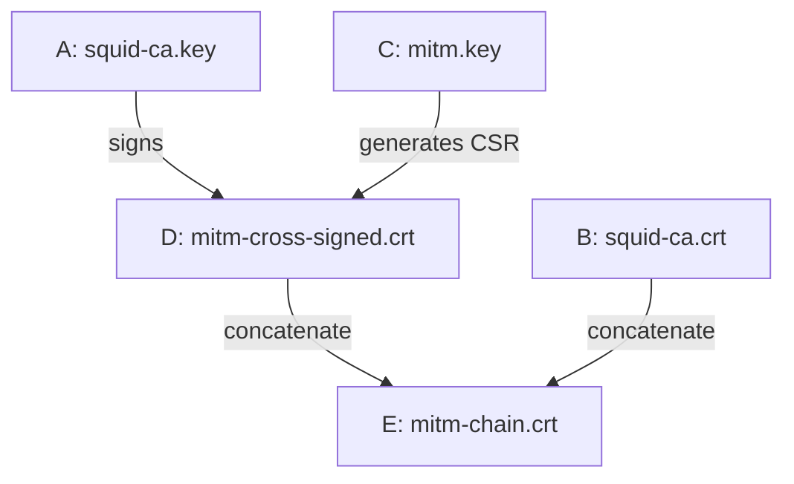
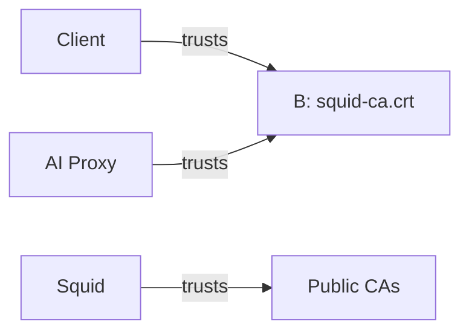
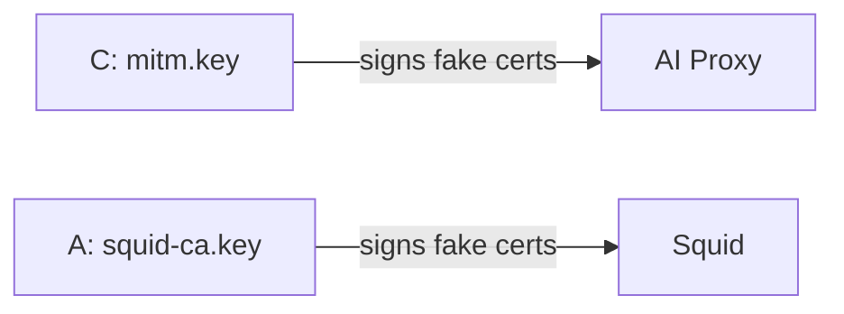

# AI Proxy Certificate Setup

This document describes how to set up MITM certificates for the AI proxy, including cross-signing for proxy chaining scenarios.

## Overview

The AI proxy uses MITM (Man-in-the-Middle) to intercept HTTPS traffic to AI providers. When chaining through an upstream SSL-bumping proxy (like Squid), both proxies need coordinated certificate trust.

## Certificate Hierarchy

```
┌─────────────────────────────────────┐
│  Upstream Proxy Root CA             │
│  (e.g., Squid Root CA)              │
│  Self-signed                        │
└──────────────┬──────────────────────┘
               │ signs
               ▼
┌─────────────────────────────────────┐
│  Downstream Proxy CA (intermediate) │
│  (AI Proxy's MITM CA)               │
│  Cross-signed by upstream           │
└──────────────┬──────────────────────┘
               │ signs
               ▼
┌─────────────────────────────────────┐
│  Leaf certificates                  │
│  (Generated per-site for MITM)      │
└─────────────────────────────────────┘
```

## Creating a New CA Key Pair

### 1. Generate a new private key

```sh
openssl genrsa -out mitm.key 2048
chmod 400 mitm.key
```

### 2. Create a self-signed CA certificate

```sh
openssl req -new -x509 -days 365 \
  -key mitm.key \
  -out mitm.crt \
  -subj "/CN=AI Proxy CA"
```

## Cross-Signing Against an Existing CA

Cross-signing allows your CA to be trusted by clients that already trust another root CA. This is essential for proxy chaining where an upstream proxy does SSL bumping.

### 1. Create a Certificate Signing Request (CSR) from your key

```sh
openssl req -new \
  -key mitm.key \
  -out mitm.csr \
  -subj "/CN=AI Proxy CA"
```

### 2. Create an extensions file for CA certificates

```sh
cat > ca_extensions.cnf << 'EOF'
basicConstraints=CA:TRUE
keyUsage=keyCertSign,cRLSign
EOF
```

### 3. Sign the CSR with the upstream CA

```sh
openssl x509 -req \
  -in mitm.csr \
  -CA upstream-ca.crt \
  -CAkey upstream-ca.key \
  -CAcreateserial \
  -out mitm-cross-signed.crt \
  -days 365 \
  -extfile ca_extensions.cnf
```

### 4. Create a certificate chain file

The chain file should contain your certificate followed by the upstream CA:

```sh
cat mitm-cross-signed.crt upstream-ca.crt > mitm-chain.crt
```

### 5. Verify the chain

```sh
# Check the signing relationship
openssl x509 -in mitm-cross-signed.crt -noout -subject -issuer

# Verify the chain is valid
openssl verify -CAfile upstream-ca.crt mitm-cross-signed.crt
```

Expected output:
```
subject=CN = AI Proxy CA
issuer=CN = Upstream Root CA
mitm-cross-signed.crt: OK
```

## Proxy Chaining Architecture

### Request Flow



### Trust Relationships



### Certificate Files Reference

| ID | File                                       | Purpose                                           | Used by                                        |
|----|--------------------------------------------|---------------------------------------------------|------------------------------------------------|
| A  | Upstream Root CA key (`squid-ca.key`)      | Signs intermediate CA; Signs fake certs for Squid | Upstream Proxy (Squid)                         |
| B  | Upstream Root CA cert (`squid-ca.crt`)     | Trust anchor for entire chain                     | AI Proxy (upstream trust); Client (root trust) |
| C  | AI Proxy CA key (`mitm.key`)               | Signs fake certificates for client connections    | AI Proxy                                       |
| D  | AI Proxy CA cert (`mitm-cross-signed.crt`) | Intermediate CA, signed by upstream root          | AI Proxy (part of chain served to clients)     |
| E  | Certificate chain (`mitm-chain.crt`)       | D + B combined, full chain                        | AI Proxy (loads as CA cert file)               |

> **Note**: Clients only need to trust `squid-ca.crt` (B). If this is already in the system trust store (e.g., corporate proxy CA), no additional client configuration is needed.

### Certificate Signing (Setup Time)

How the cross-signed certificate chain is created:



### Certificate Trust (Runtime)



> Clients validate the chain: leaf cert → D (intermediate) → B (root). Only B needs to be trusted.

### Certificate Usage (Runtime)

Which keys sign fake certificates:



## Troubleshooting

### Verifying Cross-Signing

Check that your certificate shows a different issuer than subject:

```sh
openssl x509 -in mitm-cross-signed.crt -noout -subject -issuer
```

If both are the same, the certificate is self-signed, not cross-signed.

### Testing the Chain

```sh
# Test with curl through the proxy
curl -x http://localhost:8888 \
  --cacert /path/to/ai-proxy-ca.crt \
  https://api.anthropic.com/v1/messages
```
