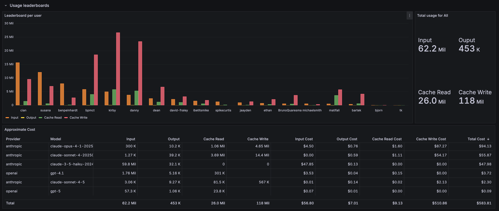

# AI Bridge Grafana Dashboard

A sample Grafana dashboard for monitoring AI Bridge token usage, costs, and cache hit rates in Coder.

The dashboard includes three main sections with multiple visualization panels:

**Usage Leaderboards** - Track token consumption across your organization:
- Bar chart showing input, output, cache read, and cache write tokens per user
- Total usage statistics with breakdowns by token type

**Approximate Cost Table** - Estimate AI spending by joining token usage with live pricing data from LiteLLM:
- Per-provider and per-model cost breakdown
- Input, output, cache read, and cache write costs
- Total cost calculations with footer summaries

**Interceptions** - Monitor AI API calls over time:
- Time-series bar chart of interceptions by user
- Total interception count

**Prompts & Tool Calls Details** - Inspect actual AI interactions:
- User Prompts table showing all prompts sent to AI models with timestamps
- Tool Calls table displaying MCP tool invocations, inputs, and errors (color-coded for failures)

All panels support filtering by time range, username, provider (Anthropic, OpenAI, etc.), and model using regex patterns.

## Setup

1. **Install the Infinity plugin**: `grafana-cli plugins install yesoreyeram-infinity-datasource`

2. **Configure data sources**:
   - **PostgreSQL datasource** (`coder-observability-ro`): Connect to your Coder database with read access to `aibridge_interceptions`, `aibridge_token_usages`, `aibridge_user_prompts`, `aibridge_tool_usages` and `users`
   - **Infinity datasource** (`litellm-pricing-data`): Point to `https://raw.githubusercontent.com/BerriAI/litellm/refs/heads/main/model_prices_and_context_window.json` for model pricing data

3. **Import**: Download [`dashboard.json`](https://raw.githubusercontent.com/coder/coder/main/examples/monitoring/dashboards/grafana/aibridge/dashboard.json) from this directory, then in Grafana navigate to **Dashboards** → **Import** → **Upload JSON file**. Map the data sources when prompted.

## Features

- Token usage leaderboards by user, provider, and model
- Filterable by time range, username, provider, and model (regex supported)
