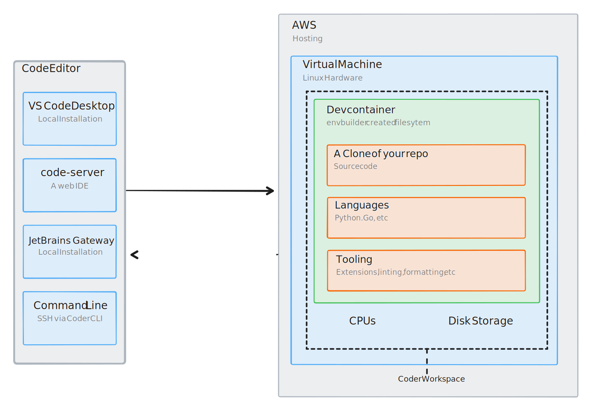

# Remote Development on AWS EC2 VMs using a Devcontainer

Provision AWS EC2 VMs as [Coder workspaces](https://coder.com/docs) with this example template.


<!-- TODO: Add screenshot -->

## Prerequisites

### Authentication

By default, this template authenticates to AWS using the provider's default [authentication methods](https://registry.terraform.io/providers/hashicorp/aws/latest/docs#authentication-and-configuration).

The simplest way (without making changes to the template) is via environment variables (e.g. `AWS_ACCESS_KEY_ID`) or a [credentials file](https://docs.aws.amazon.com/cli/latest/userguide/cli-configure-files.html#cli-configure-files-format). If you are running Coder on a VM, this file must be in `/home/coder/aws/credentials`.

To use another [authentication method](https://registry.terraform.io/providers/hashicorp/aws/latest/docs#authentication), edit the template.

## Required permissions / policy

The following sample policy allows Coder to create EC2 instances and modify
instances provisioned by Coder:

```json
{
	"Version": "2012-10-17",
	"Statement": [
		{
			"Sid": "VisualEditor0",
			"Effect": "Allow",
			"Action": [
				"ec2:GetDefaultCreditSpecification",
				"ec2:DescribeIamInstanceProfileAssociations",
				"ec2:DescribeTags",
				"ec2:DescribeInstances",
				"ec2:DescribeInstanceTypes",
				"ec2:CreateTags",
				"ec2:RunInstances",
				"ec2:DescribeInstanceCreditSpecifications",
				"ec2:DescribeImages",
				"ec2:ModifyDefaultCreditSpecification",
				"ec2:DescribeVolumes"
			],
			"Resource": "*"
		},
		{
			"Sid": "CoderResources",
			"Effect": "Allow",
			"Action": [
				"ec2:DescribeInstanceAttribute",
				"ec2:UnmonitorInstances",
				"ec2:TerminateInstances",
				"ec2:StartInstances",
				"ec2:StopInstances",
				"ec2:DeleteTags",
				"ec2:MonitorInstances",
				"ec2:CreateTags",
				"ec2:RunInstances",
				"ec2:ModifyInstanceAttribute",
				"ec2:ModifyInstanceCreditSpecification"
			],
			"Resource": "arn:aws:ec2:*:*:instance/*",
			"Condition": {
				"StringEquals": {
					"aws:ResourceTag/Coder_Provisioned": "true"
				}
			}
		}
	]
}
```

## Architecture

This template provisions the following resources:

- AWS Instance

Coder uses `aws_ec2_instance_state` to start and stop the VM. This example template is fully persistent, meaning the full filesystem is preserved when the workspace restarts. See this [community example](https://github.com/bpmct/coder-templates/tree/main/aws-linux-ephemeral) of an ephemeral AWS instance.

> **Note**
> This template is designed to be a starting point! Edit the Terraform to extend the template to support your use case.

## Caching

To speed up your builds, you can use a container registry as a cache.
When creating the template, set the parameter `cache_repo` to a valid Docker repository in the form `host.tld/path/to/repo`.

See the [Envbuilder Terraform Provider Examples](https://github.com/coder/terraform-provider-envbuilder/blob/main/examples/resources/envbuilder_cached_image/envbuilder_cached_image_resource.tf/) for a more complete example of how the provider works.

> [!NOTE]
> We recommend using a registry cache with authentication enabled.
> To allow Envbuilder to authenticate with a registry cache hosted on ECR, specify an IAM instance
> profile that has read and write access to the given registry. For more information, see the
> [AWS documentation](https://docs.aws.amazon.com/IAM/latest/UserGuide/id_roles_use_switch-role-ec2_instance-profiles.html).
>
> Alternatively, you can specify the variable `cache_repo_docker_config_path`
> with the path to a Docker config `.json` on disk containing valid credentials for the registry.

## code-server

`code-server` is installed via the [`code-server`](https://registry.coder.com/modules/code-server) registry module. For a list of all modules and templates pplease check [Coder Registry](https://registry.coder.com).
