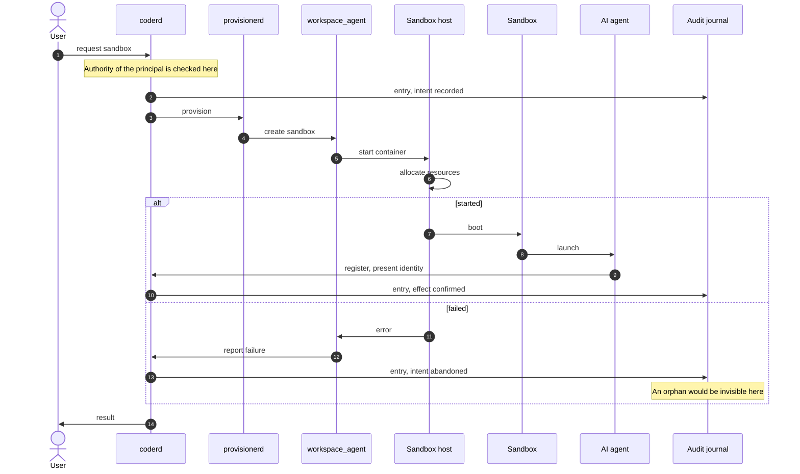

# Diagram tooling smoke test

Not a design artifact. The participants and messages below are illustrative
placeholders chosen to make the diagram wide. Nothing here is a design
position.

Purpose: compare d2 and mermaid for wide sequence diagrams, and verify that
both preview locally in VS Code.

## What to install to preview each

- **d2, standalone files**: extension `terrastruct.d2`. Previews a `.d2` file
  on its own with `Ctrl+Shift+D`. Requires the `d2` binary on the machine where
  the extension runs, which under Remote-SSH is the workspace, not your laptop.
  Already installed here at `~/.local/share/mise/shims/d2`, version 0.7.1.
- **d2, inside markdown**: extension `kdheepak.d2-markdown-preview`. This is
  the one that renders fenced `d2` blocks in the markdown preview pane. The
  official `terrastruct.d2` extension advertises this but does not reliably
  deliver it: it works by reassigning `md.options.highlight`, which VS Code's
  own markdown renderer also sets, so whichever assigns last wins.
- **mermaid**: extension `bierner.markdown-mermaid`. Bundles mermaid.js, so it
  needs no binary.

Two gotchas, both cost time to find:

1. `terrastruct.d2` probes for the `d2` binary at startup
   (`D2.checkForInstallAtStart` defaults to true). If you install `d2` after
   the editor is already running, the extension stays in a "not installed"
   state until you run **Developer: Reload Window**.
2. Setting `D2.execPath` to an absolute path is worth doing regardless, since
   the extension host's environment need not match your shell's.

## Same diagram in d2

```d2
seq: Sandbox creation (tooling smoke test) {
  shape: sequence_diagram

  user: User
  coderd: coderd
  prov: provisionerd
  wsagent: workspace_agent
  host: Sandbox host
  sandbox: Sandbox
  aiagent: AI agent
  journal: Audit journal

  user -> coderd: request sandbox
  coderd.note: Authority of the principal is checked here
  coderd -> journal: entry, intent recorded
  coderd -> prov: provision

  prov -> wsagent: create sandbox
  wsagent -> host: start container
  host -> host: allocate resources

  outcome: {
    started: {
      host -> sandbox: boot
      sandbox -> aiagent: launch
      aiagent -> coderd: register, present identity
      coderd -> journal: entry, effect confirmed
    }

    failed: {
      host -> wsagent: error
      wsagent -> coderd: report failure
      coderd -> journal: entry, intent abandoned
      journal.note: An orphan would be invisible here
    }
  }

  coderd -> user: result
}
```

## Same diagram in mermaid



## Measured

Eight participants, rendered by d2:

- dagre layout: 1695 by 2076 pixels
- elk layout: 1695 by 2076 pixels, identical

The two layout engines produce the same output because d2 sequence diagrams
use a dedicated sequence layout rather than a general graph layout. Choosing
between dagre and elk therefore has no effect on this diagram type.

At roughly 210 pixels per participant, twelve participants would be about
2500 pixels wide and sixteen about 3400.
