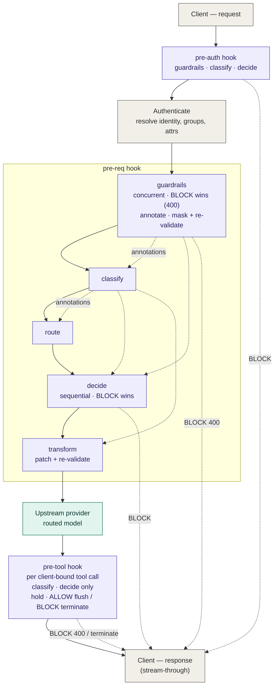

### New thoughts

- we don't need a new "route" abstraction instead of addressing providers directly;
for now we can just attach policy pipelines to provider routes, because that means
we don't need to rewrite the payload if switch between providers/endpoints

### Revision note (2026-06-11): stage model & staged rollout

This revision resolves the "guardrails are suspiciously close to kinds" tension
and redesigns pre-production evaluation. Headlines (details inline, marked
[DECIDED, revised 2026-06] where they supersede earlier decisions):

- **Two-axis stage model.** Every pipeline member is a *stage*: (substrate:
  Rego | networked adapter) x (effect mask over one shared result type). Kinds
  are single-effect Rego stages; guardrails are multi-effect networked stages
  pinned to the head slot. Guardrails are still not kinds, but they are no
  longer an exception, just a different point in the lattice (§2).
- **Unified stage-result algebra.** Policies and guardrails yield the same
  `StageResult`; one reducer/applier enforces everything, and failures are
  synthesized into ordinary results via `fail_mode` (no special-cased timeout)
  (§2).
- **Annotation namespacing + immutable names.** All producers write under
  `input.annotations.<stage_name>`; stage names are immutable at create (§3).
- **Staged rollout via version-targeted evaluation.** No pending pointer, no
  shadow mode: `activate` defaults to false, activation propagates by *minting*
  (never promoting) pipeline versions on the tip, and an owner-only header
  (`X-Coder-AI-Gateway-Pipeline-Version`) evaluates any version against real
  traffic before an explicit promote (§10.1, §10.9).

### Customer feedback note (2026-06-11): priorities — recorded, no scope change

Direct feedback from a customer call (security-team-led, GitLab-pipeline-driven
shop with test/prod environments). **Recorded as prioritisation signal only**:
no decision, phasing, or scope in this document is changed by this note. Their
ranked importance:

1. **Guardrails / AI governance** — explicitly the top priority for their
   security team relative to the other policy types.
2. **Terraform + API-first management** — must be API/Terraform-first from day
   one; click-based editing is viewed as risky for large-scale production use.
   Cue: ship the control plane (API coverage + Terraform provider) before
   investing heavily in point-and-click UX.
3. **Automated testing / CI integration** — automated tests against pipelines
   plus CI-style evaluation checks before changes are merged or promoted;
   policy validation should fit CI/CD rather than rely mainly on manual live
   testing. (Incorporated as **FR22**.)
4. **Audit logging + traceability** — enough logging to understand what
   happened in real time and support incident response, including tracing
   actions back to user or agent behavior. (Incorporated into **FR17**.)
5. **Observability of policy impact** — see the impact of policies as they
   run: evaluation volume, failures, and spikes in blocked traffic after
   changes. (Incorporated as **FR23**.)
6. **Low latency / performance safety** — important, but as a guardrail rather
   than the top differentiator; the system cannot noticeably degrade user
   experience.

Additional cues noted (not acted on here): bias phase one toward
security/governance use cases (guardrails, logging, policy auditability) over
prompt-transform / model-routing polish; invest in safe rollout + block-rate
visibility for confidence when enabling rules at scale; preserve backward
compatibility because policy breakage could affect many users (the versioned
envelopes + deterministic testing of §10.4 match this expectation).

# Coder AI Gateway — Policy Engine Design Summary

A consolidated record of the design decisions reached so far, plus requirements,
limitations, benefits, and performance considerations. Marked **[DECIDED]**,
**[LEANING]**, or **[OPEN]** where useful.

> **Substrate decision (settled):** Rego, evaluated by OPA embedded as a Go
> library. Chosen primarily for **architectural simplicity** — Coder already
> depends on OPA internally, so the engine, the team's familiarity, and existing
> tooling are reused — and for Rego's expressiveness, operator-authored
> modularity, capable transforms, and mature tooling. The accepted trade-offs vs
> CEL are **weaker static validation** (Rego is dynamically typed) and **engine
> lock-in** (Rego ≈ OPA). See §8.

---

## 1. Overview

A policy engine that sits **inline in the AI Gateway request/response path**.
Any request flowing through a route can be subjected to configurable policies
that **allow, block, flag, log, or transform** the request/response. Policies
must be safe to run on **untrusted end-user input**, fast, validatable, testable,
and configurable as code.

---

## 2. Core architectural decisions

- **[DECIDED] Substrate: Rego, via OPA embedded as a Go library** (the `rego`
  package / prepared queries — not the OPA server). Reuses the OPA dependency
  Coder already ships internally. Evaluated on the native topdown interpreter
  (NOT compiled to Wasm — Wasm is slower here; see §9). Chosen over CEL,
  Rego-via-Wasm, AssemblyScript, QuickJS-in-wasm, and Goja (see §8).
- **[DECIDED] Policies are hermetic.** No shared state, no cross-policy
  influence, no network/IO from inside a policy. (Rego *can* `http.send`; this
  must be **explicitly disabled** along with other network/time built-ins to
  preserve the guarantee — see §7.) Composition is via classification
  annotations threaded by the host (see §3), not policies calling each other.
- **[DECIDED] Typed policy *kinds*.** A kind = `(input schema + version, output
  schema, host applier)`. The Rego evaluation core is identical for every kind;
  only the output document and the applier vary. Adopted kinds:
  - **Decision** → a required `verdict` rule (+ an optional `message` rule) →
    applier maps the verdict to a pipeline action and surfaces the message to
    the user on a block.
  - **Transform** → a rewritten `body` and/or `headers` overrides → applier
    rewrites the outgoing request/response.
  - **Classification** → a structured label/score document → applier writes
    annotations into metadata/audit/telemetry and the host threads them into
    downstream stages' envelopes.
  - **Routing** → a destination directive (model/provider) → applier overrides
    the upstream target.
  - Out of scope: budget/quota (handled elsewhere), cache-control, approval/HITL.
    Param-override / redaction / tool-scoping are constrained transforms, not
    separate kinds.
- **[DECIDED] Decision verdict model (v1):** `ALLOW | LOG | BLOCK`, exposed as a
  package's `verdict` rule (`data.gateway.<name>.verdict`, with `default verdict
  := "ALLOW"`). ALLOW/LOG are pass-through; **LOG writes the verdict to the log
  stream** (no other side effect); BLOCK stops the request. Precedence across a
  pipeline: **BLOCK > LOG > ALLOW**, reduced over results. `FLAG` is deferred to
  an eventual requirement (§12). NOTE: within a single policy, overlapping
  `verdict` conditions that yield different values are a Rego **conflict error** —
  conditions must be mutually exclusive or use `else` (see §7).
- **[DECIDED] Optional decision `message` (v1) [AS BUILT].** A decide policy may
  define an optional `message` string rule (`data.gateway.message`) to override
  the generic "request blocked by policy" text shown to the user on a block. It
  is evaluated only on the blocking path; an undefined, blank, or non-string
  value falls back to the host default and never errors or alters the verdict
  (so an author's message bug cannot, e.g. under fail-open, downgrade a
  deliberate block). The verdict is the contract; the message is best-effort.
- **[DECIDED] Transform model: the policy computes the change; a Go host utility
  applies it.** Rego builds the rewritten body directly with `object.remove` /
  `object.union` / object & array comprehensions, or emits RFC 6902 ops, or
  applies them in-language via `json.patch`. The host **re-validates** the
  mutated body against the provider schema before forwarding. A transform may
  additionally define an optional `headers` rule (`data.gateway.headers`, an
  object of string values) to set/replace outgoing request headers; the host
  applies them before the interceptor captures the request, and
  `intercept.PrepareClientHeaders` strips transport, auth, and hop-by-hop
  headers, so a policy cannot inject credentials or corrupt framing this way.
  Both `body` and `headers` are optional and independent. [AS BUILT]
- **[DECIDED] Input envelope:** typed per kind *and per hook* (see §3), always
  carrying identity / groups / attributes (RBAC + ABAC) once available, plus
  request-specific fields and, for traversal policies, the raw `/v1/messages`
  body. Surfaced to Rego under `input.*`.
- **[DECIDED] Enrichment is implemented by advisory guardrails (see §3a).**
  Policies never make network calls. External signals (e.g. a moderation score)
  are produced by a networked **guardrail** running at the head of a hook and
  threaded into the envelope as annotations; the policy is a pure function over
  them. This replaces the earlier "host pre-fetches an opaque signal" wording:
  there is one enrichment mechanism, the guardrail stage, not a separate ad-hoc
  pre-fetch.
- **[DECIDED, revised 2026-06] Two-axis stage model. Guardrails: SEPARATE
  transport + config, SHARED stage plumbing, NOT a kind (see §3a).** Every
  pipeline member is a *stage*, classified on two orthogonal axes:
  **substrate** (hermetic Rego vs networked adapter) and **effect mask** (which
  fields of the shared `StageResult` it may emit; next bullet). A *kind* is a
  single-effect Rego stage; a *guardrail* is a multi-effect networked stage
  pinned to the head-of-hook slot. A guardrail is not a kind because it differs
  in **substrate** (network adapter vs Rego, concurrent vs sequential, its own
  timeout/failure envelope, secret-bearing config), not merely in output shape;
  making it a kind would poison every "for each kind" assumption (validation
  gate, shape guards, cardinality indexes) while unifying only a name. Its
  multi-effect result is a *concession to vendor wire formats* (one HTTP
  response carries score + mask + verdict and cannot be un-bundled), not a
  convenience to emulate in Rego; hermetic kinds stay decomposed (single
  effect each). Networked checks are host-orchestrated (per-guardrail network
  timeout, fail-open/closed). There is no industry-standard guardrail I/O
  format, so they integrate via per-provider **adapters composed over a base**
  modelled on litellm's *Generic Guardrail API* (extract texts/tools/
  tool_calls/structured messages → POST → block / pass /
  intervene-with-modification). Each guardrail runs in one of two modes:
  **advisory** (annotate-only; a Rego `decide` policy turns the signal into a
  verdict) or **enforcing** (may `BLOCK`/mutate directly *and* always
  annotates). What is genuinely separate is the transport and the
  (secret-bearing) config persistence, not the abstraction. A guardrail
  `BLOCK` returns **HTTP 400**, as does a policy `BLOCK` (both block paths
  return 400). [AS BUILT, except the unified result type below]
- **[DECIDED] Unified stage-result algebra.** Every stage, Rego policy or
  guardrail, projects into one result type, enforced by a **single
  reducer/applier**:

  ```
  StageResult {
    verdict:     ALLOW | LOG | BLOCK   // default ALLOW
    message:     string                // surfaced to the user on BLOCK
    annotations: map[string]any        // unioned under the stage's namespace
    body_patch:  optional              // chained, re-validated per mutation point
    route:       optional              // pre-req only, single slot
  }
  ```

  A stage *type* is an **effect mask** over this struct (classify =
  annotations-only; decide = verdict+message; route = route; transform =
  body_patch+headers; advisory guardrail = annotations; enforcing guardrail =
  verdict+message+annotations+body_patch), enforced at registration and
  defensively at load, exactly like kind-validity-by-hook. The reducer,
  short-circuit, audit record, and HTTP mapping are written once; every stage,
  including a dead vendor, produces exactly one result. **Failures are result
  synthesis, not a parallel error path:** any stage failure (eval error,
  network error, timeout, conflict) is normalized through the membership's
  `fail_mode` into an ordinary result:
  `fail_closed → {verdict: BLOCK, message: <generic>}`;
  `fail_open → {verdict: LOG, message: <error summary>}` (LOG, not ALLOW: a
  fail-open outage must be visible in the log stream, not silent). The failing
  stage's identity (e.g. "guardrail X unreachable") goes to **audit/logs
  only**, never the client-facing message; telling an adversary the DLP
  scanner is down is an invitation to retry until it stays down. There is **no
  special-cased timeout**: the global 1s eval timeout flows through the same
  rule (an attacker-induced timeout bypassing a fail-open stage is what
  fail-open *means*; singling out timeout bought no security and broke
  uniformity).
- **[DECIDED] Versioning.** Policies are versioned; input *and* output types are
  versioned; a policy is bound to a type version at compile/registration time.
  Output-shape conformance is checked via **`opa check` with input/output JSON
  schemas plus tests** (Rego has no built-in static type system — weaker than
  CEL's; see §7).
- **[DECIDED] Atomic, non-disruptive version swaps.** A per-provider pipeline
  holds an `active_version_id`; swapping it repoints the live snapshot in one
  step; in-flight requests keep their version; retired versions are GC'd in-memory
  (Go GC) once no goroutine references them. Stored as raw Rego + immutable version
  rows, not OPA bundles (see §10).
- **[DECIDED] Compile/validate on ingest.** Registration parses and compiles the
  Rego into a **prepared query** (`rego.PrepareForEval`) — compile-once,
  eval-many — and runs `opa check` (with schemas) + smoke tests as the
  validation gate. No per-request compilation. Partial evaluation precomputes
  against fixed data where possible.
- **[DECIDED] Testing.** Reuse OPA's native `opa test` framework + standard
  per-kind smoke tests + operator-supplied tests. Transform policies must assert
  on **output structure**, not just a verdict.
- **[DECIDED] IaC.** Terraform via the `coderd` provider, through the same
  ingest/compile/store API used by the frontend and LLM-assisted editor.
- **[DECIDED] Authoring UX, tiered:** canned registry policies (parameterizable,
  tagged to OWASP LLM Top 10 / NIST AI RMF categories) → form builder → raw Rego
  → LLM-assisted authoring. Operator-authored **reusable Rego modules/packages**
  are a first-class capability (a Rego advantage CEL lacked). A host-function
  "standard library" (custom OPA built-ins, in Go) covers PII detection,
  normalization, hashing, tokenization.
- **[DECIDED, revised 2026-06] Failure semantics are configurable** per
  membership (`fail_mode`), uniformly applied via result synthesis (see the
  unified algebra above): every failure class (eval error, network error,
  timeout, eval-limit-exceeded) normalizes through the same rule; no failure
  class bypasses `fail_mode`. The size gate before evaluation remains a host
  concern.

---

## 3. Request lifecycle: hooks & pipelines

Each **provider** has at most one **pipeline**. A pipeline is a single
versioned unit spanning the supported hooks; its member policies are each pinned
to a hook. A *hook* defines **where** in the request lifecycle a stage runs; it
determines the input envelope, which in turn determines which **kinds** are
valid there. Versioning and atomic swap operate on the **whole pipeline**, not
per hook — see §10.

> **v1 scope:** **pre-auth**, **pre-req**, and **pre-tool** hooks are
> implemented. The **post-resp** hook and all output-inspection/streaming modes
> are deferred to phase 2 (§12). The post-resp/streaming material below is
> retained as phase-2 design, not v1.

### Hooks and their envelopes

- **pre-auth** — raw request, headers, credentials; identity **not** yet
  resolved. For cheap, identity-free gating before paying auth cost.
- **pre-req** — + resolved identity, headers, full request, request-time
  enrichment. The richest hook; most policies live here. It is a **superset of
  pre-auth minus credential** (the credential is resolved into identity by now,
  so re-exposing the raw secret is needless attack surface).
- **pre-tool** — fires **once per assembled, client-bound tool call**, before
  the call is released to the client (see §3b). A superset of pre-req plus
  `input.tool_call` ({id, name, arguments, index}). Only classify and decide are
  valid: the request is already dispatched (no route) and a flushed stream cannot
  be rewritten (no transform).

**Envelope field contracts (as built).** The host-built parts of the envelope
are typed, owned by `aibridge/policy`, and frozen by the shape guard (§10.4):

- `input.request` = `{ method, path, body }` where `method`/`path` are
  gateway-owned and **`body` is the provider-native request body** (parsed but
  otherwise opaque, since its shape is the upstream provider's contract, not
  ours, so it is excluded from the shape guard).
- `input.identity` = `{ id, username, groups[], roles[] }`, a typed contract
  **decoupled from the upstream-forwarded actor metadata** so it cannot leak to
  the provider. `groups`/`roles` are always materialized as arrays (never
  undefined); they are reserved-empty until the `IsAuthorized` RPC carries them.
- `input.headers` = lowercase header → first value (plus synthesized
  `x-remote-addr`), present from pre-auth onward.
- `input.annotations` = the threaded classify/guardrail outputs, seeded `{}` at
  every hook so a read is defined-but-empty rather than undefined.
  **[DECIDED, revised 2026-06] The host owns the first level of this map:**
  every producer, classify and guardrail alike, writes under its own stage name
  (`input.annotations.<stage_name>.<keys>`); no top-level writes. Name
  collisions are rejected at pipeline-version create (member policy names and
  guardrail names must not overlap; validated in Go, since cross-table
  uniqueness cannot be a DB index). The same producer attached at multiple
  hooks **replaces its own namespace wholesale** at the later hook
  (last-write-wins per namespace, no deep-merge: merged documents nobody
  authored are unpredictable). Stage `name`s are **immutable at create**
  (`display_name` is the mutable label; a true rename is a fork), so annotation
  paths consumed by downstream `decide`s can never silently go `undefined` via
  a rename.
- **post-resp** — original request + response (+ annotations accumulated from
  earlier hooks). Output inspection / transform. Has two execution modes for
  streamed responses (see "Output inspection").

### Kind validity by hook

| Hook | Inputs available | Valid kinds |
|---|---|---|
| pre-auth | raw request, headers, credentials (no identity) | classification, decision |
| pre-req | + identity / groups / attributes, body, enrichment | classification, routing, decision, transform |
| pre-tool | + the assembled tool_call (per call) | classification, decision |
| post-resp (buffered) | + full response | classification, decision, transform |
| post-resp (windowed stream) | + rolling window of the response | classification, decision **only** |

The two decision-only hooks (**pre-auth** and **pre-tool**) reject the
request-mutating kinds (routing, transform) both at registration and defensively
at load: their pipelines are built through constrained constructors
(`NewPreAuthPipeline` / `NewToolPipeline`) so a route/transform smuggled past the
kind-validity check cannot modify the request. [AS BUILT]

**Guardrails are orthogonal to kinds (two-axis model, §2).** A guardrail is not
listed in the "valid kinds" column because it is not a kind; it is the
head-of-hook stage (§3a) that may attach to any hook. Its effect mask
(verdict / annotations / body_patch) is constrained by the hook just as kinds
are: at pre-auth a guardrail may block and annotate but not mutate the body (no
resolved identity / body contract yet); at pre-req it may do all three. Output
guardrails follow the post-resp constraints (§3a, §12).

### Per-hook ordering

Within a hook the stages run **`guardrails → classification → routing →
decision → transform`** (guardrails are the networked head-of-hook stage, §3a),
projected onto what the hook supports (routing only at pre-req; transform absent
in the windowed streaming mode).

- **Guardrails run first** (§3a), ahead of all policy stages, so their
  annotations are visible to classification and every later stage, an enforcing
  guardrail's `body_patch` is applied (and re-validated) before any policy sees
  the body, and an enforcing `BLOCK` short-circuits the hook before policy
  evaluation. **The head slot is a security invariant, not a scheduling
  default [DECIDED]:** a masking guardrail must precede every Rego stage that
  reads the body, otherwise a classifier could read unmasked PII and copy it
  into annotations, which thread into audit/telemetry and later envelopes.
  Guardrail placement is therefore not operator-choosable. (Conditional
  guardrail *invocation*, skipping the vendor call for some requests, is
  deferred; §12.)
- **Classification runs first** among the *policy* stages. The host threads its output (annotations) into
  the envelopes of the later stages *and later hooks*. This is how policies
  compose without calling each other — hermeticity preserved. Annotations
  accumulate across hooks.
- **Decisions in a stage run sequentially** (ordered by policy name) and reduce by
  `BLOCK > LOG > ALLOW`. A **BLOCK short-circuits**, so later decisions do not run
  (per-policy attribution is best-effort for `decide`). Whether an *error*
  short-circuits is the fail-open/closed switch.
- **Transform runs last** and the host **re-validates** the mutated body before
  forwarding (validate-after-mutate).

### 3a. Guardrails (networked head-of-hook stage)

Guardrails are the networked-webhook integration for external safety/DLP
vendors (Presidio, Bedrock, Lakera, Pangea, OpenAI/Azure moderation, Aporia,
Pillar, …). They are intentionally **not** policy kinds (a single vendor call
routinely blocks *and* masks *and* scores in one response, so it cannot be one
kind); instead a guardrail is a uniform stage that reuses the policy engine's
plumbing.

**Two axes.** Providers differ on *transport* (networked webhook / in-process /
custom code) and *mode of operation* (detect / score / mask / route / tool-gate /
log). The in-process and custom-code transports are already served by the
host-function stdlib + canned Rego (and the dropped QuickJS escape hatch, §2).
The guardrail abstraction covers exactly the **networked-webhook** transport. The
modes map 1:1 onto effects the engine already has: detect/tool-gate → a `BLOCK`;
score/moderate → annotations; mask/redact → a `body_patch`; route → deferred
(§12); vendor "log-only" modes → annotations (rendered into a `LOG` verdict by
a consuming `decide`, if desired).

**Uniform result.** Each guardrail invocation yields a `StageResult` (§2) under
the enforcing effect mask (`verdict` ∈ {ALLOW, BLOCK} from the adapter, plus
`message`, `annotations`, `body_patch`) or the advisory mask (`annotations`
only). The single reducer/applier handles it like any policy result: `verdict`
feeds the `BLOCK > LOG > ALLOW` reduction and short-circuits (HTTP 400);
`annotations` flow through the annotation-threading channel under the
guardrail's namespace (§3); `body_patch` flows through the transform applier +
validate-after-mutate. A `LOG` verdict never originates from an adapter; it
arises only from fail-open failure synthesis (§2).

**[AS BUILT] What text is scanned.** The stage extracts the **latest user
prompt** and passes it to adapters (`guardrail.UserPromptTexts`), addressed by
an sjson pointer so masking can write the redacted value back in place. The
selection is cross-provider (Anthropic Messages, OpenAI Chat Completions
`messages`, OpenAI Responses `input`): the **most recent role-`user` item that
carries a text block**, using only that item's last text block. Trailing
non-user turns are skipped, not treated as "no prompt": agentic clients append a
mid-conversation `system` message and tool-result turns after the user's prompt,
so requiring the literal last item to be a user message (as the interceptors'
prompt-recording `lastUserPrompt` does) would leave the user's PII unscanned on
real requests. Consequences/caveats:

- Only the **latest user turn** is scanned. Earlier-turn PII is not re-masked
  when the client resends history (masking is per-request on the current
  prompt). A guardrail whose detection covers an *earlier* turn does not fire.
- Anthropic top-level `system` is intentionally not scanned.
- This **diverges from** the interceptors' `lastUserPrompt` (which requires the
  literal last message to be `user`). The two are not yet shared; a future
  `LastUserPrompt`/`WithLastUserPrompt` on the provider layer would let recording
  and guardrails use one implementation (and give masking a provider-native
  write-back instead of sjson-pointer rewriting).

**Modes (per-guardrail).**

- **Advisory** — annotate-only. The guardrail never blocks or mutates; a Rego
  `decide` policy reads `input.annotations.<guardrail>.*` and renders the verdict
  (this is how a moderation score becomes "block contractors, log admins"). This
  is the enrichment mechanism referenced in §2.
- **Enforcing** — may `BLOCK` and/or emit a `body_patch` on its own authority,
  *and* always annotates. Gives the zero-Rego "block/mask on detect" path; an
  enforcing `BLOCK` short-circuits before any policy runs.

**Adapters.** A base adapter interface maps the envelope ↔ the wire contract.
The default base implements litellm's **Generic Guardrail API** shape, so any
generic-API-compatible vendor works with zero per-vendor code; specific vendors
are either thin config over the base or first-class native adapters (e.g.
Bedrock, Presidio, OpenAI Moderation) where the native API is materially better.
Each vendor still carries a `type` for its params.

**Execution.** A hook's guardrails run **concurrently** (network-bound, unlike
CPU-bound Rego). Results merge: annotations are unioned under a per-guardrail
namespace (avoiding key collisions); verdicts reduce by `BLOCK > LOG > ALLOW`
with `BLOCK` short-circuiting; `body_patch`es apply as a **deterministic ordered
chain** (by guardrail name) with a single re-validate after the guardrail stage.
The policy `transform` then runs at the tail on the already-masked body with its
own re-validate (two mutation points total, each re-validated).

**Failure/latency envelope.** Each guardrail carries its own **network timeout**
and reuses the per-membership **fail_mode** (default fail-closed, mirroring
litellm's `unreachable_fallback`). Failures (unreachable / timeout / 5xx) are
**synthesized into ordinary StageResults** (§2): fail-closed → BLOCK with a
generic client message; fail-open → LOG with the error summary. The vendor's
identity appears in audit/logs only, never the client-facing message. The
concurrent stage is bounded by the slowest guardrail's timeout plus an overall
stage deadline. **Retries are off and there is no response caching in v1.**

**Phasing.** v1 ships **serial pre-req input guardrails** only: prompt-injection
detection, input PII/secret masking, tool-call gating, and moderation →
annotations → `decide`. Deferred to phase 2 (§12):

- **Output guardrails** — these *are* the post-resp/streaming machinery (a
  `post_call` guardrail on a stream must buffer the whole response to scan/rewrite
  it; you cannot un-send a flushed chunk), so they ship with post-resp, not before.
- **`during_call` lane** — fire the guardrail concurrently with the upstream
  dispatch and join before delivering the response (latency hidden under
  generation). Because the request is already dispatched, it is hard-constrained
  to **enforcing + block-only** (no `body_patch`, no routing) and its annotations
  are **audit-only** (the policy pipeline already ran). A `during_call` block
  still incurs the upstream cost and still protects against tool-call attacks (the
  whole response, including model-requested tool calls, is discarded before
  delivery; aibridge tool execution is client-side post-response).

### 3b. Pre-tool hook (per-tool-call gating) [AS BUILT]

The **pre-tool** hook is the last control point before a model-requested tool
call reaches the client, where agentic clients execute it. It fires **once per
assembled, client-bound tool call**: a turn with three tool calls evaluates the
pipeline three times. Only **classify and decide** are valid (like pre-auth);
route and transform are rejected at registration and defensively at load.

**Envelope.** `input.tool_call` = `{id, name, arguments, index}` where
`arguments` is the parsed JSON object and `index` is the zero-based ordinal of
the call within its turn (so "at most N tool calls per turn" is expressible
without state). The envelope also carries the original `request` body,
`identity`, and the `annotations` threaded from earlier hooks/guardrails. A
policy is a plain `decide` module over `input.tool_call.*`.

**Streaming hold-and-release.** Tool calls are splayed across many SSE events, so
the interceptor **holds** a client-bound tool block's events from its start
(Anthropic `content_block_start` of type `tool_use`; OpenAI Chat Completions
first `tool_calls` delta) through completion, buffering instead of flushing.
Text outside the block streams through untouched (order-preserving FIFO). On the
block's completion the assembled call is evaluated; on **ALLOW** the held events
are flushed in order, on **BLOCK** they are discarded and the **turn is
terminated** with a provider-shaped terminal error event naming the tool and
policy. Already-flushed text stays flushed; the blocked tool call never reaches
the client. Holding is engaged only when a pre-tool pipeline is configured;
otherwise streaming is byte-for-byte unchanged. The OpenAI **Responses** path
buffers the whole response when gated (reusing the MCP-mode buffering) and
evaluates its `function_call` items before the single final flush; a per-block
byte-range hold that preserves streaming for tool-free responses is a future
optimization. Non-streaming (blocking) responses gate every client-bound tool
call with the full body in hand and return **HTTP 400** on BLOCK (so a client
cannot bypass the gate by requesting non-streaming).

**Stopping conditions / caps.** The hold is bounded: the per-stage 1s eval
timeout is normalized through the member's fail mode like any other failure
(§2); a byte cap (`HoldMaxBytes`, 4 MiB) and a wall-clock hold
deadline (`HoldDeadline`, 5 min) bound a stalled/oversized block; a client
disconnect tears everything down via the existing stream context. These are
hardcoded (generous) in v1, not operator-configurable. A cap breach or an
unevaluable/incomplete block honors the gate's **aggregate fail mode**:
fail-open releases the call unevaluated, fail-closed terminates. The aggregate
is fail-open only when **every** pre-tool member is fail-open (any fail-closed
member makes the gate fail-closed).

**BLOCK granularity.** A BLOCK terminates the **whole turn**, including any
parallel tool calls in the same turn; per-call suppression (which would require
fabricating stop-reason/index consistency) is intentionally not done.

**Phasing.** v1 gates client-bound tool calls only. Server-side injected (MCP)
tool calls are **not** gated here (the injected-MCP path is deprecated). Argument
*rewriting* (a pre-tool transform, possible since the block has not flushed) and
guardrails at pre-tool (a networked round-trip per tool call mid-stream is a
latency cliff) are out of scope for v1.

**Observability.** `policy_tool_verdicts_total{provider,tool,verdict}` and
`policy_tool_hold_duration_seconds{provider}`; each blocked call is logged with
the tool, policy, and pipeline version. Operators should roll out in **LOG**
first (zero client impact) before flipping to BLOCK, since a false positive
terminates a live agent turn.

### Validation mechanism

Unlike CEL's type-checker, Rego is dynamically typed, so hook-appropriateness and
field correctness are **not** caught for free. The mechanism:

- Define a **per-hook input JSON schema** (pre-auth has no identity/response;
  pre-req adds them; post-resp adds the response) and run `opa check -s` at
  registration so a policy referencing a field absent at its hook is flagged.
- Define an **output schema per kind** and check the policy's result against it
  (plus `opa test`).
- This is **opt-in and weaker** than CEL's compile-time rejection: without
  schemas, a typo'd `input.prmopt` is simply `undefined` at runtime (silently no
  match / fail-open), and hook-inappropriate references aren't structurally
  rejected. Schemas + tests are the compensating controls.

### Output inspection / streaming (operator's choice, per route)

1. **Stream-through** — full streaming, no output content policy. Lowest latency
   and memory.
2. **Windowed streaming hook** — the host maintains a bounded rolling window of
   the response and runs **classification / decision only** against it per SSE
   event. **No transform** (you can't retroactively redact an already-flushed
   chunk; edit-before-emit across boundaries is unreliable) and no routing. A
   `BLOCK` **halts** the stream (partial output already delivered). Misses matches
   spanning beyond the window unless the window ≥ the longest match. Cheap per
   call, but cost multiplies across events × concurrent streams.
3. **Buffered post-stream hook** — accumulate the full response, then run the
   full post-resp pipeline (classification / decision / transform, including
   redaction). Defeats streaming and holds the response in memory × concurrent
   streams; bound with a **hard max-buffer byte cap** + fail-open/closed.

**Phasing:** v1 is (1) stream-through only (no post-resp pipeline). (3) buffered
post-stream with a byte cap, then (2) the windowed hook, are phase 2 (§12).

### Diagram



(Exemplar policies in Rego — keyword/PII/injection/model-allow-list/RBAC/tool-
permission/size-guard/DLP-traversal/transform — are in `rego_vs_cel_policies.md`.)

---

## 4. Functional Requirements (FRs)

- **FR1** Evaluate requests/responses inline and emit a verdict (allow/log/block).
  LOG writes to the log stream; BLOCK stops the request. (FLAG is deferred, §12.)
- **FR2** Support request/response mutation (transform kind) via patch or
  rewritten body.
- **FR3** Attach **one pipeline per provider** (`ai_gateway_pipelines.provider_id`,
  unique among live rows). Future: named routes / "duets" with a provider + model
  set.
- **FR4** A pipeline spans the supported hook points — **v1: pre-auth, pre-req**
  (post-resp is deferred, §12) — as a single versioned unit; member policies are
  pinned to a hook. The whole pipeline is the atomic swap unit (see §10).
- **FR5** Compose multiple policies per pipeline (per-hook ordering
  `classify → route → decide → transform`; sequential decisions reduced with a
  BLOCK short-circuit; one classify/route/transform per hook; classification
  annotations threaded downstream).
- **FR6** Provide a **per-hook input envelope**; via per-hook input schemas +
  `opa check`, flag at registration a policy referencing fields unavailable at
  its hook (best-effort, given dynamic typing).
- **FR7** Provide identity, groups, and attributes to every policy from pre-req
  onward (RBAC/ABAC).
- **FR8** Allow/deny MCP tool calls.
- **FR8a** *(AS BUILT)* **Pre-tool hook**: gate each **client-bound** tool call
  inline at the **pre-tool** hook (classify + decide only), holding the tool
  block in the stream until its arguments are assembled, then ALLOW (flush) or
  BLOCK (discard + terminate the turn, HTTP 400 in blocking mode). Bounded by a
  byte/time hold cap and the per-stage timeout; cap/incomplete breaches honor the
  aggregate fail mode. Injected-MCP gating is out of scope (path deprecated).
  See §3b.
- **FR9** Inspect content — keyword / PII / pattern matching over prompts,
  responses, and `tool_result` payloads (incl. `/v1/messages` traversal).
- **FR10** *(deferred, §12)* Selectable output-inspection mode per route. v1 is
  stream-through only; windowed/buffered post-resp inspection needs phase-2
  machinery.
- **FR11** Canned policy registry: pullable, parameterizable, taxonomy-tagged.
  (Operator-authored **reusable Rego modules** are deferred, §12; v1 policies are
  single self-contained modules.)
- **FR12** Networked **guardrails** as a head-of-hook stage (§3a) with separate
  transport/config but shared stage plumbing, per-provider adapters over a
  litellm-Generic-Guardrail-API base, and per-guardrail advisory/enforcing mode.
  **v1: serial pre-req input guardrails** (injection / input PII+secret masking /
  tool gating / moderation→annotations→decide). Output guardrails and the
  `during_call` lane are deferred (§12).
- **FR13** Enrich the input envelope with externally computed signals **via
  advisory guardrails** (§3a) that thread results into `input.annotations`; a
  Rego `decide` policy is a pure function over them. (This is the same mechanism
  as FR12, used in advisory mode; there is no separate enrichment subsystem.)
- **FR14** Author policies via API / CLI / frontend / Terraform / LLM-assist;
  compile-on-ingest (prepared query); store raw Rego text (see §10).
- **FR15** Version policies and input/output types; bind at registration; **expose
  a drift metric** when a pipeline pins a non-current policy or schema version.
  Under explicit promotion (§10.1, §10.9), drift is the normal "unpromoted
  changes exist" workqueue state, not an anomaly.
- **FR16** Validate at upload (in-process Go, no `opa` CLI): compile with schemas,
  assert each kind's entrypoint rule is defined and yields a result conforming to
  the kind's **output schema**, plus standard per-kind smoke tests. Pipeline-
  version validation additionally emits best-effort **annotation-flow warnings**
  (§10.3): an advisory guardrail whose namespace no later member reads, and a
  `decide` reading a namespace no member produces. (Operator-supplied tests are
  deferred, §12.)
- **FR17** Per-execution logging + unique execution id; expose verdict, latency,
  per-policy pass/fail, **and the `pipeline_version_id` / member
  `policy_version_id`s that evaluated the request**. *(extended per customer
  feedback, 2026-06)* Each execution record also carries **actor attribution**
  (the initiating user identity and, where known, the agent/session acting on
  their behalf) so an enforcement action can be traced back to user or agent
  behavior in real time during incident response.
- **FR18** Failure semantics: per-membership `fail_mode` (fail-open/closed),
  uniformly applied by **failure-as-result-synthesis** (§2): every failure
  class, including the global 1s evaluation timeout, normalizes to BLOCK
  (fail-closed) or LOG (fail-open); no failure class bypasses `fail_mode`.
  (Per-policy timeout / eval-limit / size-gate configurability is out of scope
  for v1.)
- **FR19** Atomic, non-disruptive version swaps via `active_version_id`; retired
  snapshots GC'd in-memory.
- **FR20** Pause enforcement without deletion: an `enabled` flag on the **pipeline**
  (whole posture off) and on each **pipeline+policy membership** (a policy off
  within one pipeline). Policies themselves have no global enabled flag (see §10).
- **FR21** Version-targeted evaluation: an owner-only request header
  (`X-Coder-AI-Gateway-Pipeline-Version`) evaluates a specific, typically
  unpromoted, pipeline version against real traffic at full fidelity: same
  engine behavior, different audience. Non-owners receive 403; no header means
  the active version. See §10.9.
- **FR22** *(customer, 2026-06)* **CI-fit validation.** Expose the registration
  validation gate (§10.3: compile + schemas + per-kind smoke tests + pipeline
  structural checks) as a **headless, side-effect-free check** — an API dry-run
  endpoint and/or CLI verb that validates a policy/pipeline artifact **without
  persisting or activating anything** — so changes managed as code can be
  evaluated in an external CI pipeline (e.g. GitLab) before merge, and
  promotion can be gated on a green check rather than manual live testing
  alone. Complements, not replaces, version-targeted evaluation (§10.9): CI
  checks the artifact pre-merge; the header rehearses it against real traffic
  pre-promote.
- **FR23** *(customer, 2026-06)* **Policy-impact observability.** Per-pipeline
  **verdict/volume counters** (`{provider, hook, verdict, pipeline_version}`)
  covering evaluation volume, synthesized failures (§2), and **block rate**, so
  a spike in blocked traffic after an activation/promotion is immediately
  visible. Generalizes the pre-tool-only verdict metrics (§3b) to all hooks and
  pairs with the propagation report / drift gauge (§10.1, §10.7 D3) as the
  post-rollout safety net.

---

## 5. Non-Functional Requirements (NFRs)

- **Testable in isolation** — native `opa test` + per-kind harness.
- **Validatable before persist** — `opa check` + input/output JSON schemas +
  tests. (Weaker than a built-in type system; schema discipline is required —
  see §7.)
- **No network access during policy execution** — enforced by **disabling
  `http.send` and other network/time built-ins** in the OPA capabilities config
  (Rego permits them by default; this is a deliberate lockdown, not inherent).
- **Sandboxed / safe on untrusted input** — Rego is non-Turing-complete,
  recursion is disallowed, evaluation terminates; RE2 regex is linear-time.
  Bound cost with OPA eval limits + size gating.
- **Performant, with observable latency** — prepared queries (compile-once),
  rule indexing, partial evaluation; native topdown (not Wasm). Tens of µs per
  indexed decision.
- **Resource efficient** — heavier runtime than CEL, but the OPA dependency is
  already paid; prepared queries keep per-eval cheap. Per-eval memory is hard to
  hard-cap on the interpreter (a known OPA constraint).
- **Observable** — latency, verdict, per-policy attribution, execution id; OPA
  decision logs available out of the box. Plus verdict-volume / block-rate
  counters per pipeline version (FR23) so policy impact is visible as it runs.
- **Deterministic & reproducible** — pure evaluation once network/time built-ins
  are disabled; prepared queries are reusable.
- **Memory-safe** — Go + OPA.
- **Multi-tenant safe / bounded blast radius** — eval limits + size/buffer caps +
  per-policy timeouts (see footgun on shared infrastructure).
- **Configurable as code** — Terraform; OPA bundles for distribution.

---

## 6. Advantages / benefits of Rego (in our context)

- **Architectural simplicity** — OPA is already a Coder dependency; engineers
  know it; existing eval/testing/decision-log/bundle infra is reused. No new
  language or engine in the codebase.
- **Expressiveness** — iteration, set/object comprehensions, multi-rule
  derivation, negation, unification; complex policies are maintainable programs,
  not one giant expression.
- **Operator-authored modularity** — packages, imports, reusable rules/functions;
  the registry can ship composable Rego modules (the thing CEL could not do).
- **Capable transforms** — `object.remove` / `object.union` / comprehensions /
  `json.patch` build a rewritten body or patch cleanly (no map-producing-
  comprehension limitation).
- **Rich output** — can return a set of violations with reasons, not just one
  verdict.
- **Mature tooling** — `opa test`, `opa fmt`, coverage, bundles (signed,
  versioned distribution), decision logs, and a broad ecosystem.
- **RE2 regex** — linear-time, ReDoS-immune (parity with CEL).
- **Non-Turing-complete, terminating**; CNCF-graduated, well-governed.

---

## 7. Footguns / issues / limitations

**Substrate-specific (the cost of choosing Rego over CEL):**

- **Dynamic typing / weak static validation.** Typos are `undefined` at runtime
  (silent no-match, typically fail-open), not compile errors; hook-inappropriate
  references aren't structurally rejected. `opa check` + per-hook/per-kind JSON
  schemas + tests are the compensating controls — and they're opt-in, so
  enforce schema discipline.
- **Complete-rule conflict gotcha.** Two `verdict` rules producing *different*
  values under overlapping conditions are a runtime conflict error; make
  conditions mutually exclusive or use `else` (e.g. the token size guard).
- **`undefined`-vs-false and negation-as-failure** semantics surprise authors;
  `default` rules are mandatory to avoid undefined results.
- **Learning curve.** Datalog/logic-programming style is unfamiliar to most
  operators (the original concern). Mitigated by canned policies / form builder /
  LLM-assist; real for the hand-authoring tier.
- **Network built-ins must be disabled.** `http.send`/`net.*`/`time.*` exist by
  default; leave them enabled and a policy could call out or be
  non-deterministic. Lock down via OPA capabilities.
- **Looser cost bounding.** OPA eval limits are coarser than CEL's cost budget;
  iteration cross-products can blow up. Size-gate inputs and set eval limits.
- **Engine lock-in.** Rego ≈ OPA — no alternative engine (unlike CEL's many
  implementations). Bounded by our substrate-abstraction layer, but real.
- **Wasm is not a speed lever.** Compiling Rego to Wasm is ~3–4× *slower* than
  native topdown and has built-in gaps — don't reach for it for performance.

**Substrate-agnostic (apply regardless of language):**

- **No Unicode normalization in regex matching.** Homoglyphs / zero-width /
  fullwidth text evade keyword/PII matching; `(?i)` handles case only. Run a host
  normalization pre-pass before matching. (Silent failure — most dangerous.)
- **RE2 omits lookahead/lookbehind/backreferences** — PCRE-style patterns can't
  be ported.
- **No state / cross-request memory** — rate limits, quotas, dedupe are host-side;
  the policy only reads pre-computed values.
- **Streaming:** windowed hook is classify/decision only (no transform; can't
  un-send a chunk); misses matches beyond the window; buffered post-stream
  defeats streaming and needs a hard byte cap.
- **Transforms can produce structurally-invalid requests** → host must
  re-validate; bigger test surface than decisions.
- **Auto-upgrade on smoke-test pass is unsafe** (tests are necessary, not
  sufficient) → require operator confirmation.
- **External-guardrail integration needs a per-provider adapter** per vendor.
- **Multi-tenant blast radius:** a pathological policy or an unbounded response
  buffer degrades latency for all tenants — keep per-policy timeouts, eval
  limits, and buffer caps even for trusted authors.

---

## 8. Alternatives considered & why rejected

- **CEL (the strong alternative).** Advantages we gave up: compile-time static
  typing (rejects typos and hook-inappropriate references at upload), the per-hook
  env-scoping validation trick, tighter cost bounding on untrusted input, a
  lighter footprint, and no engine lock-in (multiple implementations). It lost on:
  no existing investment (new dependency + a language operators would learn from
  zero anyway), weaker expressiveness, **no operator-authored reusable modules**,
  clumsier whole-object transforms (no map-producing comprehension), thinner
  tooling, and no built-in decision logs. Net: CEL wins on static safety and
  footprint; Rego wins on expedience, modularity, transforms, and tooling — and
  the existing OPA investment was decisive.
- **Rego-via-Wasm** — slower than native topdown (~3–4×) with built-in gaps;
  Wasm's value is portability/memory-capping, not speed. Use native topdown.
- **AssemblyScript** — cosmetic familiarity, no first-class regex, wasm toolchain,
  not Microsoft-backed; real JS is more familiar.
- **QuickJS-in-wasm** — full JS + sandboxing but ~1–2 MB/instance, instantiation
  cost, pooling complexity. Only a (now likely unnecessary) imperative escape
  hatch.
- **Goja (pure-Go JS interpreter)** — in-process, no memory isolation; unsafe
  against untrusted input.

---

## 9. Performance / resource considerations

- **Compilation is one-time, at registration** (`opa check` + prepare), off the
  hot path.
- **Per-request cost is evaluation only**, via a cached **prepared query**
  (`rego.PrepareForEval`) — compile-once/eval-many. Indexed decision policies run
  in the tens of microseconds; cost scales with input size and iteration depth.
- **Use the native levers:** rule **indexing** (on by default; keep policies
  indexable), **partial evaluation** (precompute against fixed route/config data),
  and prepared queries. **Do not** use Wasm — it's slower here.
- **OPA eval is CPU-bound and single-threaded per query**, so dispatch concurrent
  policy evaluations across goroutines (matches the concurrent decision stage).
- **Bound the worst case** with OPA eval limits + a size gate on large bodies;
  pick fail-open vs fail-closed.
- **Heavier runtime than CEL**, but already embedded; the marginal cost of more
  evaluation is low.
- **Streaming:** windowed-hook eval is cheap per call but multiplies across events
  × concurrent streams; buffered post-stream trades latency + memory for
  whole-response inspection (hard byte cap).
- **External guardrails** add network latency → separate budget, async, fan-out,
  caching; fetch-once and inject.
- **Observability:** reuse OPA decision logs + per-policy timing/execution id.

---

## 10. Persistence, versioning & runtime swap (DB design)

Policies and pipelines are stored in Postgres, versioned, and made live in
`aibridged` without a restart. This replaces the hardcoded defaults at
`aibridge/bridge.go:128-170` (the two `TODO: sourced from the DB` comments).

### 10.1 Decisions

- **[DECIDED] Both policies and pipelines are first-class, versioned entities.**
  Policies are reusable library content; pipelines wire policies onto a provider.
  Both have an immutable-version table plus an `active_version_id` pointer on the
  parent (the `templates`/`template_versions` atomic-swap pattern).
- **[DECIDED] Deployment-global scope.** No `organization_id`. Matches the attach
  target (`ai_providers` is global). A nullable `organization_id` can be added
  later without a collapse.
- **[DECIDED] Storage format is raw Rego text** in a `text` column. Prepared
  queries (`rego.PreparedEvalQuery`) are not serializable; `aibridged` recompiles
  via `policy.NewClassify/NewDecide/NewRoute/NewTransform → prepare()` on load.
  No OPA-bundle storage (bundles are a distribution concept, not the substrate).
- **[DECIDED] Immutable versions with monotonic `version_number`** per parent
  (`UNIQUE(parent_id, version_number)`). Edits insert new rows; rows are never
  mutated. Optional content digest can be added later for dedupe.
- **[DECIDED] One pipeline per provider, spanning all three hooks.** The pipeline
  is the atomic whole-posture swap unit. There is **no** standalone reusable
  "pipeline" entity shared across providers (deliberately dropped: nobody needs to
  reuse a whole posture; policy reuse across pipelines is what matters and is
  preserved by the membership table).
- **[DECIDED] Membership pins `policy_version_id`** (not a floating
  `active_version_id`). An immutable pipeline version forces pinning, so
  composition history is exact and rollback is possible.
- **[DECIDED, revised 2026-06; supersedes the as-built auto-activate] Explicit
  two-stage rollout: activation propagates by minting, never promoting.**
  `POST .../versions` (policy, pipeline, guardrail) defaults `activate=false`:
  it mints only, and nothing changes anywhere (explicit actions are the safer
  default; BC with the prior as-built behavior is not a concern pre-GA). When a
  policy version is **activated** (explicitly, or via `activate=true` on
  create), the host, in the same transaction, re-pins **every pipeline that
  references that policy** by minting a new pipeline version on each pipeline's
  **tip** (see next bullet), but does **not** activate it. Live posture changes
  only on an explicit per-pipeline **promotion** (the existing
  activate-a-version PATCH, same path as revert). An optional `promote: true`
  on the activation request collapses the chain (mint + promote, all-or-nothing
  across referencing pipelines) for the urgent-hole-patch path; it is opt-in,
  never default. Selective rollout = activate without promote, then promote
  pipelines individually. The original rationale for auto-activation ("editing
  a policy did not change what runs" surprised operators) is answered
  differently now: editing still doesn't change what runs, *and the system says
  so*: every activation returns a **propagation report**
  (`{pipeline, minted_version, promoted}` per referencing pipeline) rendered
  loudly in UI/CLI, and the drift gauge becomes the "unpromoted changes exist"
  workqueue indicator (§10.7 D3). Guardrail versions get identical treatment.
- **[DECIDED] Minting bases on the tip.** New pipeline versions (propagation or
  direct membership edits, which also default to mint-don't-activate) base
  their membership on the pipeline's **latest** version, not the active one, so
  staged changes accumulate as one linear draft lineage and the tip is always
  the testable "everything staged so far" (§10.9). Accepted cost: the tip is
  shared mutable staging; an abandoned experiment sits in the lineage, and a
  colleague's unrelated activation mints on top of it. The promote-time diff
  (live vs candidate membership, already derivable) is the safety net showing
  everything that would go live, not just the latest change. Acceptable at POC
  scale with owner-only access; "mint from an arbitrary base" is an additive
  escape hatch if it bites.
- **[DECIDED] Stage names are immutable at create.** `name` (policy and
  guardrail) cannot change after creation; `display_name` is the mutable
  cosmetic label, and a true rename is a fork. Names key annotation namespaces
  (§3) and downstream Rego references (`input.annotations.<name>`); a rename
  would silently turn consumer reads `undefined` (Rego's silent-no-match
  footgun, §7), so the identifier is frozen by construction.
- **[DECIDED] `kind` is intrinsic and immutable on the policy**, denormalized onto
  the membership row only to power the per-hook cardinality partial-unique
  indexes (Postgres cannot index across the join).
- **[DECIDED] `hook`, `fail_mode`, and `enabled` are per-membership** (a reusable
  policy can run at different hooks / fail modes in different pipelines). Stage
  **ordering is derived by sorting on policy name** (no `position` column);
  ordering only matters cosmetically since `decide` reduces and the other kinds
  are capped at one per hook.
- **[DECIDED, as built] Enable/disable is per pipeline+policy tuple only.** A
  policy is a reusable definition with no standalone on/off meaning, so the
  policy parent has **no** `enabled` flag. Disabling a policy *within a pipeline*
  is expressed by its membership row's `enabled = false`; because versions are
  immutable, that mints a new pipeline version, and the runtime snapshot query
  excludes disabled members. The only other enable is the **pipeline parent's**
  `enabled` (whole posture on/off).
- **[DECIDED] No dbcrypt for policies.** Rego is code, meant to be readable/
  diffable/auditable/decision-logged. Secrets stay out of policies (advisory
  guardrails inject enrichment signals). Embedded secrets are
  documented-unsupported operator error. **Exception: guardrail config (§3a) is
  the one secret-bearing entity** — its credential column **is** dbcrypt-encrypted
  (see the guardrail tables in §10.2).
- **[DECIDED] Guardrails are first-class, versioned entities, attached via a
  separate membership table.** `ai_gateway_guardrails` /
  `ai_gateway_guardrail_versions` mirror the policy/version pattern (immutable
  versions, `active_version_id` pointer, atomic swap, audit, drift, soft-delete),
  but store **config** (adapter `type` + params JSON + dbcrypt secret), not Rego.
  They join pipeline versions through a **dedicated**
  `ai_gateway_pipeline_version_guardrails` table (no `kind` column, no per-kind
  cardinality indexes; many concurrent guardrails per hook are allowed). The
  pipeline version remains the atomic whole-posture swap unit and now spans both
  policy and guardrail members; the loader joins both membership tables into the
  per-provider snapshot, and the audit diff renders both.
- **[DECIDED] Single RBAC resource `ai_gateway_policy`, owner-only**, covering all
  four tables. No author-vs-wire privilege split for v1.
- **[DECIDED] Audit resources for both policies and pipelines.** The
  `active_version_id` repoint (atomic swap) is the most security-relevant action.
  Pipeline audit diffs render the **names + versions of all member policies** in
  the active version, so a reviewer sees the full posture that went live.
- **[DECIDED] Per-version changelog.** `ai_gateway_policy_versions.description`
  (nullable) is an author-supplied "what changed." The pipeline changelog
  (policies added/removed/bumped) is **derived** at read time by diffing
  membership between consecutive pipeline versions — no stored description for now.
- **[DECIDED] Soft-delete parents only; versions retained indefinitely.** Referenced
  `policy_versions` are never hard-deleted (FK `RESTRICT` + history + audit depend
  on them). "GC of retired versions" is **in-memory only** — Go GC reclaims the old
  compiled snapshot once no in-flight goroutine references it; DB rows are kept.

### 10.2 Schema (DDL)

```sql
CREATE TYPE ai_gateway_policy_kind AS ENUM ('classify','route','decide','transform');
-- v1 hooks: pre_auth, pre_req, pre_tool. 'pre_tool' was added by a follow-up
-- migration via ALTER TYPE ... ADD VALUE; 'post_resp' is added in phase 2 the
-- same way.
CREATE TYPE ai_gateway_hook AS ENUM ('pre_auth','pre_req','pre_tool');
CREATE TYPE ai_gateway_fail_mode AS ENUM ('fail_open','fail_closed');

CREATE TABLE ai_gateway_policies (
    id                uuid PRIMARY KEY DEFAULT gen_random_uuid(),
    name              text NOT NULL CHECK (name ~ '^[a-z0-9]+(-[a-z0-9]+)*$'),
    display_name      text,
    kind              ai_gateway_policy_kind NOT NULL, -- intrinsic, immutable
    active_version_id uuid,                            -- FK added below
    -- No global enabled flag: enable/disable is per pipeline+policy tuple
    -- (ai_gateway_pipeline_version_policies.enabled). A policy is a reusable
    -- definition with no standalone on/off meaning.
    deleted           boolean NOT NULL DEFAULT FALSE,
    created_at        timestamptz NOT NULL DEFAULT NOW(),
    updated_at        timestamptz NOT NULL DEFAULT NOW()
);
CREATE UNIQUE INDEX ai_gateway_policies_name_unique
    ON ai_gateway_policies (name) WHERE deleted = FALSE;

CREATE TABLE ai_gateway_policy_versions (
    id                    uuid PRIMARY KEY DEFAULT gen_random_uuid(),
    policy_id             uuid NOT NULL REFERENCES ai_gateway_policies (id) ON DELETE CASCADE,
    version_number        integer NOT NULL,
    rego                  text NOT NULL,
    input_schema_version  integer NOT NULL, -- frozen binding; bytes are in-binary
    output_schema_version integer NOT NULL,
    description           text,             -- author-supplied "what changed"
    created_at            timestamptz NOT NULL DEFAULT NOW(),
    created_by            uuid REFERENCES users (id) ON DELETE SET NULL,
    UNIQUE (policy_id, version_number),
    UNIQUE (policy_id, id) -- composite target so active_version_id can be FK-bound to its own policy
);
-- Composite FK: active_version_id must belong to THIS policy (prevents pointing
-- at another policy's version). NULL active_version_id is allowed (MATCH SIMPLE).
ALTER TABLE ai_gateway_policies
    ADD CONSTRAINT ai_gateway_policies_active_version_id_fkey
    FOREIGN KEY (id, active_version_id)
    REFERENCES ai_gateway_policy_versions (policy_id, id);

CREATE TABLE ai_gateway_pipelines (
    id                uuid PRIMARY KEY DEFAULT gen_random_uuid(),
    provider_id       uuid NOT NULL REFERENCES ai_providers (id) ON DELETE CASCADE,
    active_version_id uuid,                            -- atomic swap point (FR19)
    enabled           boolean NOT NULL DEFAULT TRUE,   -- pause enforcement
    deleted           boolean NOT NULL DEFAULT FALSE,
    created_at        timestamptz NOT NULL DEFAULT NOW(),
    updated_at        timestamptz NOT NULL DEFAULT NOW()
);
CREATE UNIQUE INDEX ai_gateway_pipelines_provider_unique
    ON ai_gateway_pipelines (provider_id) WHERE deleted = FALSE;

CREATE TABLE ai_gateway_pipeline_versions (
    id             uuid PRIMARY KEY DEFAULT gen_random_uuid(),
    pipeline_id    uuid NOT NULL REFERENCES ai_gateway_pipelines (id) ON DELETE CASCADE,
    version_number integer NOT NULL,
    created_at     timestamptz NOT NULL DEFAULT NOW(),
    created_by     uuid REFERENCES users (id) ON DELETE SET NULL,
    UNIQUE (pipeline_id, version_number),
    UNIQUE (pipeline_id, id) -- composite target for the active_version_id FK
);
-- Composite FK: active_version_id must belong to THIS pipeline.
ALTER TABLE ai_gateway_pipelines
    ADD CONSTRAINT ai_gateway_pipelines_active_version_id_fkey
    FOREIGN KEY (id, active_version_id)
    REFERENCES ai_gateway_pipeline_versions (pipeline_id, id);

CREATE TABLE ai_gateway_pipeline_version_policies (
    id                  uuid PRIMARY KEY DEFAULT gen_random_uuid(),
    pipeline_version_id uuid NOT NULL REFERENCES ai_gateway_pipeline_versions (id) ON DELETE CASCADE,
    policy_version_id   uuid NOT NULL REFERENCES ai_gateway_policy_versions (id),
    hook                ai_gateway_hook NOT NULL,
    kind                ai_gateway_policy_kind NOT NULL, -- denormalized for the indexes below
    fail_mode           ai_gateway_fail_mode NOT NULL DEFAULT 'fail_closed',
    enabled             boolean NOT NULL DEFAULT TRUE, -- disable within this pipeline only
    UNIQUE (pipeline_version_id, policy_version_id, hook) -- a policy at most once per hook
);
-- At most one classify / route / transform per (version, hook). decide is
-- unconstrained (many, reduced). Rows are immutable, so no `deleted` predicate.
CREATE UNIQUE INDEX ai_gateway_pvp_one_classify
    ON ai_gateway_pipeline_version_policies (pipeline_version_id, hook) WHERE kind = 'classify';
CREATE UNIQUE INDEX ai_gateway_pvp_one_route
    ON ai_gateway_pipeline_version_policies (pipeline_version_id, hook) WHERE kind = 'route';
CREATE UNIQUE INDEX ai_gateway_pvp_one_transform
    ON ai_gateway_pipeline_version_policies (pipeline_version_id, hook) WHERE kind = 'transform';

-- Guardrails (§3a): networked checks. Separate transport/config, shared plumbing.
CREATE TYPE ai_gateway_guardrail_mode AS ENUM ('advisory','enforcing');

CREATE TABLE ai_gateway_guardrails (
    id                uuid PRIMARY KEY DEFAULT gen_random_uuid(),
    name              text NOT NULL CHECK (name ~ '^[a-z0-9]+(-[a-z0-9]+)*$'),
    display_name      text,
    adapter_type      text NOT NULL,  -- e.g. 'generic_api','presidio','bedrock'
    active_version_id uuid,           -- FK added below (mirrors policies)
    deleted           boolean NOT NULL DEFAULT FALSE,
    created_at        timestamptz NOT NULL DEFAULT NOW(),
    updated_at        timestamptz NOT NULL DEFAULT NOW()
);
CREATE UNIQUE INDEX ai_gateway_guardrails_name_unique
    ON ai_gateway_guardrails (name) WHERE deleted = FALSE;

CREATE TABLE ai_gateway_guardrail_versions (
    id                uuid PRIMARY KEY DEFAULT gen_random_uuid(),
    guardrail_id      uuid NOT NULL REFERENCES ai_gateway_guardrails (id) ON DELETE CASCADE,
    version_number    integer NOT NULL,
    config            jsonb NOT NULL,  -- adapter params (api_base, thresholds, entity actions, …)
    -- credential + credential_key_id are the dbcrypt pair (encryptField writes
    -- the encrypted value into credential and the key id into credential_key_id).
    -- credential is "" and credential_key_id NULL when there is no secret or
    -- encryption is not configured (plaintext). [AS BUILT]
    credential        text NOT NULL DEFAULT '',
    credential_key_id text,
    -- NOTE: a config_schema_version (frozen JSON-schema binding) was designed
    -- but NOT built; guardrail config is validated by parsing it through the
    -- adapter (see §10.3), not against a versioned schema registry. Add later if
    -- BC across config-shape changes becomes a hard requirement.
    description       text,            -- author-supplied "what changed"
    created_at        timestamptz NOT NULL DEFAULT NOW(),
    created_by        uuid REFERENCES users (id) ON DELETE SET NULL,
    UNIQUE (guardrail_id, version_number),
    UNIQUE (guardrail_id, id) -- composite target for the active_version_id FK
);
ALTER TABLE ai_gateway_guardrails
    ADD CONSTRAINT ai_gateway_guardrails_active_version_id_fkey
    FOREIGN KEY (id, active_version_id)
    REFERENCES ai_gateway_guardrail_versions (guardrail_id, id);

-- Guardrail membership: distinct from the policy membership table (no kind, no
-- cardinality cap; many concurrent guardrails per hook). v1 hooks only.
CREATE TABLE ai_gateway_pipeline_version_guardrails (
    id                  uuid PRIMARY KEY DEFAULT gen_random_uuid(),
    pipeline_version_id uuid NOT NULL REFERENCES ai_gateway_pipeline_versions (id) ON DELETE CASCADE,
    guardrail_version_id uuid NOT NULL REFERENCES ai_gateway_guardrail_versions (id),
    hook                ai_gateway_hook NOT NULL,
    mode                ai_gateway_guardrail_mode NOT NULL DEFAULT 'advisory',
    fail_mode           ai_gateway_fail_mode NOT NULL DEFAULT 'fail_closed',
    network_timeout_ms  integer NOT NULL DEFAULT 2000,
    enabled             boolean NOT NULL DEFAULT TRUE,
    UNIQUE (pipeline_version_id, guardrail_version_id, hook) -- a guardrail at most once per hook
);
```

Circular `active_version_id` FKs are added via `ALTER TABLE` after both tables
exist (the `templates`/`template_versions` chicken-and-egg). The down migration
drops tables in reverse FK order. Every new symbol needs a `rename:` entry in
`coderd/database/sqlc.yaml` (e.g. `ai_gateway_policy_kind: AIGatewayPolicyKind`)
so generated Go reads `AIGateway…`, never `AiGateway…` (including
`ai_gateway_guardrail_mode: AIGatewayGuardrailMode`). Add
`resource_type_ai_gateway_policy` **and `resource_type_ai_gateway_guardrail`**
enums + audit entries in `enterprise/audit/table.go`. The guardrail
`active_version_id` FK uses the same circular-`ALTER TABLE` pattern.

> **[AS BUILT] Audit + RBAC.** `ai_gateway_guardrail` is added only as an audit
> `resource_type`; **authorization reuses the existing `ai_gateway_policy` RBAC
> resource** (owner-only), the same one the policy *and pipeline* dbauthz
> methods already use, rather than a distinct guardrail RBAC resource. Only the
> guardrail **parent** (`ai_gateway_guardrails`) is registered in
> `enterprise/audit/table.go` (mirroring policies, where the versions/membership
> tables are not individually audited); the secret lives on
> `ai_gateway_guardrail_versions`, which is not audited, so no per-column secret
> masking is needed there.

### 10.3 Validation gate (in-process Go, no `opa` CLI)

Validation is synchronous in the `coderd` create handlers; only valid rows are
ever persisted. **No shelling out** — use the OPA Go libraries:

- **`opa check -s` equivalent:** `ast.NewCompiler().WithSchemas(schemaSet)` +
  compile; reject on `compiler.Failed()`. Catches typos and hook-inappropriate
  field references against the per-hook/per-kind JSON schemas.
- **Kind/output-shape binding (C1).** Assert the version's Rego actually defines
  the declared `kind`'s entrypoint rule (`verdict`/`model`/`annotations`/`body`),
  that `decide` has a `default verdict`, and that the rule **yields a result
  conforming to the kind's output schema** on the standard per-kind smoke inputs.
  This closes the "wrong-kind / typo'd rule silently no-ops" footgun (an undefined
  rule otherwise just fails open).
- **`opa test` equivalent:** `tester.NewRunner()` (package
  `github.com/open-policy-agent/opa/v1/tester`) for the standard per-kind smoke
  tests. (Operator-supplied tests are deferred, §12.)
- **Compile:** `prepare()` already runs `rego.StrictBuiltinErrors(true)`.
- **Pipeline-version create** additionally validates structural rules in Go:
  kind-cardinality per hook, kind-validity-by-hook, and that every referenced
  `policy_version_id` exists.
- **Validation runs *before* the write transaction**, never inside `InTx` —
  `tester.Run` must not hold row locks — and is bounded by a timeout. The loader
  also **re-checks kind-validity-by-hook defensively** so a direct DB write or
  future code path cannot smuggle an invalid posture into the runtime (C3).
- **Transform validate-after-mutate (C4).** The mutated body is re-validated
  against the **provider request schema**, which the **server maintains and
  versions** (append-only, BC-compatible across all past provider schema
  versions) — same discipline as the policy schema registry (§10.4). A guardrail's
  `body_patch` is re-validated against the same provider request schema after the
  guardrail mutation chain (§3a).
- **Guardrail validation (no `opa check`/`opa test`).** A guardrail version is
  config, not Rego, so the gate is different. **[AS BUILT]** registration calls
  `adapters.Validate(adapter_type, config)`, which rejects an unknown
  `adapter_type` and **parses the config through the concrete adapter
  constructor** (e.g. `presidio.NewFromConfig`, which enforces required fields
  like the analyzer URL and valid entity actions). This is structural validation
  by construction, **not** a versioned JSON-schema check — the config-schema
  registry described earlier was not built. **Deferred / not built:** a
  versioned config JSON-schema registry, `(mode, effect)` legality checks (e.g.
  rejecting advisory on a mask-only adapter), and the **connectivity smoke
  test** (a probe call to the endpoint). Pipeline-membership validation that
  *is* built: `pre_req`-only hook, required mode/fail_mode, and that the
  referenced guardrail version exists.
- **Member-name collision check [DECIDED, not built].** Pipeline-version create
  rejects a version whose member policy names and guardrail names overlap:
  names key annotation namespaces (§3), and cross-table uniqueness cannot be a
  DB index, so it is validated in Go alongside the other structural rules.
- **Annotation-flow warnings (warn, never reject) [DECIDED, not built].** Using
  the compiled ASTs already in hand at the gate, walk each member policy's
  references into `input.annotations.<name>` and emit best-effort warnings in
  both directions: (a) an **advisory guardrail whose namespace no
  same-or-later-hook member reads**: an orphaned signal is a silently dead DLP,
  paying vendor latency on every request while enforcing nothing; (b) a
  **`decide` reading a namespace no member produces**: the typo'd-name case
  Rego would otherwise fail silent-open on (§7). Warnings, not rejections:
  dynamic addressing (`input.annotations[name]`) defeats the static walk, and
  "attach the guardrail today, the consuming decide tomorrow" is a legitimate
  staging sequence on an unpromoted tip (§10.9). Surfaced in the version-create
  response and on the promote diff.

### 10.4 Backward compatibility (HARD requirement: never break an existing policy) [AS BUILT]

The hard requirement (never break a deployed policy) is met by a **structural BC
guarantee enforced by shape guards**, not by building per-version envelopes at
runtime. The earlier "version-keyed runtime envelope" idea was dropped as
over-engineered: it required juggling per-policy envelope versions, mixed-version
hooks, and overlay-threading of classify annotations across versions, all to
defend a case the structural guarantee already covers.

- **Per-hook envelope structs, single `Build()`.** `aibridge/policy` defines
  `PreAuthEnvelope` / `PreReqEnvelope` / `PreToolEnvelope`, each with a `Build()`
  that produces the **current** envelope shape. There is **no** runtime version
  switch: the host always builds the latest shape.
- **Forensic version stamps, not runtime selectors.** `CurrentInputSchemaVersion`
  and `CurrentOutputSchemaVersion` are stamped onto each `policy_version`
  (`input_schema_version` / `output_schema_version`) at create/edit. Nothing
  reads them at evaluation time; they exist so an audit can correlate a regression
  to the envelope/output generation a policy was authored against.
- **Input contract: never remove/rename/retype a field.** Fields may be **added**
  (which bumps `CurrentInputSchemaVersion`). Because nothing is ever removed, the
  current envelope is always a superset and an old policy still finds the paths it
  reads. **Accepted residual risk:** *adding* a field can still change the verdict
  of a policy that probed the previously-undefined path (`not input.foo` flips
  when `foo` appears). This is accepted, not engineered around: additions are
  rare, reviewed, and LOG-first rollout plus per-policy tests catch regressions;
  the alternative (per-version envelopes) is a permanent complexity tax for a
  low-probability, reviewable event.
- **Output contract: widen, never narrow.** The host *consumes* policy output, so
  the rule is the mirror image: a kind's output contract is the bounded set of
  rules it may emit (the entrypoint rule plus any optional auxiliary rules) and,
  per rule, its accepted type, value set (enum), required-ness, and
   blank/undefined fallback. The contract may be **widened** (add an optional rule,
   loosen a type) but never narrowed/renamed/dropped. The optional `decide.message`
   and `transform.headers` rules are recent widenings. While the output schema is
   still **pre-stable** it stays at v1 and additive widenings update the v1 golden
   in place; once frozen, a widening **bumps `CurrentOutputSchemaVersion`** and
   writes a new `vN.json`. A genuinely new output
   *role* gets a **new kind**, never a reused kind with a changed output shape
  (kind = semantic role, immutable on the policy; a kind change is a new policy,
  not a new version, so it is reserved for new roles like a hypothetical `redact`,
  not for shape revisions).
- **Shape guards (as built), shape-change ⇒ version-bump coupling.** Two
  in-package Go tests enforce the above by inspecting the **real contract**, not
  the Go structs:
  - `schema_guard_test.go` builds each hook's envelope, walks the resulting
    `ast.Value`, and pins a `path:type` snapshot of the **fixed** skeleton
    (excluding the variable-content subtrees `request.*` and
    `tool_call.arguments.*`) against `testdata/envelope_shape/vN.json`.
  - `output_guard_test.go` declares each kind's bounded output set (per-rule
    `type` / `required` / `enum` / `blank_uses_default`) and verifies every
    declared property **behaviorally** against the real consumer
    (`{decide,classify,route,transform}.Evaluate`). For example: `decide.verdict`
    accepts exactly `{ALLOW,LOG,BLOCK}` and a non-member errors, that
    `decide.message` surfaces only strings and falls back to the default on
    blank/undefined/non-string, that `transform.body` accepts any JSON value
    while `transform.headers` accepts only an object of string values, and that
    each entrypoint matches `EntrypointRule`. The declaration cannot drift from
    real consumer behavior, and is pinned against `testdata/output_shape/vN.json`.
  - The golden filename is the current version, and the guard asserts the current
    shape differs from every frozen prior `vN`, so a shape/contract change cannot
    land without bumping the version (the stamp cannot silently lie). Regenerate
    with `POLICY_SCHEMA_UPDATE=1 go test ./aibridge/policy/...` and commit the new
    `vN` file; prior files are immutable.
- **Not built:** the embedded JSON-Schema registry (`schemas/<kind>/<hook>/vN.json`)
  and `opa check -s` against it. The Go shape guards are the lighter-weight
  compensating control; a JSON-Schema registry can layer on later if operator-
  facing published schemas are needed.

### 10.5 Runtime swap

- **Topology:** `coderd` validates + writes + publishes; `aibridged` subscribes +
  reloads. Mirrors `ai_providers` / `SubscribeProviderReload`.
- **Dedicated channel** `ai_gateway_pipelines_changed`; **rebuild-all** on any
  change (compilation is cheap and pipelines are few — scale is ~3-5 pipelines);
  **keep last-good snapshot** on a reload compile error (alert via metric/log;
  near-impossible given the registration gate — not a fail-open).
- **Periodic safety reload** on a ~5m tick in addition to pubsub. Catches a
  missed/lost NOTIFY and read-replica lag (C2): if `aibridged`'s load can hit a
  replica, a post-commit NOTIFY may outrun replication; the tick converges the
  snapshot, and the read should prefer the primary where possible.
- **Per-provider snapshot.** The snapshot is a map `provider → {preAuth, preReq}`
  compiled `*policy.Pipeline`s (post-resp deferred, §12). The mux handler looks up
  its provider's pipelines. Each compiled hook now holds both its guardrail
  members (§3a, with their adapters/timeouts/modes) and its Rego policy stages.
  **No pipeline = pass-through** (no implicit deployment-wide default). The
  hardcoded defaults in `bridge.go` are deleted; example Rego becomes seedable
  registry content. The snapshot query excludes members with `enabled = false`,
  disabled pipelines, soft-deleted providers, and soft-deleted policies **or
  guardrails**, so any of those removes the member from what runs. Guardrail
  adapters are constructed once at snapshot build (decrypting the credential then)
  so per-request cost is the network call only, never a decrypt.
- **Compile-cache keyed by `policy_version_id`** (immutable ⇒ a prepared query is
  reusable across reloads and across pipelines sharing the version). This is the
  main per-reload performance lever.
- **Lazy compile for version-targeted evaluation (§10.9).** Non-active versions
  referenced by the evaluation header are compiled on first use and cached by
  pipeline-version id; the `policy_version_id` compile-cache is shared
  underneath, so a version differing by one membership costs one prepared
  query, not a recompile. The same snapshot-query filtering (disabled members,
  soft-deleted parents) applies to arbitrary versions. No eviction at the
  expected 3-5 pipeline scale.
- **Consistency:** load each active pipeline version + membership + pinned policy
  versions in a single consistent read (one join / repeatable-read txn); `Publish`
  strictly **post-commit** (never inside `InTx`) so `Reload` cannot race a
  half-written change.
- **GC** is in-memory: the atomic pointer swap drops the old snapshot; Go GC
  reclaims it once no in-flight request references it.

### 10.6 NFR risks & mitigations

- **[DECIDED] Absence = pass-through (accepted).** A provider with no pipeline runs
  with no policy enforcement. This matches current behaviour and is intentional;
  visibility comes from the per-provider active-snapshot-version metric (below),
  not a hard default-deny.
- **[DECIDED, revised 2026-06] Eval is bounded; timeouts honor `fail_mode`.**
  Each policy stage evaluates under a **1s `context.WithTimeout`**; a timeout
  is synthesized through the member's `fail_mode` like every other failure
  (§2): fail-closed → BLOCK, fail-open → LOG. The earlier "timeout fails closed
  regardless of fail_mode" special case is removed: an attacker-induced timeout
  bypassing a fail-open stage is what fail-open *means*; the special case
  bought no security, broke uniformity, and contradicted §3b. This needs wiring
  in `prepare()` / `Pipeline.Evaluate` (today neither sets a deadline or eval
  limit). Expose a **timeout counter** metric.
- **[DECIDED] Block delete of an in-use policy.** Soft-deleting an
  `ai_gateway_policies` row is rejected while any of its versions is referenced by
  an **active** pipeline version. The operator must first mint a pipeline version
  that drops the policy and activate it. (The membership FK already blocks hard
  delete; this covers the soft-delete gap.)
- **[DECIDED] Integrity:** composite `active_version_id` FKs (see §10.2 DDL)
  guarantee a parent can only activate one of *its own* versions.
- **[DECIDED] Reload observability.** Emit a **reload success/failure (+ duration)**
  metric and a **per-provider active snapshot version** gauge. Together these make
  DB↔runtime divergence (keep-last-good staleness) visible rather than silent.
- **[ACCEPTED, not mitigated] Reload fan-out / compile-cache growth.** Rebuild-all
  across replicas and an accumulating `policy_version_id` compile-cache are
  acceptable at the expected ~3-5 pipeline scale; no debounce or cache eviction
  for v1. Revisit if pipeline/policy count grows by an order of magnitude.

### 10.7 Functional decisions

- **[DECIDED, as built] v1 hooks are pre-auth, pre-req, and pre-tool.**
  `post_resp` and all output-inspection modes (FR10) are deferred to phase 2
  (§12); the `post_resp` enum value is not created in v1. The **pre-tool** hook
  (§3b) gates client-bound tool calls inline (classify + decide only); its enum
  value was added by a follow-up `ALTER TYPE ... ADD VALUE` migration. Loader and
  registration both enforce kind-validity-by-hook for pre-tool.
- **[DECIDED] Execution log records the evaluating versions (D1).** Each execution
  record carries the active `pipeline_version_id` and the member
  `policy_version_id`s, so "what ran" is reconstructable after a swap/rollback.
- **[DECIDED, as built] `enabled` at pipeline and membership level (D2).** A
  disabled **pipeline** is skipped entirely (provider runs pass-through). A policy
  disabled **within a pipeline** (its membership's `enabled = false`) is excluded
  from that pipeline's snapshot only. There is **no** global policy `enabled` — a
  policy has no standalone on/off meaning. Disabling a membership mints a new
  pipeline version (rows are immutable). Pausing is explicit and surfaced by the
  active-snapshot metric so reduced enforcement is visible.
- **[DECIDED] Drift is a metric (D3).** When a pipeline pins a policy version that
  is not that policy's `active_version_id`, or a policy binds a non-latest schema
  version, expose a drift gauge. Under explicit promotion (§10.9) the gauge's
  meaning shifts from anomaly signal to **workqueue indicator**: "unpromoted
  changes exist" is a normal, visible state, and the propagation report is its
  receipt. No bespoke drift UX for v1.
- **[DECIDED] Decide short-circuit, partial attribution (C2).** Only `decide` is
  many-per-hook. Decisions reduce with a BLOCK short-circuit, so policies after
  the first blocker do not run and their per-policy result is unknown; per-policy
  attribution (FR17) is therefore best-effort for `decide`. Accepted for v1.
- **[DECIDED] Routing is within-provider model override only.** Cross-provider
  routing (which would require rewriting the request body for a different provider
  type, and changing which pipeline applies) is deferred (§12).
- **[DECIDED, revised 2026-06] Annotations are host-namespaced; values stay
  opaque.** The first level of the threaded `annotations` subtree is host-owned
  (one namespace per producing stage, keyed by immutable stage name; collisions
  rejected at version-create; later-hook self-writes replace the namespace
  wholesale; see §3). The *values* under each namespace remain opaque,
  unvalidated, and **not** covered by the per-hook input schema; full
  inter-policy value-flow validation is deferred (§12), with the best-effort
  produced/consumed warnings of §10.3 as the interim control.

### 10.8 As-built API, UI & observability

- **HTTP surface (enterprise, license-gated).** CRUD lives at
  `/api/v2/aibridge/policies` and `/api/v2/aibridge/pipelines` (plus
  `POST .../{id}/versions`), registered in `enterprise/coderd` and gated by
  `RequireFeatureMW(FeatureAIBridge)` — the **AI Governance add-on**, same gate as
  the aibridge HTTP API. Handlers are exported route-mounters on the core
  `coderd.API`; dbauthz keeps the single owner-only `ai_gateway_policy` resource.
  `codersdk` client + types and `db2sdk` converters are wired; every mutating
  handler publishes `ai_gateway_pipelines_changed` **after commit**.
- **Revert.** `PATCH .../policies/{id}` with `active_version_id` set to an older
  version activates it and auto-propagates to pipelines (same path as edit). The
  edit UI lists the last 3 versions with expandable Rego and a "revert to this".
- **Frontend.** Management page at `/ai/settings/policies`: policy list (kind,
  active version `vN`, edit/delete) with a Monaco-based **Rego editor** (custom
  Monarch tokenizer) for create/edit and version-history revert; pipeline list
  (per-provider) with create/edit-policies/enable/disable/delete, an expandable
  row listing **attached policies** (resolved names) with per-membership
  enable/disable and a jump-to-policy "edit / revert". 409s and delete-in-use
  errors surface inline.
- **Observability (implemented).** `coder_aibridged_policy_pipeline_reloads_total{result}`,
  `..._policy_pipeline_info{provider_name,pipeline_version}` (live version),
  `..._policy_pipeline_drift` (pinned ≠ active count), recomputed each reload;
  `..._policy_eval_duration_seconds` buckets aligned to the 1s timeout
  (0.1ms…1s); and `pipeline_version` stamped on every policy decision log line so
  audits can reconstruct what evaluated a past request.
- **Guardrails [AS BUILT].** CRUD at `/api/v2/aibridge/guardrails`
  (+ `POST .../{id}/versions`) under the same `FeatureAIBridge` gate, authorized
  against the existing **`ai_gateway_policy` RBAC resource** (not a separate
  guardrail resource). Guardrail management is rendered as a **"Guardrails"
  subhead on the policies page** (`/ai/settings/policies`), not a standalone
  page: a guardrail list (adapter, active version, enable/disable/delete) with a
  create/edit dialog (adapter type + JSON config editor + write-only credential).
  The pipeline create/edit dialogs gained a **guardrail-attach** control
  (per-membership advisory/enforcing mode + fail_mode + network timeout; hook is
  fixed to pre-req in v1), and the expandable pipeline row lists attached
  guardrails with enable/disable. Re-minting a pipeline version (policy or
  guardrail edit, toggle) preserves **both** member kinds.
  - **Metrics: NOT YET BUILT.** The planned `..._guardrail_eval_duration_seconds`
    / `_verdict_total` / `_unreachable_total` counters are not implemented; a
    guardrail block currently only logs. Per-guardrail failures are surfaced via
    `StageResult.Errors`, which the pre-req hook logs at warn
    (`guardrail evaluation failed guardrail=… error=…`) so a vendor outage,
    wrong endpoint, or timeout is visible (the generic 400 reason hides it).

### 10.9 Staged rollout & version-targeted evaluation [DECIDED, not built]

How operators evaluate a posture before it goes live. The engine's behavior is
never forked (no shadow or dry-run mode: what you test is byte-for-byte what
you promote); only the **audience** is. Any minted-but-unpromoted pipeline
version is already a complete, immutable, addressable artifact, and a request
header selects it per request.

- **Selection header:** `X-Coder-AI-Gateway-Pipeline-Version: <version uuid>`
  on the normal provider route. Deliberately a header, not a route or query
  param: SDKs join `base_url + "/v1/messages"` and routinely mangle or drop
  query strings on base URLs; a path prefix needs mux surgery; and the audience
  is owners by definition, who live in curl/SDKs where `default_headers` is
  trivial (Anthropic/OpenAI SDKs and Claude Code all support it).
- **Authorization:** owner-only. Non-owner with the header → **403**, never a
  silent fallthrough to the active version (a typo'd staging test must fail
  loudly, not quietly exercise production posture). Unknown version, or a
  version belonging to another provider's pipeline → 4xx, same reasoning. No
  header → active version, untouched hot path.
- **Full fidelity:** the targeted version evaluates exactly as live: real
  guardrail network calls (real credentials), real failure synthesis (§2), real
  BLOCKs (HTTP 400), real masking. Rollback rehearsal falls out for free: the
  header can target an *older* version to verify a rollback candidate against
  real traffic before repointing.
- **Workflow** (with §10.1's explicit two-stage semantics): edit policy → save
  with `activate=true` (or activate explicitly later) → propagation mints
  re-pinned versions on each referencing pipeline's tip → point a test client
  at the tip via the header → promote per pipeline (existing PATCH). The
  test-before-*activate* loop (rehearsing a draft policy version that was never
  activated) is a known residual gap, accepted: activation is low-stakes by
  construction (it changes no live posture), so activating an untested version
  costs only the policy's "current" pointer moving.
- **Observability:** decision logs already stamp `pipeline_version`, which
  disambiguates staged evaluations by itself; metrics additionally carry a
  `staged` label (targeted version ≠ active). The propagation report (§10.1)
  and the promote-time live-vs-candidate membership diff are the operator's
  receipt and safety net.
- **Schema impact: none.** No pending pointer, no `live` column, no new route.
  The mechanism is the existing version rows + the active pointer + one header.
- **Deferred (§12): traffic mirroring.** The header sees only traffic
  deliberately pointed at it; tuning false-positive rates needs the real
  traffic distribution. Asynchronously evaluating an unpromoted version against
  live traffic (log-only, never affecting responses) is the phase-2 answer.

---

## 11. Open questions / next steps

- Define each kind's **input and output JSON schemas** (per hook) and wire
  `opa check -s` + `opa test` into the registration gate — the main work to claw
  back the static validation CEL gave for free.
- Lock down the **OPA capabilities** (disable `http.send`/network/time built-ins)
  and set eval limits.
- Pipeline ordering is **resolved** to a per-hook partial order
  (`classify → route → decide → transform`, validate-after-mutate). Residual:
  re-evaluation if a transform changes inputs a prior decision already saw.
- **Resolved (2026-06): body- and annotation-threading semantics.** Annotations
  are host-namespaced per stage with last-write-wins-per-namespace across hooks
  (§3); body mutation points are the guardrail patch chain + the transform
  tail, each re-validated (§3a). Residual: only the deferred value-flow
  validation (§12).
- Streaming is **resolved** to an operator per-route choice with a phase split.
  Residual: window sizing defaults; halt-stream client UX; per-event cost budget.
- Scope the **host-function standard library** (custom OPA built-ins, in Go) —
  PII, normalization, hashing, tokenizer.
- Design the **normalization pre-pass** (homoglyph / zero-width defense).
- Set **size-gating + eval-limit defaults** (global 1s timeout already decided,
  §10.6/FR18). External guardrails and buffer-cap move to §12.
- **Storage/versioning/runtime-swap, CRUD API, frontend, and core metrics are
  built (§10, §10.8).** Residual: the in-binary schema-registry layout + the CI
  breaking-change guard; the **Terraform** surface (`coderd` provider) over these
  tables; per-execution decision logging beyond the `pipeline_version` log field
  (FR17 store + UI, now including actor attribution); the **headless CI
  validation surface** (FR22); the **all-hook verdict/block-rate counters**
  (FR23); and the post-resp/streaming machinery (§12). **Newly
  decided, not built (2026-06):** the unified StageResult reducer + failure
  synthesis (§2), annotation namespacing + immutable names (§3, §10.1),
  explicit activation/promotion with tip-based minting + the propagation report
  (§10.1), the version-targeted evaluation header (§10.9), and the §10.3
  name-collision check + annotation-flow warnings. The as-built auto-activating
  propagation and the as-built activate-on-create default are superseded.
- Map the **registry taxonomy** to OWASP LLM Top 10 / NIST AI RMF. (Reusable Rego
  modules are deferred — §12.)
- Confirm the **escape hatch is unnecessary** (Rego's expressiveness should cover
  it) and formally drop it unless a concrete imperative need appears.

---

## 12. Eventual requirements (deferred, in priority order)

Explicitly out of scope for v1; recorded so the v1 schema/runtime leave room.

1. **Guardrail phase-2 extensions (FR12).** The networked-guardrail abstraction
   and **serial pre-req input guardrails** are v1 (§3a). Deferred: (a) **output
   guardrails**, which ride item 2 below because a `post_call` guardrail on a
   stream *is* the post-resp/streaming machinery (buffer to scan/rewrite; cannot
   un-send a chunk); (b) the **`during_call` lane** (concurrent-with-dispatch,
   enforcing+block-only, annotations audit-only, cost-on-block); and (c)
   operational niceties (response caching with TTL, retries, vendor-account load
   balancing).
2. **post-resp hook + output inspection (was FR10).** Buffered post-stream (with a
   hard byte cap), then the windowed streaming hook. Requires phase-2 machinery:
   response buffering/windowing, halt-stream client UX, per-event cost budget, and
   the `post_resp` enum value + per-pipeline streaming-mode/buffer-cap storage.
   **Output guardrails (1a) ship here**, reusing the same buffering/windowing:
   a masking guardrail needs buffered mode; a block/score guardrail can run in the
   windowed mode (detect-only).
3. **Operator-authored reusable Rego modules.** Shared library modules /
   imports / multi-package composition, beyond v1's single self-contained module
   per version. Needs a module-storage and import-resolution model.
4. **Operator-supplied tests.** Persist and re-run author-provided `opa test`
   cases as a versioned, stored part of the policy artifact (UI + re-validation).
5. **FLAG verdict.** Re-introduce `FLAG` with a defined sink (review queue /
   audit flag), reordering precedence to `BLOCK > FLAG > LOG > ALLOW`.
6. **Cross-provider routing.** Let a `route` policy change the destination
   *provider*, not just the model — which requires rewriting the request body for
   a different provider type and resolving which pipeline applies.
7. **Inter-policy value-flow validation.** Validate the threaded `annotations`
   subtree (classifier-defined keys consumed by later stages/hooks) rather than
   treating it as an opaque, unvalidated map. (The §10.3 produced/consumed
   warnings are the interim control.)
8. **Conditional guardrail execution.** A guardrail membership MAY carry an
   invocation condition (e.g. an annotation-key gate) so the vendor call is
   skipped for requests that don't need it (cost/latency). A skipped guardrail
   synthesizes `{verdict: ALLOW}` with a `skipped` audit marker; skipping is a
   deliberate operator decision, not a failure, so `fail_mode` is not
   consulted. IFF the condition needs resolved identity before the pre-req
   guardrail stage, introduce a **post-auth hook** at that point (body-less
   envelope: identity/headers/path only, preserving §3's masked-body invariant;
   classify + decide only), and not before it's needed.
9. **Traffic mirroring for staged versions.** Asynchronously evaluate an
   unpromoted pipeline version against live traffic (log-only, never affecting
   responses) to tune false-positive rates against the real traffic
   distribution: the gap version-targeted evaluation (§10.9) deliberately does
   not cover.
