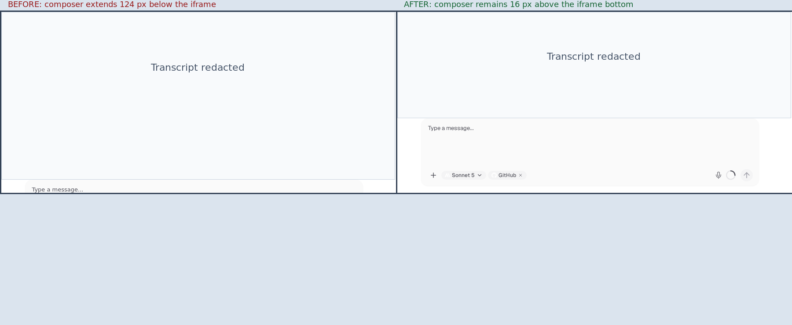

# Embedded agent chat height

Sanitized screenshots showing the embedded agent chat before and after the viewport sizing fix. Live dogfood transcript content is fully redacted.

Recorded 2026-09-19 against the `fix/agent-embed-chat-height` branch.

## What changed

- The embed route provides a full-height flex column under block-level `#root`.
- The chat view fills its parent instead of growing to transcript height.
- Transcript overflow stays in the message scroller and the composer remains inside a fixed-height iframe.

Generated with Coder Agents.
