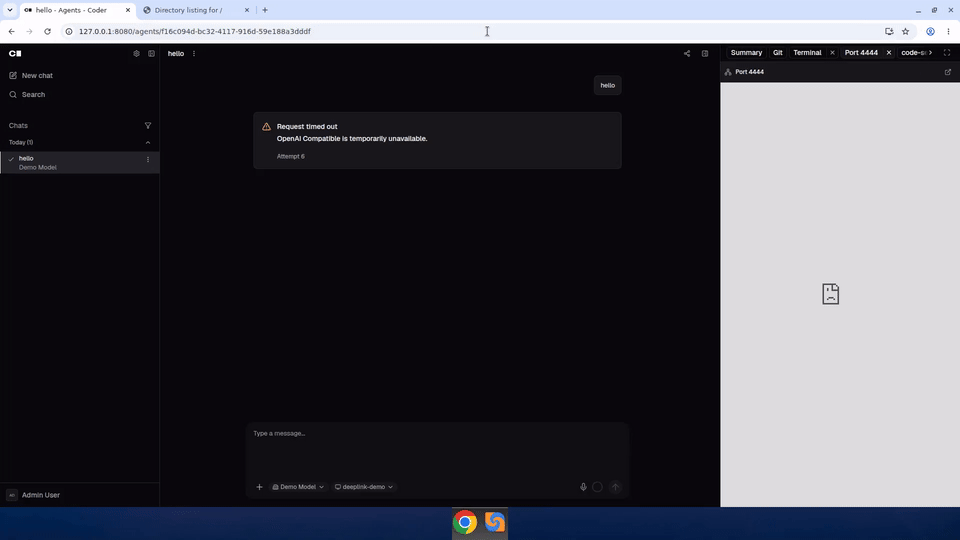

# Agents right-panel deep link

Prototype: deep-link query params on the Coder Agents chat page
(`/agents/<chatId>`) that open and maximise a specific right-panel tab
(a port-forward preview or a `coder_app`), and optionally collapse the
left chat-list sidebar.

Recorded 2026-09-18 against the `main` branch (uncommitted prototype
changes).

## What changed

- `?panel=port&port=<N>&protocol=http|https` opens/activates a
  port-forward tab for port N and maximises the right panel.
- `?panel=app&app=<slug>` opens/activates a `coder_app` tab the same
  way.
- `?sidebar=hidden` collapses the left chat-list sidebar.
- Params are stripped from the URL once applied, so the link only
  drives the panel/sidebar once and doesn't fight manual tab
  switching afterwards.

The recording shows: baseline (panel closed, sidebar visible) →
`?panel=port&port=4444&protocol=http` (panel maximised, port 4444
tab showing a real directory listing) → `?panel=app&app=code-server`
(tab created and panel maximised; the iframe itself 404s because this
demo template's code-server app is registered path-based rather than
subdomain-based, unrelated to the deep-link code) →
`?panel=port&port=4444&protocol=http&sidebar=hidden` (same maximised
port panel, with the chat list also collapsed).

