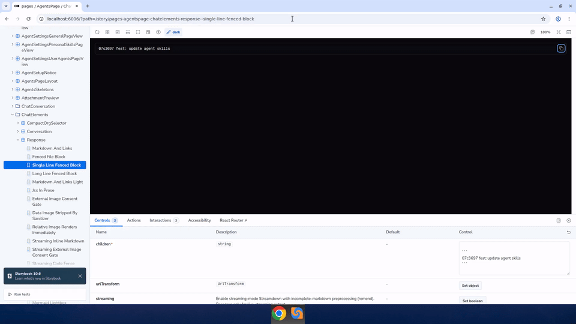

# Chat code block copy button

Adds a hover-revealed copy button to fenced code blocks in agent chat, for both single-line and multi-line blocks.

Recorded 2026-09-17 against `bpmct/chat-code-block-copy-hover` branch (demoed via the Storybook stories for the affected component, since a full Coder login was not available in the recording session).

## What changed

- `pre` code blocks in `Response.tsx` now show a "Copy code" button on hover, top-right of the block
- Applies to single-line blocks (previously the only way to grab a long single line was scrolling/selecting it) and multi-line blocks (previously had no copy affordance at all since Streamdown's built-in controls are disabled)
- Mermaid diagram blocks are excluded (they have their own controls)

