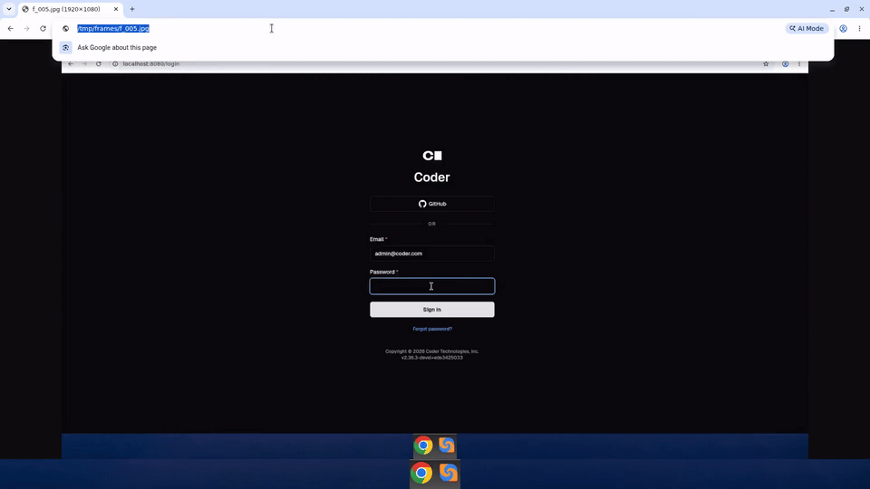

# Chat invalid-state repair and retry

Archiving a chat stuck in an invalid execution state now opens a
"Repair agent state" dialog that reconciles the chat and retries the
archive, instead of dead-ending on a 409 toast.

Recorded 2026-08-28 against `bpmct/chat-invalid-state-repair-retry`.

## What changed

- Archive/unarchive failures with the invalid-state 409 open a repair dialog
- Confirming calls POST /api/v2/chats/{chat}/reconcile-invalid, then retries once

