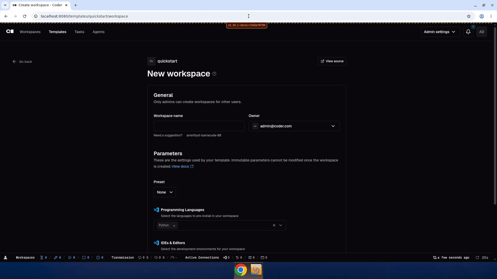

# DEVREL-136: Quickstart template Programming Languages dropdown closes mid-interaction

Reproduction of [DEVREL-136](https://linear.app/codercom/issue/DEVREL-136/bug-quick-start-template-clicking-go-language-option-triggers)
in a fresh local Coder dev server (`./scripts/develop.sh`, `examples/templates/quickstart` pushed as
`quickstart`, dynamic parameters enabled).

Recorded against `main` at `f242ef0799` on 2026-06-08.

## What happens

On the create-workspace form for the Quickstart template, opening the
**Programming Languages** multi-select dropdown and hovering toward **Go**
sometimes causes the dropdown to close before the click registers. No option
is selected and the dropdown has to be re-opened.

Confirmed both interactively (computer-use subagent) and via the recording:
- 0 to 4s: form clean, only `Python` selected, dropdown closed.
- ~4 to 6s: dropdown opens, `Go` highlighted.
- ~6 to 7s: dropdown closes unexpectedly while mouse is still over `Go`. No
  chip added.
- ~7 to 9s: dropdown reopened, second click on `Go` succeeds, `Python + Go`
  chips visible.

Likely cause: the dynamic-parameters re-evaluation on selection change
re-renders the multi-select and unmounts/remounts the open menu, racing with
the user's click.

