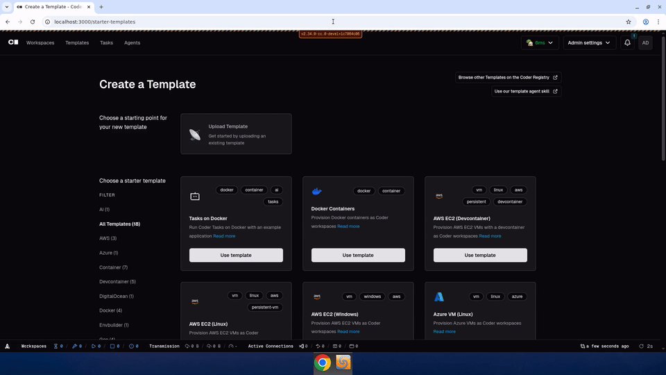

# Template README Prerequisites Step

Prototype of a README preview step with prerequisites confirmation
before template creation in the Coder UI.

Recorded 2026-05-04 against `main` branch.

## What changed

- Added ReadmePreviewStep component shown before the template creation form
- Prerequisites section is extracted from the README and displayed in a prominent callout
- Admins must confirm prerequisites are met via checkbox before proceeding
- "Continue to create" button is disabled until confirmation
- Prerequisites section is removed from the README below to avoid duplication
- HTML comments are stripped from rendered markdown

