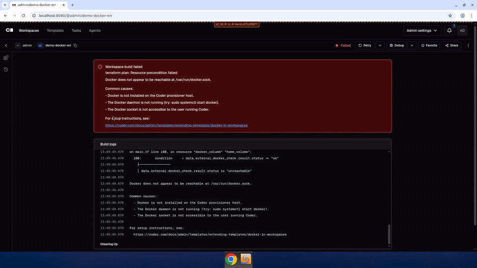

# Docker Error UX

Improved error experience when Docker is unavailable for the Docker
template. Instead of a generic "terraform plan: exit status 1", users
see a clear, actionable error with:

- The specific Docker socket path that failed
- Common causes (Docker not installed, daemon not running, socket
  permissions)
- A clickable link to setup docs

Recorded 2026-05-05 against `bpmct/docker-error-ux` branch.

## What changed

- **Template**: `data "external" "docker_check"` + precondition on
  `docker_volume` with heredoc error message
- **Backend**: `diagnosticCollector` in `executor.go` captures terraform
  error diagnostics and surfaces them instead of "exit status 1"
- **Frontend**: Shared `BuildErrorAlert` component renders the error
  with multi-line formatting and clickable URLs on both the workspace
  page and the template import drawer

