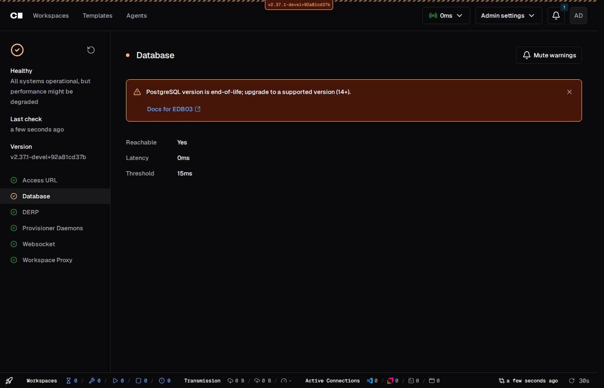

# Embedded Postgres v16 + EOL health check

Screenshot of the Health page Database section warning when Coder is
connected to an end-of-life PostgreSQL major version (<14).

Captured 2026-09-10 against branch `bpmct/embedded-pg-v16-eol-healthcheck`,
running a dev instance against a real `postgres:13` container.

