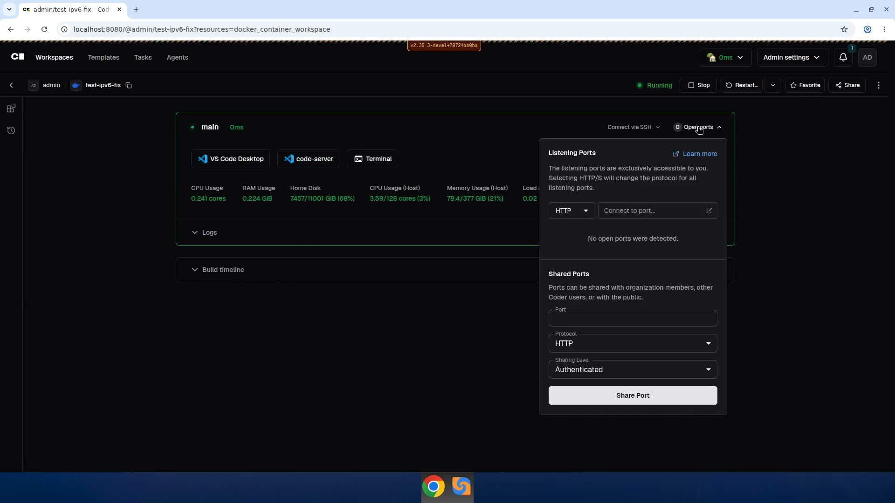
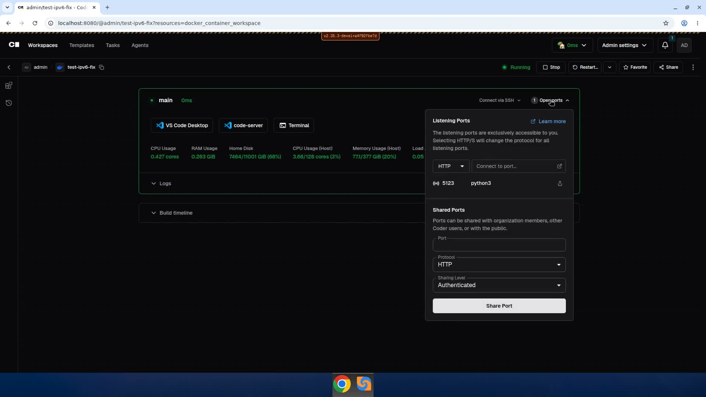

# IPv6 listening port detection

Before/after demo for `fix(agent): detect IPv6-bound listening ports`.
The agent's port scanner only read `/proc/net/tcp` (IPv4), so servers
bound to the IPv6 wildcard address (Next.js, Node's default
`http.Server`, etc.) never appeared in the dashboard Ports panel even
though they were reachable. The fix also scans `/proc/net/tcp6`.

Recorded 2026-07-31 against `fix-ipv6-listening-ports` branch. Both
captures show workspace `test-ipv6-fix` with
`python3 -m http.server 5123 --bind ::` running inside it.

## Before (unpatched, main)

Ports panel shows "No open ports were detected." despite the server
listening and responding on port 5123.

## After (patched)

Ports panel lists port 5123 (python3).
