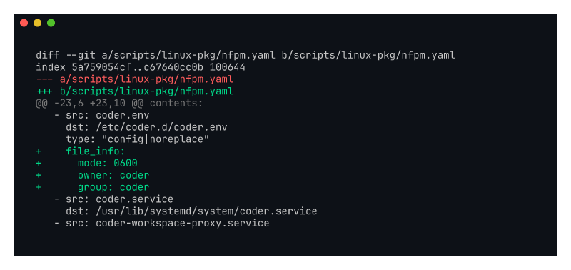

# kayla-coder-env-perms

Screenshot of the nfpm packaging change that tightens permissions on
`coder.env` (Kayla #4).

Recorded against `kayla/coder-env-perms` (commit `670296fc9e`).

## What it shows

The `coder.env` and `provisioner.env` config files now ship with mode
`0600` instead of `0644`. They contain `CODER_PG_CONNECTION_URL` and
`CODER_PROVISIONER_DAEMON_PSK`, which are operator secrets. World-readable
defaults made copy-paste setups quietly leak credentials.

Addresses Kayla's complaint:

> "etc/coder.d/coder.env is world readable when it has the postgres URL
> and other secrets, the file should be 600"

