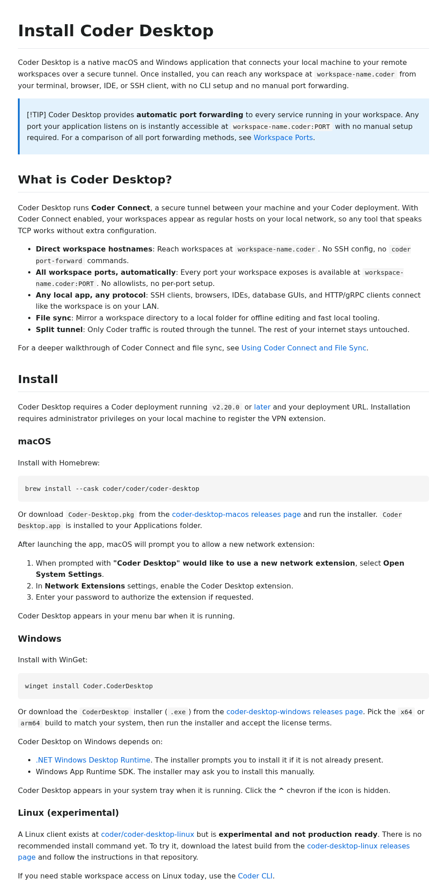

# kayla-docs-desktop

Screenshot of the rebuilt Coder Desktop install docs (Kayla #6).

Recorded against `kayla/docs-desktop` (commit `4faf0546e2`).

## What it shows

`docs/user-guides/desktop/index.md` rendered with the new structure:

- Per-platform install steps (macOS, Windows, Linux) up front.
- Explicit "what you need from your admin" section before sign-in.
- Connection requirements (CoderVPN, headnet) explained near the top
  instead of buried under FAQ.
- Troubleshooting moved to a dedicated section.

Addresses Kayla's complaint:

> "Coder Desktop docs are confusing for first-time end users; I keep
> getting asked the same setup questions"

