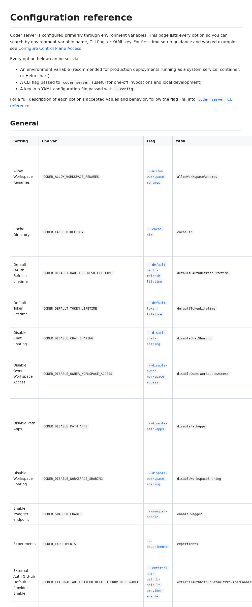

# kayla-docs-env-vars-first

Screenshot of the new `docs/admin/setup/configuration-reference.md` page
(Kayla #10).

Recorded against `kayla/docs-env-vars-first` (commit `c6777ad3e5`).

## What it shows

Generated reference page that lists every `CODER_*` env var, the matching
CLI flag, the matching YAML key, default value, and a one-line
description. The same content is sourced from the existing CLI option
metadata so it stays in sync automatically. The page is linked from
`docs/admin/setup/index.md` as the first stop after "install".

Addresses Kayla's complaint:

> "I keep grep'ing the docs for env var names and finding nothing, the
> CLI flag docs aren't keyed by `CODER_*`"

