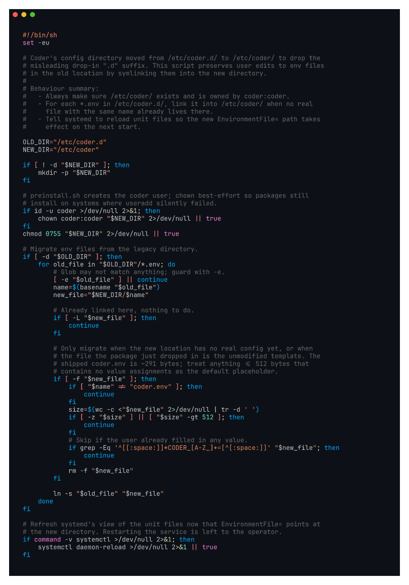

# kayla-etc-coder-rename

Screenshot of the package `postinstall.sh` after renaming `/etc/coder.d` to
`/etc/coder` (Kayla #3).

Recorded against `kayla/etc-coder-rename` (commit `fb3b46e474`).

## What it shows

`postinstall.sh` now installs the env files to `/etc/coder/coder.env` and
`/etc/coder/provisioner.env`. To keep existing installations working we
leave a one-time symlink: `/etc/coder.d -> /etc/coder`. Service units and
package `config|noreplace` lines reference the new path. Existing operators
keep working without intervention; new operators get the conventional
`/etc/<service>` layout.

Addresses Kayla's complaint:

> "/etc/coder.d (it should be /etc/coder, you don't see /etc/postgres.d/
> /etc/mysql.d/ /etc/nginx.d/)"

