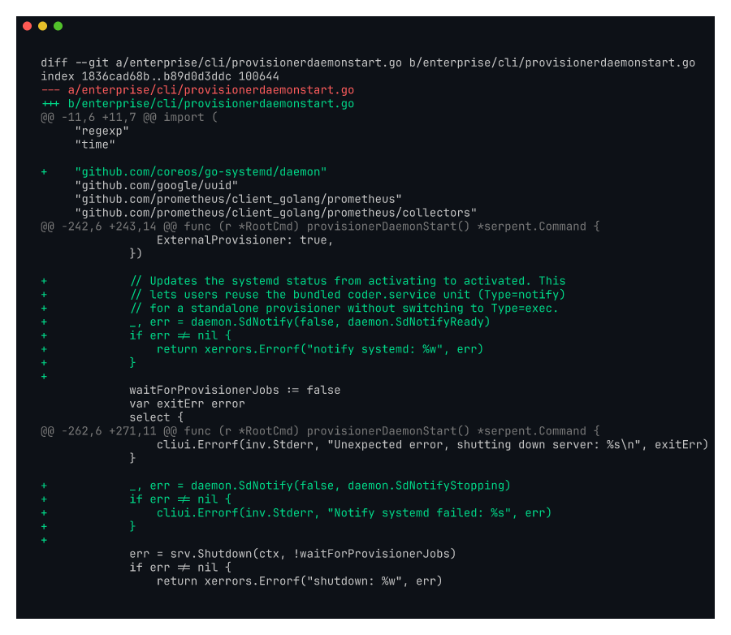
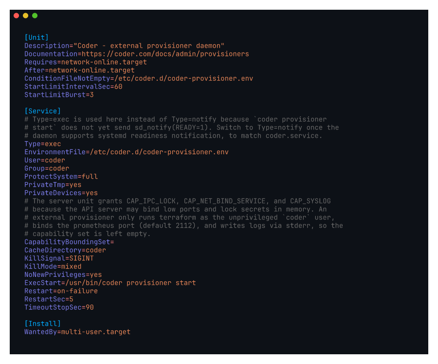

# kayla-provisionerd-systemd

Two-part fix for "deploying coder provisioners with systemd" (Kayla #1).

Recorded against `kayla/provisionerd-sdnotify` (commit `d10ac14da6`) and
`kayla/provisionerd-systemd` (commit `6c76fe5d39`).

## What the screenshots show

`screenshot-sdnotify.png`: diff of `enterprise/cli/provisionerdaemonstart.go`
adding `daemon.SdNotify(false, daemon.SdNotifyReady)` after the provisioner
daemon connects to coderd. This lets systemd promote the unit from
`activating (start)` to `active (running)` only when the daemon is
actually serving, which fixes false-positive `systemctl start` exits.

`screenshot-unit.png`: the new `provisioning/nfpm/coder-provisioner.service`
unit file packaged in the deb/rpm. `Type=notify` pairs with the SdNotify
call above. `EnvironmentFile` reads `/etc/coder/provisioner.env`
(complementary to the `/etc/coder.d` rename in #3) and `ExecStart` runs
`/usr/bin/coder provisioner start`. Installing the package is now enough
to get a managed external provisioner; no hand-written unit required.

Addresses Kayla's complaint:

> "deploying coder provisioners with systemd. I've had to use the coder
> systemd file as a base but I have to fork it and that feels gross"

