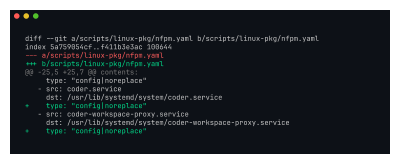

# kayla-service-noreplace

Screenshot of the nfpm `config|noreplace` annotations on coder service unit
files (Kayla #5).

Recorded against `kayla/service-noreplace` (commit `f2eb2d8e36`).

## What it shows

`coder.service`, `coder-workspace-proxy.service`, and the new
`coder-provisioner.service` are now declared as `config|noreplace` in the
deb/rpm package. Operators frequently customize these units (override
`ExecStart`, add hardening flags, tweak `User`); upgrades no longer
silently overwrite local edits. The same change is applied to env files.

Addresses Kayla's complaint:

> "the package needs to declare service files as configs, not data files,
> otherwise every upgrade nukes my customizations"

