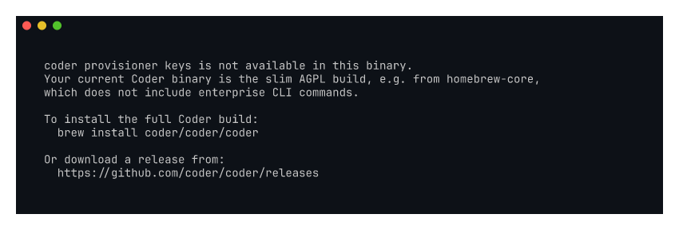

# kayla-slim-helpful-error

Demo of the new `coder provisioner keys` helpful error when run against the
slim AGPL binary (e.g. from homebrew-core).

Recorded against `kayla/slim-helpful-error` branch (commit `fce224010b`).

## What it shows

- `coder-slim --version` reports "Slim build".
- `coder-slim --help` now lists `licenses`, `groups`, `provisioner` (stubs).
- `coder-slim provisioner --help` lists `keys` alongside `list`, `jobs`.
- `coder-slim provisioner keys create test` prints a helpful error pointing
  at `brew tap coder/coder && brew install coder` for the full build.

Addresses Kayla's complaint:

> "the version of coder in homebrew-core doesn't support issuing provisioner
> keys?? that was kind of annoying to discover"

## Still screenshot

A terminal still showing just the error output is also included as
`screenshot.png`.

