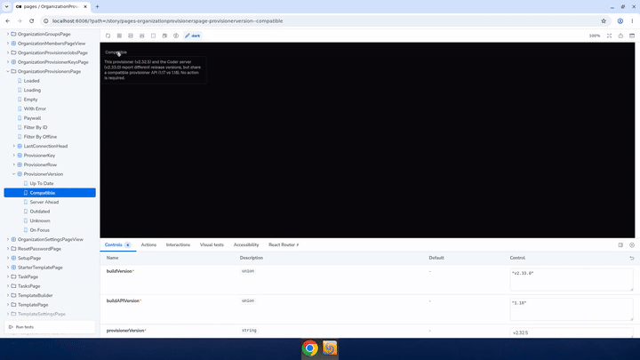
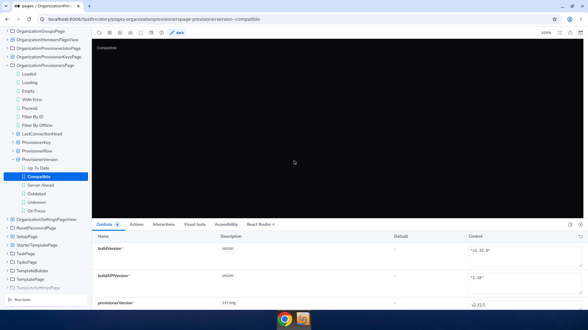

# kayla-ui-provisioner-version

Demo of the Provisioner Version UI fix.

Recorded against `kayla/ui-provisioner-version` branch (commit `505547408a`).

## What it shows

Storybook walk-through of the new five-state `ProvisionerVersion` component:

- **Up to date**: neutral, no warning (release versions match).
- **Compatible**: neutral, no warning even though release versions differ
  (API versions are compatible). This is Kayla's case: previously this
  rendered as a red "Outdated" pill with the tooltip "please upgrade to a
  newer version".
- **Server out of date**: warning, daemon API is newer than the server.
- **Outdated**: softer warning, daemon API major is behind the server.
- **Version mismatch**: neutral fallback when either side did not report an
  API version.

Addresses Kayla's complaint:

> "I wound up with a newer provisioner version than the server and the
> frontend said my provisioner was out of date because of it"

## Still screenshot

A single still of the "Compatible" state (Kayla's case) is also included
as `screenshot.png` for use in places where animated GIFs are awkward.

## Recording note

The desktop session captured for this demo included some unrelated focus
artifacts (a stray Chrome dialog, blank desktop). The GIF is trimmed to the
cleanest Storybook section. The full unedited mp4 is included in this
folder.
