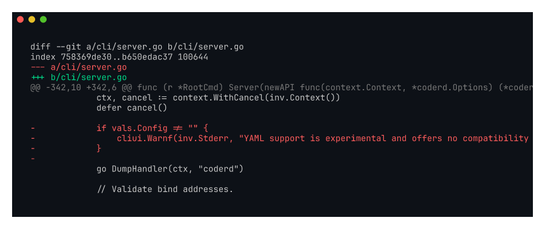

# kayla-yaml-stable

Screenshot of the change that drops the "experimental" wording from the
YAML config flow (Kayla #9).

Recorded against `kayla/yaml-stable` (commit `9f6861841c`).

## What it shows

Diff of `cli/server.go` (and adjacent help text) removing the
`(experimental)` qualifier from `--config-yaml` / `CODER_CONFIG_FILE`.
The YAML config has been in production use for multiple releases and has
no migration risk; the warning was scaring operators off using it.

Addresses Kayla's complaint:

> "it's been 'experimental' forever, just label it stable so I don't get
> security review pushback for using it"

