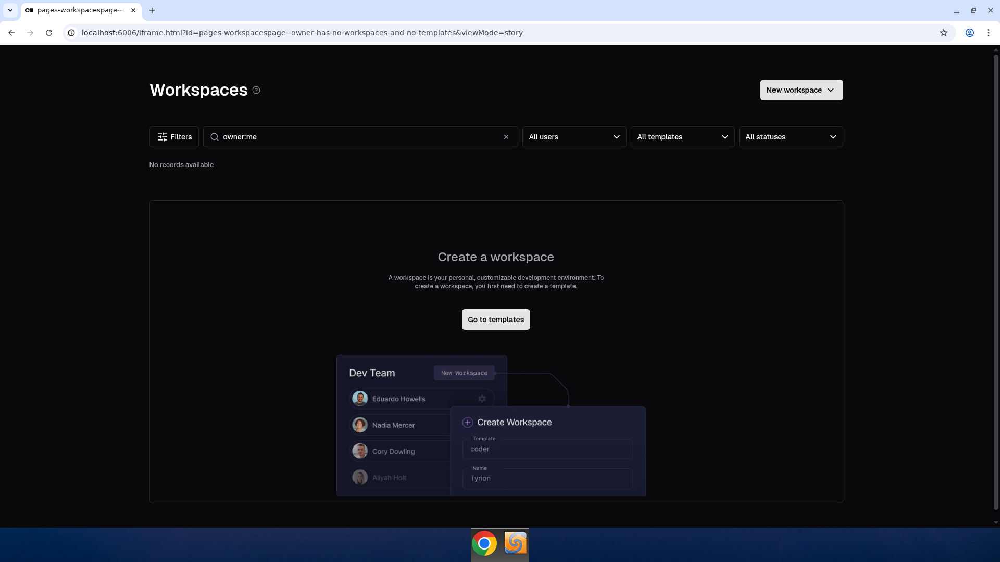

# No Templates Empty State

Screenshot of the WorkspacesPage when an owner has no workspaces and no templates.

Recorded 2025-05-05 from Storybook story `OwnerHasNoWorkspacesAndNoTemplates`.

## What it shows

- The "Create a workspace" empty state with a "Go to templates" CTA
- Filter bar with default `owner:me` filter

