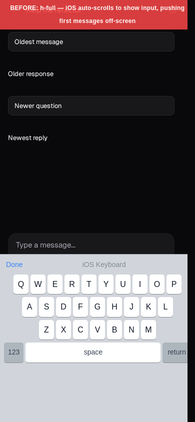
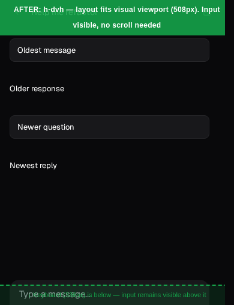

# Mobile Keyboard Fix: Screenshots

Screenshots demonstrating the iOS virtual-keyboard layout bug and its fix
in the Coder Agents chat page.

## Before (`h-full`)

The root div uses `h-full`, which equals 100% of the **layout** viewport.
On iOS the layout viewport stays at the full device height even after the
keyboard opens. The browser then auto-scrolls to bring the focused chat
input into view, pushing the oldest messages above the visible area.

## After (`h-dvh`)

Replacing `h-full` with `h-dvh` (100% **dynamic** viewport height) makes
the root track the **visual** viewport. When the keyboard opens the root
shrinks to the remaining visible height. The input is naturally anchored at
the bottom of this smaller container without any browser scroll, so all
messages stay in view.

---

Screenshots captured via Playwright against a Storybook story
(`AgentChatPageView: MessageOrderIsStillCorrect`) at iPhone 14 Pro
dimensions (390 x 844 px), with the iOS keyboard simulated as a 336 px
overlay. The "after" capture uses a viewport of 390 x 508 px to match
the visual viewport that `100dvh` would resolve to with the keyboard open.
